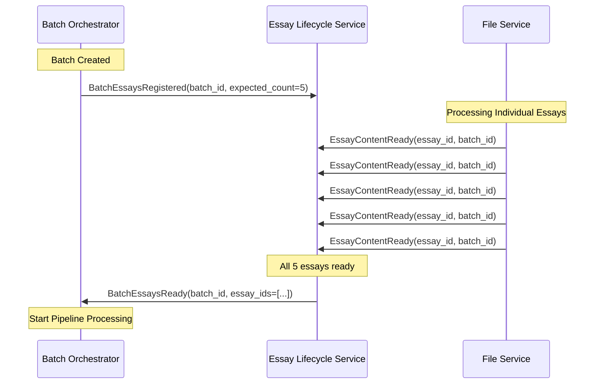

# HuleEdu Processing Pipeline: Master Product Requirements Document

**Version:** 2.0
**Date:** May 27, 2025
**Status:** Walking Skeleton Implementation

## 1. Introduction & Overview 🎯

This document outlines the requirements and architectural design for the HuleEdu Processing Pipeline Walking Skeleton. The primary goal is to establish a working event-driven coordination pattern between File Service, Essay Lifecycle Service (ELS), and Batch Orchestrator Service (BOS) for spellcheck-only pipeline processing.

The architecture emphasizes microservice autonomy with event-driven communication via Kafka. Each service maintains clear boundaries and communicates through typed Pydantic event models defined in the `common_core` package. The walking skeleton validates the core architectural pattern: File Service processes uploads → ELS aggregates batch readiness → BOS orchestrates spellcheck pipeline.

This PRD serves as the foundation for the minimal viable processing workflow, focusing on proving inter-service coordination rather than comprehensive feature implementation.

---

## 2. Goals & Objectives 🌟

* **Inter-Service Coordination:** Establish working event-driven communication between File Service, ELS, and BOS for batch processing coordination.
* **Spellcheck Pipeline:** Implement end-to-end spellcheck processing from file upload through corrected text output.
* **Batch Aggregation:** Validate count-based aggregation pattern where ELS coordinates batch readiness between File Service and BOS.
* **Event-Driven Architecture:** Prove asynchronous communication via Kafka with typed Pydantic event models.
* **Service Autonomy:** Demonstrate clear service boundaries with File Service (file processing), ELS (essay state management), and BOS (batch orchestration).
* **Architectural Foundation:** Establish patterns for future pipeline expansion while keeping walking skeleton minimal and focused.

---

## 3. Core Architectural Principles 🏗️

* **Microservice Autonomy:** Each service (File Service, ELS, BOS, Spell Checker) operates independently with clear domain boundaries.
* **Event-Driven Communication:** Services communicate asynchronously via Kafka events with typed Pydantic models.
* **Thin Events:** Events carry identifiers and essential context; large data objects are stored in Content Service and referenced via `StorageReferenceMetadata`.
* **Explicit Contracts:** All inter-service communication uses versioned Pydantic models defined in `common_core`.
* **EventEnvelope Standard:** All Kafka events are wrapped in standardized `EventEnvelope` with metadata (`event_id`, `event_type`, `source_service`, `correlation_id`).
* **Service Boundaries:** File Service owns file processing, ELS owns essay state management, BOS owns batch orchestration, Spell Checker owns spell correction.

---

## 4. Batch Readiness Coordination Architecture 🔄

To enable BOS-centric processing, the platform implements a **Count-Based Aggregation Pattern** for coordinating batch readiness between File Service, ELS, and BOS. This architectural decision ensures clean service boundaries while maintaining event-driven principles.

### 4.1. Coordination Pattern: BOS → ELS → BOS

The coordination follows a three-step process:

1. **Registration Phase**: BOS informs ELS about batch expectations
2. **Aggregation Phase**: ELS tracks individual essay readiness from File Service
3. **Completion Phase**: ELS notifies BOS when entire batch is ready



### 4.2. Key Coordination Events

**Batch Registration Event:**

```python
class BatchEssaysRegistered(BaseModel):
    """BOS → ELS: Establishes batch expectations"""
    batch_id: str
    expected_essay_count: int
    essay_ids: list[str]
    metadata: SystemProcessingMetadata
```

**Essay Readiness Event:**

```python
class EssayContentReady(BaseModel):
    """File Service → ELS: Individual essay content ready"""
    essay_id: str
    batch_id: str
    content_storage_reference: StorageReference
    entity: EntityReference
    metadata: SystemProcessingMetadata
```

**Batch Completion Event:**

```python
class BatchEssaysReady(BaseModel):
    """ELS → BOS: All essays ready for processing"""
    batch_id: str
    ready_essay_ids: list[str]
    total_count: int
    batch_entity: EntityReference
    metadata: SystemProcessingMetadata
```

### 4.3. Service Boundary Responsibilities

| **Service** | **Responsibility** | **Rationale** |
|-------------|-------------------|---------------|
| **File Service** | File upload handling, text extraction, content ingestion coordination, emit `EssayContentReady` events | Dedicated service for file processing with proper service boundaries |
| **ELS** | Aggregate readiness, track batch expectations, coordinate with BOS | Natural essay state manager, has batch context |
| **BOS** | Batch orchestration, pipeline initiation, batch state management | Primary orchestrator for batch processing workflows |

**Coordination Verification**: The aggregation model ensures batch readiness is correctly calculated regardless of arrival order or timing. ELS can track partial completion and handle timeouts, providing clear audit trail of batch readiness progression.

**Note**: The walking skeleton validates proper inter-service coordination through event-driven communication between File Service, ELS, and BOS.

### 4.4. Architectural Benefits

* ✅ **Clean Service Boundaries**: Each service owns its domain expertise
* ✅ **Event-Driven**: True reactive system, no polling overhead
* ✅ **Scalable Coordination**: Works with any batch size (1-10,000+ essays)
* ✅ **Fault Tolerance**: ELS can track partial completion and handle timeouts
* ✅ **Observability**: Clear audit trail of batch readiness progression

### 4.5. Walking Skeleton Implementation

For the initial walking skeleton (spellcheck-only pipeline), the event-driven coordination flow is:

1. **File Service Processing**: `POST /v1/files/batch` accepts file uploads, processes them through states: `UPLOADED`, `TEXT_EXTRACTED`, `CONTENT_INGESTING`, then emits `EssayContentReady` events to ELS
2. **ELS Coordination**: Receives `EssayContentReady` events, transitions essays to `READY_FOR_PROCESSING`, aggregates batch readiness, emits `BatchEssaysReady` to BOS  
3. **BOS Pipeline Initiation**: Receives `BatchEssaysReady`, initiates spellcheck pipeline
4. **ELS Pipeline States**: `AWAITING_SPELLCHECK`, `SPELLCHECKING_IN_PROGRESS`, `SPELLCHECKED_SUCCESS`, `SPELLCHECK_FAILED`, `ESSAY_CRITICAL_FAILURE`

**Architectural Decision**: File Service is implemented as a separate microservice to properly validate inter-service coordination patterns. This ensures the walking skeleton tests the most challenging aspect of the architecture - event-driven communication between autonomous services.

---

## 5. Key Services Involved 🛠️

* **Batch Service (BS):** The primary orchestrator of batch processing. Manages `ProcessingPipelineState` and initiates pipeline phases for entire batches.
* **File Service:** A dedicated microservice responsible for file upload handling, text extraction, and content ingestion coordination. Accepts multipart file uploads, processes files to extract text content, coordinates with Content Service for storage, and emits essay readiness events to trigger downstream processing.
* **Essay Lifecycle Service (ELS):** Manages the state and lifecycle of individual essays. Consumes batch phase initiation commands from BS. Dispatches individual essay processing requests to Specialized Services. Consumes results from Specialized Services, updates essay states, and notifies BS of these updates.
* **Content Service:** A dedicated microservice responsible for storing and retrieving all textual content and binary artifacts (e.g., original essays, corrected texts, NLP JSON, AI feedback documents). Accessed via a RESTful API.
* **Specialized Services (SS):** Perform specific, focused processing tasks on individual essays or batches. Examples:
  * **SpellChecker Service:** Performs spell checking.
  * **NLP Service:** Generates linguistic metrics and features.
  * **AI Feedback Service:** Generates AI-driven feedback and editor revisions.
  * **CJ Assessment Service:** Performs comparative judgment on essays within a batch.
* **Kafka:** The distributed event streaming platform serving as the event bus for all asynchronous inter-service communication.
* **Supporting Infrastructure (Conceptual):**
  * **API Gateway:** (Future) Single entry point for external API requests.
  * **Observability Stack:** (Future) Tools for distributed tracing, metrics, and centralized logging.

---

## 6. Walking Skeleton Service Structure 🧩

The walking skeleton implements minimal services for spellcheck-only pipeline validation:

```plaintext
huledu-reboot/
├── common_core/
│   └── src/common_core/
│       ├── enums.py                        # ProcessingStage, EssayStatus, BatchStatus, etc.
│       ├── metadata_models.py              # EntityReference, SystemProcessingMetadata, etc.
│       ├── pipeline_models.py              # Pipeline state models
│       ├── batch_service_models.py         # BOS command models
│       ├── essay_service_models.py         # ELS request models
│       └── events/                         # Event schemas
│           ├── envelope.py                 # EventEnvelope wrapper
│           ├── base_event_models.py        # Base event classes
│           ├── spellcheck_models.py        # Spellcheck event data
│           ├── ai_feedback_events.py       # AI feedback models (implemented)
│           └── batch_coordination_events.py # Batch coordination events
│
├── services/
│   ├── file_service/                       # File upload and processing
│   │   ├── app.py                          # Quart HTTP API
│   │   ├── worker_main.py                  # Kafka consumer
│   │   ├── protocols.py                    # Service interfaces
│   │   └── [processing modules]            # File processing logic
│   │
│   ├── essay_lifecycle_service/            # Essay state management
│   │   ├── app.py                          # Quart HTTP API (optional)
│   │   ├── worker_main.py                  # Kafka consumer
│   │   ├── batch_command_handlers.py       # Event routing and processing
│   │   ├── batch_tracker.py                # Batch coordination and readiness tracking
│   │   ├── state_store.py                  # Essay state persistence layer
│   │   ├── core_logic.py                   # Business logic and state transitions
│   │   ├── protocols.py                    # Service interfaces
│   │   ├── di.py                           # Dependency injection (lean, ~114 lines)
│   │   ├── implementations/                # Business logic implementations
│   │   │   ├── content_client.py           # HTTP content storage operations
│   │   │   ├── event_publisher.py          # Kafka event publishing logic
│   │   │   ├── metrics_collector.py        # Prometheus metrics collection
│   │   │   ├── batch_command_handler_impl.py # Batch command processing
│   │   │   └── service_request_dispatcher.py # Specialized service request dispatching
│   │   └── [other modules]                 # Essay lifecycle logic
│   │
│   ├── batch_orchestrator_service/         # Batch coordination
│   │   ├── app.py                          # Quart HTTP API
│   │   ├── worker_main.py                  # Kafka consumer
│   │   ├── protocols.py                    # Service interfaces
│   │   └── [orchestration modules]         # Batch orchestration logic
│   │
│   ├── spell_checker_service/              # Spellcheck processing
│   │   ├── worker_main.py                  # Kafka consumer
│   │   ├── spell_logic/                    # Core spellcheck algorithms
│   │   ├── protocols.py                    # Service interfaces
│   │   └── [processing modules]            # Spellcheck implementation
│   │
│   ├── content_service/                    # Blob storage (existing)
│   │   ├── app.py                          # Quart HTTP API
│   │   └── [storage modules]               # Content storage logic
│   │
│   └── libs/                               # Shared service libraries
└── [other directories]
```

**Key Characteristics:**
* **Minimal Scope:** Only spellcheck pipeline implemented
* **Clear Boundaries:** Each service has distinct responsibilities
* **Event-Driven:** Inter-service communication via Kafka
* **Future-Ready:** Structure supports additional pipelines

---

## 7. Detailed Pipeline Flows & Data Models 🌊

This section details the interaction for each processing pipeline, emphasizing the Pydantic data models used in `EventEnvelope.data` and the roles of each service.

### 7.1. Common Pydantic Components

* **`common_core.metadata_models.EntityReference`**: (`entity_id`, `entity_type`, `parent_id`) - Identifies entities.
* **`common_core.metadata_models.EssayProcessingInputRefV1`**: (`essay_id`, `text_storage_id`) - Points to an essay and its text for processing.
* **`common_core.events.base_event_models.BaseEventData`**: Base for event payloads (`event_name`, `entity_ref`, `timestamp`).
* **`common_core.events.base_event_models.ProcessingUpdate`**: Extends `BaseEventData` with `status` and `system_metadata` (an instance of `common_core.metadata_models.SystemProcessingMetadata`).
* **`common_core.metadata_models.StorageReferenceMetadata`**: Carries references to stored artifacts.

### 7.2. Pipeline 1: Spell Checking

* **Purpose:** Identify and correct spelling errors.
* **Input:** Original essay text, language.
* **Output:** Corrected text, spellcheck metrics/log.

**Event Flow & Data Models:**

1. **BS Initiates Spellcheck Phase for Batch:**
    * `EventEnvelope.event_type`: `"huleedu.batchservice.spellcheck_phase.initiate.v1"`
    * `EventEnvelope.data` (Type: `BatchServiceSpellcheckInitiateCommandDataV1` from `common_core.batch_service_models`):

        ```python
        # From BaseEventData: entity_ref (Batch), event_name (BATCH_SPELLCHECK_PHASE_INITIATE)
        essays_to_process: List[EssayProcessingInputRefV1]
        language: str 
        ```

    * BS Updates `ProcessingPipelineState.spellcheck` to `DISPATCH_INITIATED`, publishes `BATCH_PIPELINE_PROGRESS_UPDATED_V1`.

2. **ELS Requests Spellcheck for Individual Essay:**
    * `EventEnvelope.event_type`: `"huleedu.els.spellcheck.request.v1"`
    * `EventEnvelope.data` (Type: `EssayLifecycleSpellcheckRequestV1` from `common_core.essay_service_models`):

        ```python
        # From ProcessingUpdate: entity_ref (Essay), event_name (ESSAY_SPELLCHECK_REQUESTED), status (AWAITING_SPELLCHECK), system_metadata
        text_storage_id: str 
        language: str
        ```

    * ELS updates essay status, publishes `ESSAY_LIFECYCLE_STATE_UPDATED_V1`.

3. **SpellChecker Service Publishes Result:**
    * `EventEnvelope.event_type`: `"huleedu.spellchecker.essay.concluded.v1"`
    * `EventEnvelope.data` (Type: `EssaySpellcheckConcludedV1` from `common_core.events.spellcheck_events`):

        ```python
        # From ProcessingUpdate: entity_ref (Essay), event_name (ESSAY_SPELLCHECK_RESULT_RECEIVED), status (SPELLCHECKED_SUCCESS/_FAILED), system_metadata
        original_text_storage_id: str
        storage_metadata: Optional[StorageReferenceMetadata] 
        corrections_made: Optional[int]
        ```

4. **ELS Processes Result & Updates BOS:** ELS updates essay status, publishes `ESSAY_LIFECYCLE_STATE_UPDATED` event. BOS consumes this, updates batch state, and continues with pipeline progression.

---

## 8. Walking Skeleton Success Metrics 📊

* **End-to-End Flow:** File upload through File Service → content ready → batch aggregation → spellcheck processing → corrected text output
* **Inter-Service Coordination:** Successful event-driven communication between File Service, ELS, and BOS
* **Batch Aggregation:** ELS correctly tracks and signals batch readiness regardless of file upload order
* **Event Processing:** All services consume and produce events correctly via Kafka
* **Service Autonomy:** Each service operates independently with clear boundaries
* **Architectural Validation:** Proves event-driven coordination pattern for future pipeline expansion

---

## 9. Future Considerations 🔭

* **Additional Pipelines:** NLP analysis, AI feedback, comparative judgment assessment
* **Advanced Error Handling:** Dead Letter Queues, retry mechanisms, circuit breakers  
* **Observability:** Distributed tracing, metrics collection, monitoring dashboards
* **API Gateway:** External access management and routing
* **Service Mesh:** Advanced traffic management and security at scale

---

## 10. Conclusion 📝

This PRD defines the minimal walking skeleton for the HuleEdu Processing Pipeline, focused on validating the core event-driven coordination architecture between File Service, Essay Lifecycle Service, and Batch Orchestrator Service. The scope is intentionally limited to spellcheck processing to prove the fundamental patterns before expanding to additional pipelines.

The walking skeleton establishes the foundation for:
* **Event-driven microservice coordination**
* **Batch aggregation patterns**  
* **Service autonomy with clear boundaries**
* **Typed contract-based communication**
* **Scalable architecture for future expansion**

Success will be measured by the ability to process essay batches from file upload through spellcheck completion with proper inter-service coordination via Kafka events.
