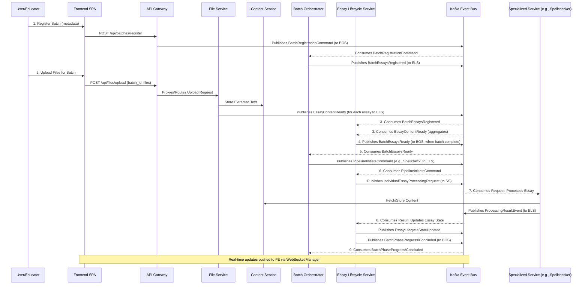

# HuleEdu Platform: Master Product Requirements Document

**Version:** 3.0
**Date:** May 31, 2025
**Status:** Integrated Backend & Frontend Vision (Backend Walking Skeleton In Progress)

## 1. Introduction & Platform Vision 🌟

### 1.1. Overall Platform Overview

The HuleEdu platform aims to provide a comprehensive suite of tools for essay processing, analysis, and feedback. The current development phase focuses on establishing a working event-driven coordination pattern between core backend microservices: File Service, Essay Lifecycle Service (ELS), and Batch Orchestrator Service (BOS), initially for a spellcheck-only pipeline. This backend architecture emphasizes microservice autonomy with event-driven communication via Kafka, where each service maintains clear boundaries and communicates through typed Pydantic event models defined in the `common_core` package.

### 1.2. Vision for the HuleEdu Experience (Backend + Frontend)

The broader vision is to create a modern, highly responsive, and intuitive platform. This includes a Single Page Application (SPA) frontend that will offer users (initially educators/teachers) a seamless experience for submitting essays for processing, monitoring their progress in real-time, and accessing detailed results and analytics. The frontend will be an authenticated application, prioritizing functionality and real-time updates. The backend's event-driven microservice architecture is designed to support this rich, interactive user experience.

### 1.3. Purpose of this PRD

This PRD defines the scope, features, and key requirements for the HuleEdu Platform, encompassing both the backend processing pipeline and the frontend application. It serves as a guiding document for design, development, and testing. For the backend, it solidifies the "walking skeleton" for inter-service coordination. For the frontend, it outlines the initial requirements and technical direction, incorporating guidance from the "React + Vite front-end guide". The primary goal of this integrated document is to help developers understand how the backend components they are currently working on will serve an end-user client and what connecting surfaces will be necessary.

---

## 2. Platform Goals & Objectives 🎯

* **Backend - Inter-Service Coordination:** Establish working event-driven communication between File Service, ELS, and BOS for batch processing coordination.
* **Backend - Spellcheck Pipeline:** Implement end-to-end spellcheck processing from file upload through corrected text output as the initial "walking skeleton" pipeline.
* **Backend - Batch Aggregation:** Validate the count-based aggregation pattern where ELS coordinates batch readiness between File Service and BOS.
* **Backend - Event-Driven Architecture:** Prove asynchronous communication via Kafka with typed Pydantic event models.
* **Backend - Service Autonomy:** Demonstrate clear service boundaries with File Service (file processing), ELS (essay state management), and BOS (batch orchestration).
* **Backend - Architectural Foundation:** Establish patterns for future pipeline expansion while keeping the walking skeleton minimal and focused.
* **Frontend - Intuitive Workflows:** Provide clear and efficient user workflows for registering batches, uploading essay files, and initiating processing pipelines.
* **Frontend - Real-Time Visibility:** Offer users immediate feedback and live updates on the status of their batches and individual essays.
* **Frontend - Accessible Results:** Clearly present processing results, such as spellcheck corrections, NLP metrics, and AI-generated feedback.
* **Platform - Secure Access:** Ensure all interactions are authenticated and authorized appropriately.
* **Platform - Performant Experience:** Deliver a fast-loading and responsive user interface and efficient backend processing.
* **Platform - Maintainable & Scalable Design:** Build upon a modern tech stack that promotes code quality, maintainability, and can scale with future feature enhancements.

---

## 3. Target Audience & User Personas 👥

(This section to be expanded based on detailed user research. Initial focus is on educators.)

* **Primary Persona: Educator/Teacher**
  * Needs to manage essay assignments for multiple classes/courses.
  * Submits batches of student essays for automated processing and feedback.
  * Requires clear visibility into processing progress and timely access to results.
  * May need to configure processing parameters for different assignments.
* **Future Personas (to consider in long-term roadmap):**
  * Student (e.g., for submitting essays directly, viewing their own feedback).
  * Platform Administrator (e.g., for user management, system monitoring).

---

## 4. Core Architectural Principles 🏗️

* **Microservice Autonomy:** Each service (File Service, ELS, BOS, Spell Checker, Content Service) operates independently with clear domain boundaries.
* **Event-Driven Communication:** Services communicate asynchronously via Kafka events with typed Pydantic models.
* **Thin Events:** Events carry identifiers and essential context; large data objects are stored in Content Service and referenced via `StorageReferenceMetadata`.
* **Explicit Contracts:** All inter-service communication uses versioned Pydantic models defined in `common_core`.
* **EventEnvelope Standard:** All Kafka events are wrapped in a standardized `EventEnvelope` with metadata (`event_id`, `event_type`, `source_service`, `correlation_id`).
* **Service Boundaries:** File Service owns file processing; ELS owns essay state management and batch readiness aggregation; BOS owns batch orchestration and pipeline initiation decisions; Specialized Services (like Spell Checker) own their specific processing tasks; Content Service owns raw content storage.

---

## 5. High-Level User Experience & System Flow UX

### 5.1. User Journey Overview

The primary user journey for an Educator will involve:

1. **Logging In**: Securely accessing the HuleEdu platform.
2. **Batch Registration**: Defining a new batch of essays with associated metadata (course details, assignment instructions, expected number of essays, essay identifiers).
3. **File Upload**: Uploading essay files for the registered batch.
4. **Processing Monitoring**: Observing the status of the batch and individual essays in real-time as they move through the processing pipeline (e.g., spellcheck, NLP analysis).
5. **Results Viewing**: Accessing and reviewing the outcomes of the processing, such as corrected text or feedback reports.

### 5.2. Mapping Frontend Interactions to Backend Processes

* **Login**: Frontend interacts with the API Gateway's authentication endpoint.
* **Batch Registration**:
  * Frontend sends batch metadata to an API Gateway endpoint.
  * API Gateway publishes a command event to BOS.
  * BOS processes this command, stores batch context, and publishes a `BatchEssaysRegistered` event to ELS.
* **File Upload**:
  * Frontend uploads files for a specific `batch_id` to an API Gateway endpoint (which likely proxies to the File Service).
  * File Service processes each file, coordinates with Content Service to store extracted text, and publishes `EssayContentReady` events to ELS.
* **Real-Time Monitoring**:
  * Frontend establishes a WebSocket connection with the WebSocket Manager Service.
  * As backend services (ELS, BOS, Specialized Services) process essays and batches, they emit status update events. These events are consumed by backend infrastructure that ultimately pushes updates through the WebSocket Manager to the connected frontend clients.
  * The Batch Status Dashboard and Individual Essay Status views on the frontend are updated dynamically.
  * Initial data for dashboards can be fetched via the API Gateway querying the Result Aggregator Service.
* **Results Viewing**:
  * Frontend requests specific results (e.g., spellcheck report for an essay) via an API Gateway endpoint.
  * The API Gateway routes this query, potentially to the ELS (which knows storage IDs via its state) or a Result Aggregator, which in turn might fetch data from the Content Service.

---

## 6. Backend Architecture & Services ⚙️

### 6.1. Overview of Backend Microservices

* **Batch Orchestrator Service (BOS):** The primary orchestrator of batch processing. Manages `ProcessingPipelineState` and initiates pipeline phases for entire batches. (Also referred to as Batch Service or BS in some contexts of the original PRD).
* **File Service:** A dedicated microservice responsible for file upload handling, text extraction, and content ingestion coordination. Emits essay readiness events.
* **Essay Lifecycle Service (ELS):** Manages the state and lifecycle of individual essays. Consumes batch phase initiation commands from BOS, dispatches requests to Specialized Services, consumes their results, updates essay states, and aggregates batch readiness for BOS.
* **Content Service:** Stores and retrieves all textual content and binary artifacts. Accessed via a RESTful API.
* **Specialized Services (SS):** Perform specific processing tasks. Examples: SpellChecker Service, NLP Service, AI Feedback Service, CJ Assessment Service.
* **Kafka:** The distributed event streaming platform serving as the event bus for all asynchronous inter-service communication.

### 6.2. Batch Readiness Coordination Architecture

To enable BOS-centric processing, the platform implements a **Count-Based Aggregation Pattern** for coordinating batch readiness between File Service, ELS, and BOS.

#### 6.2.1. Coordination Pattern: BOS → ELS → File Service → ELS → BOS

The coordination follows this refined flow:

1. **Registration Phase (BOS → ELS)**: BOS informs ELS about batch expectations (e.g., `batch_id`, `expected_essay_count`, `essay_ids`) by publishing a `BatchEssaysRegistered` event.
2. **Content Ingestion & Essay Readiness Reporting (File Service → ELS)**: The File Service processes uploaded files for a given batch, stores their content (via Content Service), and emits an `EssayContentReady` event for each successfully processed essay to ELS.
3. **Aggregation Phase (ELS)**: ELS consumes `EssayContentReady` events and tracks the readiness of individual essays against the expectations set by BOS for each batch using `BatchEssayTracker`.
4. **Batch Ready Notification (ELS → BOS)**: Once ELS determines that all expected essays for a batch are ready (or a timeout/threshold is met), it notifies BOS by publishing a `BatchEssaysReady` event.
5. **Pipeline Orchestration (BOS)**: BOS consumes the `BatchEssaysReady` event and then initiates the appropriate processing pipelines for that batch by sending commands (e.g., to ELS to start a spellcheck phase for all essays in the batch).

#### 6.2.2. Key Coordination Events

(Models reside in `common_core.events.batch_coordination_events`)

* **BatchEssaysRegistered**: BOS → ELS.
* **EssayContentReady**: File Service → ELS.
* **BatchEssaysReady**: ELS → BOS.

#### 6.2.3. Service Boundary Responsibilities

| **Service** | **Responsibility** | **Rationale** |
| :--------------- | :------------------------------------------------------------------------------------------------------------------------- | :------------------------------------------------------------------- |
| **File Service** | File upload handling, text extraction, content ingestion coordination, emit `EssayContentReady` events                       | Dedicated service for file processing with proper service boundaries |
| **ELS** | Aggregate readiness from `EssayContentReady`, track batch expectations from `BatchEssaysRegistered`, coordinate with BOS via `BatchEssaysReady` | Natural essay state manager, has batch context                       |
| **BOS** | Batch orchestration, pipeline initiation upon `BatchEssaysReady`, overall batch state management                            | Primary orchestrator for batch processing workflows                  |

#### 6.2.4. Architectural Benefits

* ✅ **Clean Service Boundaries**: Each service owns its domain expertise.
* ✅ **Event-Driven**: True reactive system, no polling overhead.
* ✅ **Scalable Coordination**: Works with any batch size.
* ✅ **Fault Tolerance**: ELS can track partial completion and handle timeouts (future enhancement).
* ✅ **Observability**: Clear audit trail of batch readiness progression.

### 6.3. Detailed Pipeline Flows (Example: Spell Checking)

This section details the interaction for the spell-checking pipeline.

#### 6.3.1. Common Pydantic Components

* `common_core.metadata_models.EntityReference`
* `common_core.metadata_models.EssayProcessingInputRefV1`
* `common_core.events.base_event_models.BaseEventData`, `ProcessingUpdate`
* `common_core.metadata_models.StorageReferenceMetadata`

#### 6.3.2. Spell Checking Pipeline Event Flow & Data Models

1. **BOS Initiates Spellcheck Phase for Batch (BOS → ELS):**
    * `EventEnvelope.event_type`: Derived from `topic_name(ProcessingEvent.BATCH_SPELLCHECK_INITIATE_COMMAND)`.
    * `EventEnvelope.data`: `BatchServiceSpellcheckInitiateCommandDataV1`.
    * BOS updates its `ProcessingPipelineState.spellcheck` to `DISPATCH_INITIATED`.
2. **ELS Requests Spellcheck for Individual Essay (ELS → Spell Checker Service):**
    * `EventEnvelope.event_type`: Derived from `topic_name(ProcessingEvent.ESSAY_SPELLCHECK_REQUESTED)`.
    * `EventEnvelope.data`: `EssayLifecycleSpellcheckRequestV1`.
    * ELS updates essay status to `AWAITING_SPELLCHECK`.
3. **SpellChecker Service Publishes Result (Spell Checker Service → ELS):**
    * `EventEnvelope.event_type`: Derived from `topic_name(ProcessingEvent.ESSAY_SPELLCHECK_RESULT_RECEIVED)`.
    * `EventEnvelope.data`: `SpellcheckResultDataV1`.
4. **ELS Processes Result & Updates BOS:** ELS updates essay status (e.g., `SPELLCHECKED_SUCCESS` or `SPELLCHECK_FAILED`), publishes `ESSAY_LIFECYCLE_STATE_UPDATED`. Once all essays in the batch phase complete, ELS informs BOS.

### 6.4. Walking Skeleton Implementation Details & Current Focus

* **Minimal Scope**: The current "walking skeleton" implements the spellcheck-only pipeline to validate the core coordination pattern.
* **Key Services in Scope**: File Service (to be built), ELS, BOS, Content Service, Spell Checker Service.
* **File Service Implementation**: A critical next step is the creation of the File Service skeleton as detailed in the `FILE_SERVICE_IMPLEMENTATION_TASK_TICKET.md`.
* **Current State**: ELS and BOS are partially implemented to support this flow. The `BatchEssayTracker` in ELS is designed for the aggregation logic. BOS's Kafka consumer is set up to handle `BatchEssaysReady`.
* **Architectural Decision**: File Service is implemented as a separate microservice to properly validate inter-service coordination patterns.

### 6.5. Walking Skeleton Success Metrics (Backend-focused)

* **End-to-End Flow:** File upload through File Service → content ready event → ELS aggregates batch readiness → ELS notifies BOS → BOS initiates spellcheck pipeline → Spell Checker processes → results flow back.
* **Inter-Service Coordination:** Successful event-driven communication between File Service, ELS, and BOS via Kafka.
* **Batch Aggregation:** ELS correctly tracks and signals batch readiness.
* **Event Processing:** All services consume and produce their designated events correctly.
* **Service Autonomy:** Each service operates independently within its defined boundaries.
* **Architectural Validation:** The core event-driven coordination pattern is proven functional.

---

## 7. Frontend Application Architecture & Requirements 🖥️

### 7.1. Frontend Vision & Objectives

The HuleEdu frontend will be a Single Page Application (SPA) built with React, designed to be modern, highly responsive, and intuitive. It aims to provide users, starting with educators, a seamless experience for submitting essays, monitoring progress in real-time, and accessing results.

### 7.2. Key Frontend Features & User Stories

* **Authentication & Authorization**:
  * Login/Logout: Secure user authentication.
  * *User Story*: "As an Educator, I want to log in with my credentials so that I can access my dashboard and manage my essay batches securely."
* **Batch Management & File Upload**:
  * Batch Registration: Users can create a new batch with metadata (course code, class designation, instructions, expected essay count, list of essay identifiers) via the API Gateway, which then commands BOS.
  * *User Story*: "As an Educator, I want to register a new batch of essays with relevant course and assignment details, so the system is prepared for the upcoming file uploads."
  * File Upload: Users can upload multiple essay files to a registered batch, interacting with the File Service (via the API Gateway).
  * *User Story*: "As an Educator, I want to upload multiple essay files (e.g., .txt, future: .docx, .pdf) for a registered batch, so they can be processed by the system."
* **Real-Time Processing Monitoring**:
  * Batch Status Dashboard: View a list of batches and their high-level processing status, updated in real-time via WebSockets. Data initially fetched via API Gateway (querying Result Aggregator Service).
  * *User Story*: "As an Educator, I want to see a dashboard of all my batches and their current processing status at a glance, with live updates."
  * Individual Essay Status: Drill down into a batch to see the status of individual essays.
  * *User Story*: "As an Educator, I want to view the detailed status of each essay within a batch to understand its progress through the pipeline."
* **Results Viewing**:
  * Display Processing Outcomes: View spellcheck corrections, NLP metrics, AI feedback, etc.
  * *User Story*: "As an Educator, I want to easily access and review the spellcheck corrections and (future) NLP analysis for each essay."

### 7.3. Functional Requirements

* **UI Framework**: SPA built with React.
* **Client-Side Routing**: Navigation without full page reloads.
* **Authentication**: JWT-based against the API Gateway.
* **API Communication**: All backend interactions for commands/queries via the API Gateway Service over HTTP/S.
* **Real-time Communication**: Utilize WebSockets for asynchronous updates from the WebSocket Manager Service.
* **File Uploads**: Support robust multi-file uploads associated with a batch identifier.
* **Data Presentation**: Clear, organized, responsive display of batch/essay information and results.
* **Error Handling**: Graceful display of API/WebSocket errors.
* **Responsiveness**: UI adaptable to different screen sizes (desktop-first initially).

### 7.4. Non-Functional Requirements

* **Performance**: Fast initial load (Vite code-splitting), sub-second UI responses, efficient real-time updates, fast HMR for development.
* **Security**: Secure JWT handling (in-memory preferred), HTTPS/WSS, input validation. API Gateway handles CORS.
* **Type Safety**: End-to-end TypeScript, DTOs aligned/generated from backend `common_core` Pydantic models.
* **Maintainability**: Modular codebase, ESLint/Prettier enforced standards.
* **Testability**: Unit tests (Vitest), component interaction tests (React Testing Library), E2E tests (Cypress/Playwright).
* **Deployment**: Static assets (HTML, CSS, JS) deployed via static web server/CDN. No Node.js runtime for the frontend itself.
* **Browser Compatibility**: Modern evergreen browsers.

### 7.5. Proposed Frontend Tech Stack

(Informed by the "React + Vite front-end guide")

* **Core**: React with Vite (using `react-ts` template).
* **Language**: TypeScript.
* **Routing**: React Router v6.
* **State Management**:
  * Server State & Caching: TanStack Query (`@tanstack/react-query`).
  * Global UI/Client State: Zustand.
* **Data Fetching**: Custom `apiFetch` wrapper around native `fetch` for API Gateway interactions (including JWT).
* **WebSocket Integration**: Custom React hook (`useWebSocket`) using native browser WebSocket API to connect to WebSocket Manager Service.
* **Styling**: Tailwind CSS, potentially with shadcn/ui.
* **DTOs/Type Sharing**: Generate TypeScript interfaces from backend Pydantic models (via JSON Schema export and tools like quicktype or zod-to-ts).
* **Environment Variables**: Vite's `import.meta.env` (e.g., `VITE_API_URL`, `VITE_WS_URL`).

---

## 8. Key System Integration Points: Frontend & Backend 🔌

The frontend application will interact with the backend microservices primarily through a set of dedicated interface services:

### 8.1. API Gateway Service

* **Role**: The API Gateway will serve as the single, unified entry point for all HTTP/S requests from the frontend to the backend. It will be responsible for:
  * Request routing to appropriate downstream microservices.
  * Authentication and authorization of incoming requests.
  * Potentially, request/response transformation and rate limiting.
  * Aggregating results from multiple services if needed for certain queries.
* **Interaction**: The frontend will use a base URL (configured via `VITE_API_URL`) to send all commands (e.g., batch registration, file upload initiation) and synchronous queries (e.g., fetching initial batch lists, user profiles, aggregated results).
* **Current Status**: Conceptual/Future, but solidified as a requirement by the frontend PRD.

### 8.2. WebSocket Manager Service

* **Role**: This service will manage persistent WebSocket connections with active frontend clients. It will receive internal backend events (likely via Kafka, processed from various microservices) and push relevant real-time updates to the subscribed frontend clients.
* **Interaction**: The frontend will establish a WebSocket connection to this service (configured via `VITE_WS_URL`) to receive server-pushed events for live updates on batch/essay processing status, new results, and other notifications.
* **Current Status**: Implied by frontend's real-time requirements; not explicitly detailed in the backend walking skeleton PRD but aligns with an event-driven architecture.

### 8.3. Result Aggregator Service

* **Role**: This service is responsible for collecting, aggregating, and providing access to processing results and statuses from various microservices.
* **Interaction**: The frontend's Batch Status Dashboard will initially fetch data by querying this service (via the API Gateway). It would consolidate information that might otherwise require multiple queries to different services.
* **Current Status**: Mentioned as a "Future Architectural Component" in the root README and its necessity is reinforced by frontend dashboard requirements.

### 8.4. Data Transfer Objects (DTOs) & Type Consistency

* All data exchanged between the frontend and backend (via API Gateway or WebSockets) will conform to versioned Pydantic models defined in the `common_core` package.
* For frontend type safety, TypeScript interfaces will be generated from these Pydantic models (e.g., by exporting Pydantic models to JSON Schema and then converting JSON Schema to TypeScript interfaces).

### 8.5. File Upload Flow Clarification

* The frontend PRD notes a need for clarification on the exact file upload mechanism. The envisioned flow is: Frontend uploads files (associated with a `batch_id`) to an API Gateway endpoint. The API Gateway then either:
    1. Proxies these file uploads directly to the File Service's HTTP API.
    2. Receives the files and then makes a separate command/request to the File Service.
    The backend's File Service is planned to have a direct HTTP endpoint for uploads, so a proxy pattern through the API Gateway is the most likely approach for consistency and centralized management.

---

## 9. Platform Development Roadmap 🗺️

### Phase 1: Backend Walking Skeleton & Core Infrastructure (Current Focus - Target Sprint 1-2)

* **Objective**: Validate core event-driven inter-service coordination for a single pipeline (spellcheck).
* **Key Deliverables**:
  * Functional Batch Orchestrator Service (BOS) for initiating batch registration and consuming `BatchEssaysReady` events to trigger pipeline commands.
  * Functional Essay Lifecycle Service (ELS) for consuming `BatchEssaysRegistered` & `EssayContentReady` events, performing batch readiness aggregation (`BatchEssayTracker`), and handling initial pipeline commands from BOS.
  * Implementation of File Service skeleton for handling multipart file uploads via an HTTP API and producing `EssayContentReady` Kafka events.
  * Functional Content Service for blob storage, accessible via its HTTP API.
  * Functional Spell Checker Service consuming requests from ELS and producing results.
  * End-to-end spellcheck pipeline coordination demonstrated: Batch Registration (BOS) → File Upload (File Service) → Content Ready (File Service → ELS) → Batch Ready (ELS → BOS) → Initiate Spellcheck (BOS → ELS) → Spellcheck Request (ELS → Spell Checker) → Spellcheck Result (Spell Checker → ELS) → (ELS updates state, informs BOS).
  * All necessary `common_core` contracts (Pydantic models, enums, `topic_name` mappings) defined and utilized for this flow.
  * Basic containerization (`Dockerfile` for each service) and `docker-compose.yml` setup for all involved services, including Kafka and `kafka_topic_setup`.

### Phase 2: Frontend MVP & Essential Interface Services (Target Sprint 3-4)

* **Objective**: Deliver a minimum viable frontend for educators and establish the primary backend interfaces required for client interaction.
* **Key Deliverables (Backend)**:
  * **Initial API Gateway Service**:
    * Implement JWT-based authentication endpoints.
    * Route batch registration requests to BOS (e.g., by publishing a command to Kafka that BOS consumes or by direct HTTP call if deemed appropriate later, though events are preferred).
    * Route file upload requests to the File Service (proxy pattern).
    * Provide a basic query endpoint for fetching batch list and status (integrating with a stubbed/initial Result Aggregator Service).
  * **Initial WebSocket Manager Service**:
    * Establish basic WebSocket connection handling.
    * Implement logic to consume key backend events (e.g., `BatchEssaysReady`, `EssayLifecycleStateUpdated`, BOS pipeline progress) from Kafka and forward them to subscribed frontend clients.
  * **Stub/Initial Result Aggregator Service**:
    * Develop a basic version capable of storing and providing a list of batches and their high-level statuses for the frontend dashboard.
  * **Hardening of Phase 1 Services**:
    * Improve error handling mechanisms within BOS, ELS, File Service, and Spell Checker.
    * Enhance structured logging with more contextual information and correlation ID propagation.
    * Implement essential Prometheus metrics for monitoring service health and basic throughput.
* **Key Deliverables (Frontend - MVP)**:
  * Secure user login and logout functionality.
  * UI for batch registration, allowing educators to input all necessary metadata.
  * Multi-file upload interface associated with a registered batch.
  * Real-time Batch Status Dashboard displaying a list of user's batches and their current processing status (e.g., "Uploading," "Aggregating Readiness," "Processing [Spellcheck]," "Completed").
  * Ability to drill down into a batch to view the status of individual essays within the spellcheck pipeline.
  * Basic display of spellcheck results for an essay.
  * Frontend built using the proposed tech stack: React, Vite, TypeScript, TanStack Query, Zustand, Tailwind CSS.
  * Type-safe DTOs generated/aligned with `common_core`.

### Phase 3: Expanding Processing Capabilities & Frontend Richness (Target Sprint 5-7)

* **Objective**: Integrate additional specialized backend processing services and enhance the frontend to display diverse results and offer more interaction.
* **Key Deliverables (Backend)**:
  * **Integration of NLP Service**:
    * Develop the NLP Service to generate linguistic metrics.
    * Update BOS and ELS to orchestrate the NLP pipeline phase.
    * Define and implement `common_core` contracts for NLP-related events and commands.
  * **Integration of AI Feedback Service (Initial Version)**:
    * Develop the AI Feedback Service to provide initial automated feedback.
    * Update BOS and ELS to orchestrate the AI Feedback pipeline phase.
    * Define and implement `common_core` contracts for AI Feedback events and commands.
  * **Enhanced Result Aggregator Service**: Develop capabilities to aggregate and query detailed results from NLP and AI Feedback services.
  * **Mature API Gateway**: Add new endpoints to support querying diverse result types and potentially initiating new pipeline types.
  * **Mature WebSocket Manager**: Support for more granular real-time event types related to new processing stages.
* **Key Deliverables (Frontend)**:
  * Display detailed NLP metrics reports for essays.
  * Display AI-generated feedback to users.
  * Implement a basic user profile view.
  * Improve batch management features (e.g., more detailed historical views, search/filter capabilities for batches).

### Phase 4: Advanced Features, Observability & Scalability (Target Sprint 8+)

* **Objective**: Introduce advanced user features, establish robust system-wide monitoring and observability, and ensure the platform can scale efficiently.
* **Key Deliverables (Backend)**:
  * **Integration of CJ Assessment Service** and any other planned specialized services.
  * **Full Observability Stack Implementation**: Integrate tools for distributed tracing (e.g., Jaeger/OpenTelemetry), set up advanced metrics dashboards (e.g., Grafana), and enable centralized, queryable logging (e.g., ELK stack or similar).
  * **Advanced Error Handling & Resilience**: Implement Dead Letter Queues (DLQs) for Kafka, robust retry mechanisms with backoff, and circuit breaker patterns for inter-service HTTP calls.
  * **Performance Optimization & Scaling Strategies**: Identify and address bottlenecks in high-volume services, implement horizontal scaling for services where appropriate.
  * **(Possible) Introduction of a Service Mesh** (e.g., Istio, Linkerd) for advanced traffic management, security, and observability if complexity warrants.
* **Key Deliverables (Frontend)**:
  * Allow users to configure certain pipeline parameters for their batches (if supported by backend).
  * Implement more complex batch management actions like retrying failed essays or cancelling in-progress batches (dependent on backend support).
  * Develop analytics dashboards for educators to view aggregated statistics and trends.
  * Implement user settings and application preferences.

### Continuous Improvement (Ongoing - All Phases)

* **Security**: Regular security audits, dependency vulnerability scanning, and adherence to secure coding practices.
* **Code Quality**: Ongoing refactoring, addressing technical debt, ensuring adherence to linting and typing standards (Ruff, MyPy).
* **Automated Testing**: Continuous expansion of unit, integration, contract, and end-to-end test suites for both backend and frontend.
* **Documentation**: Keeping all service READMEs, API documentation (e.g., OpenAPI specs for API Gateway), architectural diagrams, and this PRD up-to-date.
* **Development Standards**: Adherence to and iterative refinement of the development rules located in `.cursor/rules/`.
* **Dependency Management**: Regular review and update of dependencies using PDM.

---

## 10. Open Questions & Areas for Further Design ❓

* Detailed UI/UX mockups and design specifications for all frontend screens and workflows.
* Specific list of all user roles and their respective permissions/views for both frontend and backend API authorization.
* Comprehensive error handling strategies and user messaging for various API and WebSocket failure scenarios, and how these translate to backend event patterns.
* Accessibility (a11y) requirements and standards to adhere to.
* Internationalization (i18n) / Localization (l10n) strategy, if applicable in the future.
* Specific client-side and server-side metrics and analytics to be captured for performance monitoring and user behavior analysis.
* Definitive file upload mechanism: How does the API Gateway interact with the File Service for uploads (direct proxy vs. command)?
* Data schema and query interface for the Result Aggregator Service.
* Detailed API specification for the API Gateway Service (endpoints, request/response models, authentication mechanisms).
* Event schema and topics for the WebSocket Manager Service to consume from Kafka and the message format for WebSocket clients.
* Strategy for handling `text_storage_id` propagation from File Service -> ELS -> BOS -> ELS -> Specialized Services to ensure the correct content is processed, moving away from mocks used in BOS for the walking skeleton.

---

## 11. Conclusion 📝

This integrated Product Requirements Document provides a unified view of the HuleEdu platform, combining the immediate goals of implementing a backend "walking skeleton" with the vision for a user-centric frontend application. The initial backend focus on robust, event-driven inter-service coordination for a spellcheck pipeline directly enables the future development of a responsive, real-time frontend experience.

By understanding these combined requirements and the phased development roadmap, developers working on current backend services (File Service, ELS, BOS) can appreciate how their components fit into the larger ecosystem and anticipate the needs of client-facing interface services like the API Gateway and WebSocket Manager. The successful implementation of the walking skeleton, followed by the frontend MVP, will validate the core HuleEdu architecture and pave the way for a feature-rich educational platform designed to enhance the teaching and learning experience.
