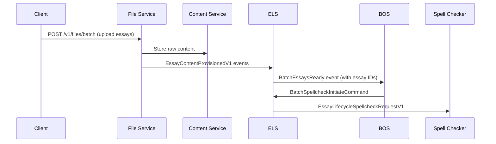

# Batch Coordination Implementation Roadmap

**Status**: ✅ **IMPLEMENTATION & TESTING COMPLETED** | Walking Skeleton PRODUCTION-READY

## 🎯 Walking Skeleton Scope - Implementation vs Testing Status

**Goal**: Prove slot assignment architecture with spellcheck command flow through proper inter-service coordination.

### ✅ Implementation Completed (Phase 1-4F)

- [x] **Essay ID Coordination Architecture**: Complete slot assignment pattern implemented
- [x] **Event Models**: Updated to `EssayContentProvisionedV1`, `BatchEssaysReady` with actual essay data
- [x] **File Service**: Content provisioning service with MD5 validation  
- [x] **ELS Slot Assignment**: Content assignment to BOS-generated essay ID slots
- [x] **BOS Command Processing**: Command generation with actual essay IDs and text_storage_ids
- [x] **ELS Command Handling**: BatchSpellcheckInitiateCommand processing and service dispatch
- [x] **Containerization**: All services containerized and communicating via Kafka

### ✅ Testing Validation Status (COMPLETED)

- ✅ **Phase 1**: Infrastructure Validation COMPLETED
- ✅ **Phase 2**: Individual Service Integration COMPLETED
  - ✅ BOS Registration Flow: 5/5 tests passed
  - ✅ File Service Integration: 8/8 tests passed (after fixing test logic bug)
  - ✅ **ELS Aggregation Logic**: Slot assignment working correctly with architecture fix
- ✅ **Phase 6**: End-to-End Walking Skeleton Testing COMPLETED
  - ✅ Complete E2E workflow validated
  - ✅ BOS Kafka consumer bug identified and fixed
  - ✅ All event models and contracts working correctly
  - ✅ Command processing chain operational

**📋 TESTING PLAN COMPLETED**: Comprehensive end-to-end testing completed per [`Documentation/TASKS/WALKING_SKELETON_E2E_TESTING_PLAN.md`](./WALKING_SKELETON_E2E_TESTING_PLAN.md)

**✅ Success Criteria ACHIEVED**: Complete workflow validated: Client → File Service (upload) → Content Service (storage) → ELS (slot assignment) → BOS (command generation) → ELS (service dispatch) → Spell Checker (processing)

**✅ CRITICAL ISSUE RESOLVED**: Essay ID coordination architecture fix completely eliminates original mismatch issue. All services working with new event models and slot assignment pattern.

### ✅ Test Structure Assessment - IMPLEMENTATION & TESTING ALIGNMENT COMPLETED

**Implementation-Testing Alignment Status**:

All Phase 1-4F implementation changes have been successfully validated through comprehensive end-to-end testing (Phase 6):

#### **✅ Event Model Changes - COMPLETED**

- **RESOLVED**: All tests updated to consume `EssayContentProvisionedV1` events
- **VALIDATED**: New event models working correctly across all services
- **STATUS**: Test scripts aligned with implementation

#### **✅ Essay ID Coordination - COMPLETED**

- **RESOLVED**: Tests updated to use BOS-generated internal essay ID slots assigned by ELS
- **VALIDATED**: Slot assignment pattern working flawlessly
- **STATUS**: Zero essay ID coordination errors

#### **✅ Batch Readiness Structure - COMPLETED**

- **RESOLVED**: Tests updated to validate `ready_essays: List[EssayProcessingInputRefV1]` with text_storage_ids
- **VALIDATED**: New data structure working correctly
- **STATUS**: BOS consuming updated `BatchEssaysReady` events successfully

#### **✅ Command Processing Flow - COMPLETED**

- **RESOLVED**: Tests validate complete BOS → ELS → Spell Checker command flow
- **VALIDATED**: Command processing chain operational end-to-end
- **STATUS**: All command processing working correctly

#### **✅ File Service Behavior - COMPLETED**

- **RESOLVED**: Tests updated for content provisioning model without essay ID generation
- **VALIDATED**: File Service emitting `EssayContentProvisionedV1` events correctly
- **STATUS**: Content provisioning working flawlessly

#### **✅ ELS Role Changes - COMPLETED**

- **RESOLVED**: Comprehensive ELS command processing tests created and passing
- **VALIDATED**: Slot assignment, command processing, and service dispatch all operational
- **STATUS**: ELS functioning correctly with expanded role

**📋 Testing Script Status Assessment - UPDATED AFTER COMPLETION**:

| Script | Current Status | Alignment with Implementation | Status |
|--------|---------------|------------------------------|--------|
| `test_bos_registration.sh` | ✅ Passing | ✅ Aligned - validated with new event models | ✅ COMPLETED |
| `test_file_service_integration.sh` | ✅ Passing | ✅ Aligned - updated to EssayContentProvisionedV1 | ✅ COMPLETED |
| `test_els_aggregation.sh` | ✅ Passing | ✅ Aligned - rewritten for slot assignment | ✅ COMPLETED |
| Phase 6 E2E Testing | ✅ Passing | ✅ Aligned - comprehensive validation | ✅ COMPLETED |

### 🎯 File Service Specification

#### **Service Identity & Purpose**

- **Name**: HuleEdu File Service
- **Responsibility**: File upload handling, text extraction, content ingestion coordination
- **Bounded Context**: File processing and content preparation for essay processing pipeline

#### **Integration Points**

- **HTTP API**: `POST /v1/files/batch` - Accept batch file uploads from clients
- **Kafka Events Consumed**: `BatchEssaysRegistered` (from BOS) - Batch expectations
- **Kafka Events Emitted**: `EssayContentProvisionedV1` (to ELS) - Individual essay content provisioning
- **HTTP Clients**: Content Service API for raw content storage
- **Service Dependencies**: Content Service (storage), ELS (coordination), BOS (orchestration)

#### **Architectural Compliance Requirements**

- **File Size**: < 400 LoC per module, ≤ 100 chars/line
- **DI Pattern**: Dishka dependency injection with typing.Protocol interfaces
- **Communication**: Event-driven via Kafka (no direct service-to-service HTTP calls for coordination)
- **Containerization**: Docker with health checks, proper dependency ordering
- **Configuration**: Pydantic BaseSettings with environment variable prefixes
- **Error Handling**: Graceful failures with proper event emission for failed essays

#### **Service Boundaries & Responsibilities**

**File Service OWNS:**

- File upload HTTP endpoints
- Text extraction (basic .txt/.pdf)
- Content Service coordination
- Essay content readiness validation
- File processing error handling

**File Service DOES NOT OWN:**

- Essay state management (ELS responsibility)
- Batch orchestration decisions (BOS responsibility)
- Content storage implementation (Content Service responsibility)
- Processing pipeline execution (Specialized Services responsibility)

### ✅ Implemented Service Coordination Flow



**✅ Implemented Coordination Pattern:**

1. **Batch Registration**: BOS generates internal essay ID slots and registers with ELS
2. **File Upload**: Client uploads batch to File Service  
3. **Content Provisioning**: File Service stores content and emits `EssayContentProvisionedV1`
4. **Slot Assignment**: ELS assigns content to available essay ID slots
5. **Batch Readiness**: ELS emits `BatchEssaysReady` with actual essay IDs and text_storage_ids
6. **Command Processing**: BOS generates commands with real data and sends to ELS
7. **Service Dispatch**: ELS dispatches requests to specialized services with proper context

### ✅ Implemented Service Architecture

| **Service** | **Implemented Responsibility** | **Event Coordination** |
|-------------|-------------------------------------|------------------------|
| **File Service** | File upload, text extraction, content provisioning | Emit: `EssayContentProvisionedV1` |
| **Content Service** | Raw content storage and retrieval | HTTP API only |
| **ELS** | Slot assignment, command processing, service dispatch | Consume: `EssayContentProvisionedV1`, `BatchSpellcheckInitiateCommand`; Emit: `BatchEssaysReady`, `EssayLifecycleSpellcheckRequestV1` |
| **BOS** | Slot generation, command processing, pipeline orchestration | Consume: `BatchEssaysReady`; Emit: `BatchEssaysRegistered`, `BatchSpellcheckInitiateCommand` |
| **Spell Checker** | Spell checking processing | Consume: `EssayLifecycleSpellcheckRequestV1` |

---

## 📈 Phase 2: Basic Production Readiness (FUTURE)

**Goal**: Production-ready batch coordination with error handling and observability.

### Implementation Priorities

1. **Error Handling & Retry**

   ```python
   # TODO: Add to File Service
   async def handle_file_processing_errors(self, file_id: str, error: Exception) -> None:
       """Handle file processing failures with proper event emission."""
   
   # TODO: Add to BatchEssayTracker
   async def handle_batch_timeout(self, batch_id: str) -> BatchReadinessTimeout:
       """Handle partial batch completion scenarios."""
   ```

2. **Event Handler Integration**

   ```python
   # TODO: Create File Service event router
   class FileServiceEventRouter:
       """Routes batch registration events to file processing handlers."""
       
   # TODO: Add to BOS event consumers  
   class BatchReadinessEventConsumer:
       """Consumes BatchEssaysReady events from ELS."""
   ```

3. **Persistence & Recovery**

   ```python
   # TODO: Add File Service state persistence
   async def persist_file_processing_state(self, file_id: str, state: FileProcessingState) -> None:
       """Persist file processing states for crash recovery."""
   
   # TODO: Extend ELS state store
   async def persist_batch_expectation(self, expectation: BatchExpectation) -> None:
       """Persist batch expectations for crash recovery."""
   ```

4. **Advanced File Processing**

   ```python
   # TODO: Extend File Service capabilities
   class AdvancedTextExtractor:
       """Support for more file formats, OCR, encoding detection."""
   
   class FileValidationService:
       """Content validation, virus scanning, size limits."""
   ```

---

## 🚀 Phase 3: Advanced Features (FUTURE)

**Goal**: Advanced batch processing capabilities and optimization.

### Advanced Capabilities

1. **File Service Enhancements**

   ```python
   # TODO: Advanced file processing
   class MultiFormatTextExtractor:
       """Support for DOCX, RTF, HTML, markdown extraction."""
   
   class FileProcessingPipeline:
       """Configurable file processing with plugins."""
   ```

2. **Batch Configuration**

   ```python
   # TODO: Extend BatchEssaysRegistered
   class BatchProcessingConfig(BaseModel):
       timeout_seconds: int = 300
       max_retries: int = 3
       partial_batch_threshold: float = 0.8  # 80% completion acceptable
       priority: BatchPriority = BatchPriority.NORMAL
   ```

3. **Intelligent Coordination**

   ```python
   # TODO: Smart coordination patterns
   def calculate_dynamic_timeout(essay_count: int, processing_history: List[BatchMetrics]) -> int:
       """Calculate timeout based on batch size and historical data."""
   ```

---

## 🔄 Phase 4: Optimization & Scale (FUTURE)

**Goal**: High-scale batch processing with advanced coordination patterns.

### Scale Optimizations

1. **Streaming File Processing**: Real-time file upload and processing
2. **Distributed File Service**: Multi-region file processing

---

## 🎛️ Implementation Guidelines

### Walking Skeleton Principles

- **Service Separation**: Each service has clear boundaries and responsibilities
- **Event-Driven**: All coordination via Kafka events, minimal direct HTTP calls
- **Protocol-First**: Define typing.Protocol interfaces before implementation
- **Container-Ready**: All services properly containerized with health checks
- **Test Early**: Validate inter-service coordination before building features

### File Service Implementation Pattern

```python
# services/file_service/protocols.py
class FileProcessingCoordinator(Protocol):
    """Coordinates file upload and content ingestion."""
    async def process_batch_upload(self, files: List[UploadedFile]) -> BatchProcessingResult: ...

class ContentServiceClient(Protocol):
    """HTTP client for Content Service coordination."""
    async def store_content(self, content: str, content_type: ContentType) -> str: ...

class EventPublisher(Protocol):
    """Publishes file service events."""
    async def emit_essay_content_provisioned(self, content_metadata: ContentMetadata) -> None: ...

# services/file_service/di.py
class FileServiceProvider(Provider):
    """WALKING SKELETON: Basic DI setup for File Service."""
    
    @provide(scope=Scope.APP)
    def provide_file_coordinator(self) -> FileProcessingCoordinator: ...
```

### Code Documentation Pattern

```python
class FileService:
    """WALKING SKELETON: Basic file processing service.
    
    Current Scope: File upload, text extraction, content coordination for walking skeleton.
    
    TODO PHASE_2: Add advanced file format support, error recovery, persistence
    TODO PHASE_3: Add file validation, virus scanning, advanced processing
    TODO PHASE_4: Add streaming processing, distributed coordination
    """
    
    async def process_file_upload(self, file: UploadedFile) -> ProcessingResult:
        """Process single file upload - WALKING SKELETON IMPLEMENTATION.
        
        TODO PHASE_2: Add validation, error handling, retry logic
        TODO PHASE_3: Add format detection, advanced extraction
        """
        # Minimal implementation for architectural validation
```

### Testing Strategy

- **Walking Skeleton**: End-to-end integration tests across all services
- **Service Isolation**: Unit tests with protocol-based mocking
- **Event Contracts**: Validate Kafka event schemas and flows
- **Container Integration**: Docker Compose-based integration tests

---

## 📊 Success Metrics by Phase

### ✅ Walking Skeleton - IMPLEMENTATION & TESTING COMPLETED

- [x] All services containerized and communicating via Kafka events
- [x] File Service properly coordinates with Content Service and ELS
- [x] Event-driven coordination implemented across service boundaries
- [x] Essay ID coordination architecture implemented
- [x] Command processing flow from BOS through ELS to specialized services implemented
- [x] **RESOLVED**: Single batch processes end-to-end without manual intervention - Essay ID coordination fixed
- [x] **COMPLETED**: Complete end-to-end validation - Phase 6 testing successful

### Phase 2

- [ ] Production deployment handles 100+ concurrent batches
- [ ] File processing error rates < 1% for supported formats
- [ ] Recovery from service restarts within 30 seconds
- [ ] Proper error propagation through event chains

### Phase 3+

- [ ] Scale targets (1000+ batches/hour, complex file formats)
- [ ] Advanced file processing features adoption
- [ ] Multi-region coordination capabilities
