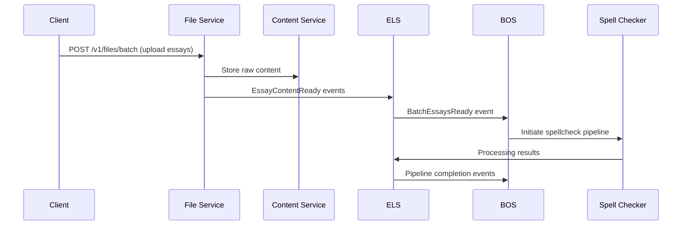

# Batch Coordination Implementation Roadmap

## 🎯 Walking Skeleton Scope (CURRENT)

**Goal**: Prove count-based aggregation architecture with minimal spellcheck-only flow through proper inter-service coordination.

### ✅ Completed Architecture

- [x] Event models defined (`BatchEssaysRegistered`, `EssayContentReady`, `BatchEssaysReady`)
- [x] ELS batch tracking logic (`BatchEssayTracker`, `BatchExpectation`)
- [x] State machine updated with `READY_FOR_PROCESSING`
- [x] PRD updated with coordination architecture
- [x] Service README updates

### 🚧 Walking Skeleton Implementation (PRIORITY ORDER)

**Architectural Decision**: File Service will be implemented as a separate microservice to properly validate inter-service coordination patterns via Kafka events.

#### **PRIORITY 1: Fix ELS Containerization (BLOCKING)**

- [x] **ELS Dockerfile**: Create following established service patterns
- [x] **ELS docker-compose.yml Entry**: Add service with proper dependencies
- [x] **ELS Integration**: Ensure worker and API both containerized
- [x] **Dependency Chain**: content_service → essay_lifecycle_service → batch_orchestrator_service

#### **PRIORITY 2: File Service Skeleton (Architecturally Compliant)**

- [ ] **Service Structure**: Create `services/file_service/` with complete service skeleton
- [ ] **Core Components**:
  - `app.py` - Quart HTTP API with file upload endpoints
  - `worker_main.py` - Kafka event consumer (for batch registrations)
  - `protocols.py` - All service protocol interfaces
  - `di.py` - Dishka DI container setup
  - `config.py` - Pydantic settings with env vars
  - `pyproject.toml` - Service dependencies and scripts
  - `Dockerfile` - Following established containerization patterns
  - `hypercorn_config.py` - HTTP server configuration
  - `__init__.py` - Service exports
- [ ] **Event Integration**:
  - Consume `BatchEssaysRegistered` from BOS
  - Emit `EssayContentReady` events to ELS
  - HTTP client for Content Service coordination
- [ ] **Containerization**: Add to docker-compose.yml with proper dependencies

#### **PRIORITY 3: End-to-End Integration**

- [ ] **Event Flow Validation**: BOS → File Service → ELS → BOS coordination
- [ ] **Walking Skeleton Test**: Single batch, 2-3 essays, spellcheck-only pipeline
- [ ] **Service Boundaries**: Verify proper separation of concerns

**Success Criteria**: Client → File Service (upload) → Content Service (storage) → ELS (aggregation) → BOS (orchestration) → Spell Checker (processing)

### 🎯 File Service Specification

#### **Service Identity & Purpose**

- **Name**: HuleEdu File Service
- **Responsibility**: File upload handling, text extraction, content ingestion coordination
- **Bounded Context**: File processing and content preparation for essay processing pipeline

#### **Integration Points**

- **HTTP API**: `POST /v1/files/batch` - Accept batch file uploads from clients
- **Kafka Events Consumed**: `BatchEssaysRegistered` (from BOS) - Batch expectations
- **Kafka Events Emitted**: `EssayContentReady` (to ELS) - Individual essay readiness
- **HTTP Clients**: Content Service API for raw content storage
- **Service Dependencies**: Content Service (storage), ELS (coordination), BOS (orchestration)

#### **Architectural Compliance Requirements**

- **File Size**: < 400 LoC per module, ≤ 100 chars/line
- **DI Pattern**: Dishka dependency injection with typing.Protocol interfaces
- **Communication**: Event-driven via Kafka (no direct service-to-service HTTP calls for coordination)
- **Containerization**: Docker with health checks, proper dependency ordering
- **Configuration**: Pydantic BaseSettings with environment variable prefixes
- **Error Handling**: Graceful failures with proper event emission for failed essays

#### **Service Boundaries & Responsibilities**

**File Service OWNS:**

- File upload HTTP endpoints
- Text extraction (basic .txt/.pdf)
- Content Service coordination
- Essay content readiness validation
- File processing error handling

**File Service DOES NOT OWN:**

- Essay state management (ELS responsibility)
- Batch orchestration decisions (BOS responsibility)
- Content storage implementation (Content Service responsibility)
- Processing pipeline execution (Specialized Services responsibility)

### 🔄 Walking Skeleton Service Coordination Flow



**Event-Driven Coordination Pattern:**

1. **File Upload**: Client uploads batch to File Service
2. **Content Storage**: File Service coordinates with Content Service
3. **Essay Readiness**: File Service emits `EssayContentReady` per essay
4. **Batch Aggregation**: ELS tracks essays, emits `BatchEssaysReady` when complete
5. **Pipeline Initiation**: BOS receives batch ready, starts processing pipeline

### 🎯 Walking Skeleton Service Architecture

| **Service** | **Walking Skeleton Responsibility** | **Event Coordination** |
|-------------|-------------------------------------|------------------------|
| **File Service** | File upload, text extraction, content coordination | Emit: `EssayContentReady` |
| **Content Service** | Raw content storage and retrieval | HTTP API only |
| **ELS** | Essay state management, batch readiness aggregation | Consume: `EssayContentReady`, Emit: `BatchEssaysReady` |
| **BOS** | Batch orchestration, pipeline management | Consume: `BatchEssaysReady`, Emit: pipeline commands |
| **Spell Checker** | Spell checking processing | Standard processing events |

---

## 📈 Phase 2: Basic Production Readiness (FUTURE)

**Goal**: Production-ready batch coordination with error handling and observability.

### Implementation Priorities

1. **Error Handling & Retry**

   ```python
   # TODO: Add to File Service
   async def handle_file_processing_errors(self, file_id: str, error: Exception) -> None:
       """Handle file processing failures with proper event emission."""
   
   # TODO: Add to BatchEssayTracker
   async def handle_batch_timeout(self, batch_id: str) -> BatchReadinessTimeout:
       """Handle partial batch completion scenarios."""
   ```

2. **Event Handler Integration**

   ```python
   # TODO: Create File Service event router
   class FileServiceEventRouter:
       """Routes batch registration events to file processing handlers."""
       
   # TODO: Add to BOS event consumers  
   class BatchReadinessEventConsumer:
       """Consumes BatchEssaysReady events from ELS."""
   ```

3. **Persistence & Recovery**

   ```python
   # TODO: Add File Service state persistence
   async def persist_file_processing_state(self, file_id: str, state: FileProcessingState) -> None:
       """Persist file processing states for crash recovery."""
   
   # TODO: Extend ELS state store
   async def persist_batch_expectation(self, expectation: BatchExpectation) -> None:
       """Persist batch expectations for crash recovery."""
   ```

4. **Advanced File Processing**

   ```python
   # TODO: Extend File Service capabilities
   class AdvancedTextExtractor:
       """Support for more file formats, OCR, encoding detection."""
   
   class FileValidationService:
       """Content validation, virus scanning, size limits."""
   ```

---

## 🚀 Phase 3: Advanced Features (FUTURE)

**Goal**: Advanced batch processing capabilities and optimization.

### Advanced Capabilities

1. **File Service Enhancements**

   ```python
   # TODO: Advanced file processing
   class MultiFormatTextExtractor:
       """Support for DOCX, RTF, HTML, markdown extraction."""
   
   class FileProcessingPipeline:
       """Configurable file processing with plugins."""
   ```

2. **Batch Configuration**

   ```python
   # TODO: Extend BatchEssaysRegistered
   class BatchProcessingConfig(BaseModel):
       timeout_seconds: int = 300
       max_retries: int = 3
       partial_batch_threshold: float = 0.8  # 80% completion acceptable
       priority: BatchPriority = BatchPriority.NORMAL
   ```

3. **Intelligent Coordination**

   ```python
   # TODO: Smart coordination patterns
   def calculate_dynamic_timeout(essay_count: int, processing_history: List[BatchMetrics]) -> int:
       """Calculate timeout based on batch size and historical data."""
   ```

---

## 🔄 Phase 4: Optimization & Scale (FUTURE)

**Goal**: High-scale batch processing with advanced coordination patterns.

### Scale Optimizations

1. **Streaming File Processing**: Real-time file upload and processing
2. **Distributed File Service**: Multi-region file processing
3. **Adaptive Batching**: Dynamic batch size optimization based on file complexity
4. **Predictive Processing**: ML-based processing time estimation

---

## 🎛️ Implementation Guidelines

### Walking Skeleton Principles

- **Service Separation**: Each service has clear boundaries and responsibilities
- **Event-Driven**: All coordination via Kafka events, minimal direct HTTP calls
- **Protocol-First**: Define typing.Protocol interfaces before implementation
- **Container-Ready**: All services properly containerized with health checks
- **Test Early**: Validate inter-service coordination before building features

### File Service Implementation Pattern

```python
# services/file_service/protocols.py
class FileProcessingCoordinator(Protocol):
    """Coordinates file upload and content ingestion."""
    async def process_batch_upload(self, files: List[UploadedFile]) -> BatchProcessingResult: ...

class ContentServiceClient(Protocol):
    """HTTP client for Content Service coordination."""
    async def store_content(self, content: str, content_type: ContentType) -> str: ...

class EventPublisher(Protocol):
    """Publishes file service events."""
    async def emit_essay_content_ready(self, essay_id: str, storage_refs: StorageRefs) -> None: ...

# services/file_service/di.py
class FileServiceProvider(Provider):
    """WALKING SKELETON: Basic DI setup for File Service."""
    
    @provide(scope=Scope.APP)
    def provide_file_coordinator(self) -> FileProcessingCoordinator: ...
```

### Code Documentation Pattern

```python
class FileService:
    """WALKING SKELETON: Basic file processing service.
    
    Current Scope: File upload, text extraction, content coordination for walking skeleton.
    
    TODO PHASE_2: Add advanced file format support, error recovery, persistence
    TODO PHASE_3: Add file validation, virus scanning, advanced processing
    TODO PHASE_4: Add streaming processing, distributed coordination
    """
    
    async def process_file_upload(self, file: UploadedFile) -> ProcessingResult:
        """Process single file upload - WALKING SKELETON IMPLEMENTATION.
        
        TODO PHASE_2: Add validation, error handling, retry logic
        TODO PHASE_3: Add format detection, advanced extraction
        """
        # Minimal implementation for architectural validation
```

### Testing Strategy

- **Walking Skeleton**: End-to-end integration tests across all services
- **Service Isolation**: Unit tests with protocol-based mocking
- **Event Contracts**: Validate Kafka event schemas and flows
- **Container Integration**: Docker Compose-based integration tests

---

## 📊 Success Metrics by Phase

### Walking Skeleton

- [ ] All services containerized and communicating via Kafka events
- [ ] Single batch processes end-to-end without manual intervention
- [ ] File Service properly coordinates with Content Service and ELS
- [ ] Event-driven coordination validated across service boundaries

### Phase 2

- [ ] Production deployment handles 100+ concurrent batches
- [ ] File processing error rates < 1% for supported formats
- [ ] Recovery from service restarts within 30 seconds
- [ ] Proper error propagation through event chains

### Phase 3+

- [ ] Scale targets (1000+ batches/hour, complex file formats)
- [ ] Advanced file processing features adoption
- [ ] Multi-region coordination capabilities
