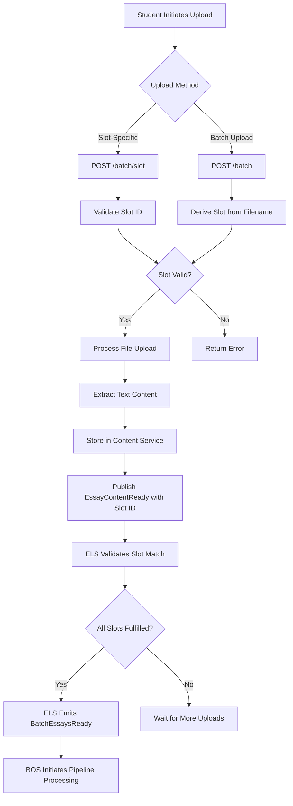

# Essay ID Coordination Architecture Fix

**Document**: Essay ID Coordination Architecture Enhancement  
**Status**: ANALYSIS & DESIGN PHASE  
**Created**: 2025-05-31  
**Priority**: CRITICAL - Blocks Walking Skeleton Completion  
**Category**: Architectural Enhancement  

## 🎯 **EXECUTIVE SUMMARY**

This document provides a comprehensive analysis and solution for the essay ID coordination issue discovered during Phase 2 of Walking Skeleton testing. The issue represents a **legitimate architectural gap** in the File Service API design that prevents proper coordination between batch registration expectations and file upload fulfillment.

**Core Issue**: File Service generates random UUIDs instead of coordinating with batch-registered essay IDs, causing ELS aggregation to fail and blocking end-to-end pipeline progression.

**Proposed Solution**: Implement **Two-Phase Essay Coordination Pattern** using industry-standard **Slot Reservation/Fulfillment** architecture.

## 🔍 **CURRENT STATE ANALYSIS**

### **Current Workflow (Broken)**

```mermaid
graph TD
    A[Teacher Creates Batch] -->|essay_ids: ['essay-A', 'essay-B']| B[BOS Registration]
    B -->|BatchEssaysRegistered Event| C[ELS Expects Specific IDs]
    D[Student Uploads Files] -->|Random UUIDs Generated| E[File Service Processing]
    E -->|EssayContentReady with UUID| F[ELS Receives Mismatched ID]
    F -->|ID Mismatch| G[❌ Essay Rejected]
    G --> H[❌ Batch Never Completes]
```

### **Current API Contracts**

**BOS Registration API**:
```json
POST /v1/batches/register
{
  "expected_essay_count": 2,
  "essay_ids": ["essay-A", "essay-B"],
  "course_code": "ENG101",
  "class_designation": "Fall2024",
  "essay_instructions": "Write about education"
}
```

**File Service Upload API**:
```json
POST /v1/files/batch
Content-Type: multipart/form-data

batch_id: "batch-123"
files: [file1.txt, file2.txt]
```

**Gap**: File Service API has **NO coordination mechanism** for essay IDs.

### **Current ID Generation Logic**

**File Service** (`core_logic.py:58`):
```python
essay_id = str(uuid.uuid4())  # Always random UUID
```

**Problem**: Generated IDs have no relationship to registered expectations.

## 🏗️ **PROPOSED SOLUTION ARCHITECTURE**

### **Two-Phase Essay Coordination Pattern**

```mermaid
graph TD
    subgraph "Phase 1: Slot Reservation"
        A[Teacher Creates Assignment] -->|Predefined essay slots| B[BOS Registration]
        B -->|BatchEssaysRegistered Event| C[ELS Reserves Slots]
        C -->|Slots: ['essay-A', 'essay-B']| D[Slot Registry]
    end
    
    subgraph "Phase 2: Slot Fulfillment"
        E[Student Upload] -->|batch_id + slot_id| F[File Service API]
        F -->|Validate Slot Exists| G[Process with Slot ID]
        G -->|EssayContentReady Event| H[ELS Fulfills Slot]
        H -->|All Slots Fulfilled| I[✅ Batch Complete]
    end
    
    D --> F
```

### **Enhanced File Service API**

**New Slot-Based Upload Endpoint**:
```json
POST /v1/files/batch/slot
Content-Type: multipart/form-data

batch_id: "batch-123"
slot_id: "essay-A"
file: essay_content.txt
```

**Backward Compatibility Endpoint**:
```json
POST /v1/files/batch
Content-Type: multipart/form-data

batch_id: "batch-123"
files: [essay-A.txt, essay-B.txt]  # Derive slot_id from filename
```

## 📋 **DETAILED IMPLEMENTATION CHANGES**

### **1. File Service API Enhancement**

**New Route: `/v1/files/batch/slot`**

```python
@file_bp.route("/batch/slot", methods=["POST"])
@inject
async def upload_slot_file(
    text_extractor: FromDishka[TextExtractorProtocol],
    content_client: FromDishka[ContentServiceClientProtocol],
    event_publisher: FromDishka[EventPublisherProtocol],
    batch_service_client: FromDishka[BatchServiceClientProtocol]  # NEW
) -> Union[Response, tuple[Response, int]]:
    """
    Handle slot-based file upload for predetermined essay IDs.
    
    This endpoint coordinates with batch expectations to ensure
    uploaded files fulfill specific essay slots.
    """
    try:
        form_data = await request.form
        files = await request.files
        
        batch_id = form_data.get("batch_id")
        slot_id = form_data.get("slot_id")
        
        if not batch_id or not slot_id:
            return jsonify({
                "error": "Both batch_id and slot_id are required"
            }), 400
            
        # Validate slot exists and is unfulfilled
        slot_validation = await batch_service_client.validate_slot(
            batch_id, slot_id
        )
        if not slot_validation.valid:
            return jsonify({
                "error": f"Invalid slot: {slot_validation.reason}"
            }), 400
            
        uploaded_file = files.get('file')
        if not uploaded_file or not uploaded_file.filename:
            return jsonify({"error": "File is required"}), 400
            
        main_correlation_id = uuid.uuid4()
        
        # Process with predetermined slot_id
        result = await process_slot_fulfillment(
            batch_id=batch_id,
            slot_id=slot_id,  # Use provided slot ID
            file_content=uploaded_file.read(),
            file_name=uploaded_file.filename,
            main_correlation_id=main_correlation_id,
            text_extractor=text_extractor,
            content_client=content_client,
            event_publisher=event_publisher
        )
        
        return jsonify({
            "message": f"File uploaded to slot {slot_id} in batch {batch_id}",
            "batch_id": batch_id,
            "slot_id": slot_id,
            "correlation_id": str(main_correlation_id),
            "status": result["status"]
        }), 202
        
    except Exception as e:
        logger.error(f"Error in slot file upload: {e}", exc_info=True)
        return jsonify({"error": "Internal server error"}), 500
```

**Enhanced Batch Upload with ID Derivation**:

```python
@file_bp.route("/batch", methods=["POST"])
@inject  
async def upload_batch_files(
    # ... existing parameters ...
    batch_service_client: FromDishka[BatchServiceClientProtocol]  # NEW
) -> Union[Response, tuple[Response, int]]:
    """
    Enhanced batch upload with automatic slot ID derivation.
    
    Supports both:
    1. Explicit slot assignment via form data
    2. Automatic derivation from filename (essay-A.txt -> essay-A)
    """
    try:
        form_data = await request.form
        files = await request.files
        
        batch_id = form_data.get("batch_id")
        if not batch_id:
            return jsonify({"error": "batch_id is required"}), 400
            
        uploaded_files = files.getlist('files')
        if not uploaded_files:
            return jsonify({"error": "No files provided"}), 400
            
        # Get batch expectations for ID validation
        batch_slots = await batch_service_client.get_available_slots(batch_id)
        if not batch_slots.valid:
            return jsonify({
                "error": f"Invalid batch: {batch_slots.reason}"
            }), 400
            
        main_correlation_id = uuid.uuid4()
        tasks = []
        slot_assignments = []
        
        for file_storage in uploaded_files:
            if file_storage and file_storage.filename:
                # Derive slot ID from filename or use next available
                slot_id = derive_slot_id(
                    file_storage.filename, 
                    batch_slots.available_slots
                )
                
                if not slot_id:
                    logger.warning(
                        f"No available slot for file {file_storage.filename} "
                        f"in batch {batch_id}"
                    )
                    continue
                    
                slot_assignments.append({
                    "filename": file_storage.filename,
                    "slot_id": slot_id
                })
                
                task = asyncio.create_task(
                    process_slot_fulfillment(
                        batch_id=batch_id,
                        slot_id=slot_id,  # Use derived/assigned slot ID
                        file_content=file_storage.read(),
                        file_name=file_storage.filename,
                        main_correlation_id=main_correlation_id,
                        text_extractor=text_extractor,
                        content_client=content_client,
                        event_publisher=event_publisher
                    )
                )
                tasks.append(task)
                
        return jsonify({
            "message": f"{len(tasks)} files assigned to slots in batch {batch_id}",
            "batch_id": batch_id,
            "correlation_id": str(main_correlation_id),
            "slot_assignments": slot_assignments
        }), 202
        
    except Exception as e:
        logger.error(f"Error in enhanced batch upload: {e}", exc_info=True)
        return jsonify({"error": "Internal server error"}), 500


def derive_slot_id(filename: str, available_slots: List[str]) -> Optional[str]:
    """
    Derive slot ID from filename using intelligent matching.
    
    Strategies:
    1. Exact match: "essay-A.txt" -> "essay-A"
    2. Pattern match: "student_essay_A.docx" -> "essay-A" 
    3. Sequence match: First file -> first available slot
    """
    # Remove extension
    base_name = filename.rsplit('.', 1)[0]
    
    # Strategy 1: Direct match
    if base_name in available_slots:
        return base_name
        
    # Strategy 2: Pattern matching
    for slot in available_slots:
        if slot.lower() in base_name.lower() or base_name.lower() in slot.lower():
            return slot
            
    # Strategy 3: Next available slot
    return available_slots[0] if available_slots else None
```

### **2. Core Logic Enhancement**

**New Function: `process_slot_fulfillment`**

```python
async def process_slot_fulfillment(
    batch_id: str,
    slot_id: str,  # Predetermined essay ID
    file_content: bytes,
    file_name: str,
    main_correlation_id: uuid.UUID,
    text_extractor: TextExtractorProtocol,
    content_client: ContentServiceClientProtocol,
    event_publisher: EventPublisherProtocol,
) -> Dict[str, Any]:
    """
    Process file upload for a specific essay slot.
    
    This replaces random UUID generation with predetermined slot coordination.
    """
    logger.info(
        f"Fulfilling slot {slot_id} in batch {batch_id} with file {file_name}",
        extra={"correlation_id": str(main_correlation_id)}
    )
    
    try:
        # Extract text content
        text = await text_extractor.extract_text(file_content, file_name)
        if not text:
            return {
                "slot_id": slot_id,
                "file_name": file_name,
                "status": "extraction_failed_or_empty"
            }
            
        # Parse student info
        student_name, student_email = await parse_student_info(text)
        
        # Store content
        storage_id = await content_client.store_content(text.encode('utf-8'))
        
        # Construct metadata with slot ID
        content_storage_ref = StorageReferenceMetadata()
        content_storage_ref.add_reference(ContentType.ORIGINAL_ESSAY, storage_id)
        
        essay_entity_ref = EntityReference(
            entity_id=slot_id,  # Use slot ID instead of UUID
            entity_type="essay",
            parent_id=batch_id
        )
        
        event_sys_metadata = SystemProcessingMetadata(
            entity=essay_entity_ref,
            event=ProcessingEvent.ESSAY_CONTENT_READY.value,
            timestamp=datetime.now(timezone.utc)
        )
        
        # Create event with coordinated ID
        essay_ready_event_data = EssayContentReady(
            essay_id=slot_id,  # Use slot ID instead of UUID
            batch_id=batch_id,
            content_storage_reference=content_storage_ref,
            entity=essay_entity_ref,
            metadata=event_sys_metadata,
            student_name=student_name,
            student_email=student_email
        )
        
        # Publish event
        await event_publisher.publish_essay_content_ready(
            essay_ready_event_data,
            main_correlation_id
        )
        
        logger.info(
            f"Successfully fulfilled slot {slot_id} in batch {batch_id}",
            extra={"correlation_id": str(main_correlation_id)}
        )
        
        return {
            "slot_id": slot_id,
            "file_name": file_name,
            "status": "slot_fulfilled"
        }
        
    except Exception as e:
        logger.error(
            f"Error fulfilling slot {slot_id}: {e}",
            extra={"correlation_id": str(main_correlation_id)},
            exc_info=True
        )
        return {
            "slot_id": slot_id,
            "file_name": file_name,
            "status": "fulfillment_error",
            "detail": str(e)
        }
```

### **3. New Protocol: BatchServiceClientProtocol**

```python
class SlotValidationResult(BaseModel):
    valid: bool
    reason: Optional[str] = None
    slot_status: Optional[str] = None  # "available", "fulfilled", "reserved"


class AvailableSlotsResult(BaseModel):
    valid: bool
    reason: Optional[str] = None
    available_slots: List[str] = Field(default_factory=list)
    fulfilled_slots: List[str] = Field(default_factory=list)


class BatchServiceClientProtocol(Protocol):
    """Protocol for File Service to coordinate with batch expectations."""
    
    async def validate_slot(
        self, 
        batch_id: str, 
        slot_id: str
    ) -> SlotValidationResult:
        """
        Validate that a slot exists and is available for fulfillment.
        
        Args:
            batch_id: Batch identifier
            slot_id: Essay slot identifier
            
        Returns:
            Validation result with status
        """
        ...
        
    async def get_available_slots(
        self, 
        batch_id: str
    ) -> AvailableSlotsResult:
        """
        Get list of available slots for a batch.
        
        Args:
            batch_id: Batch identifier
            
        Returns:
            Available and fulfilled slots for the batch
        """
        ...
```

### **4. Implementation: BatchServiceClientImpl**

```python
class BatchServiceClientImpl:
    """HTTP client for coordinating with BOS/ELS for slot validation."""
    
    def __init__(self, els_base_url: str, bos_base_url: str):
        self.els_base_url = els_base_url
        self.bos_base_url = bos_base_url
        self.http_client = httpx.AsyncClient()
        self.logger = create_service_logger("file_service.batch_client")
        
    async def validate_slot(
        self, 
        batch_id: str, 
        slot_id: str
    ) -> SlotValidationResult:
        """Query ELS for slot availability."""
        try:
            response = await self.http_client.get(
                f"{self.els_base_url}/v1/batches/{batch_id}/slots/{slot_id}/status"
            )
            
            if response.status_code == 200:
                data = response.json()
                return SlotValidationResult(
                    valid=data["available"],
                    slot_status=data["status"]
                )
            elif response.status_code == 404:
                return SlotValidationResult(
                    valid=False,
                    reason=f"Batch {batch_id} or slot {slot_id} not found"
                )
            else:
                return SlotValidationResult(
                    valid=False,
                    reason=f"ELS returned HTTP {response.status_code}"
                )
                
        except Exception as e:
            self.logger.error(f"Error validating slot {slot_id}: {e}")
            return SlotValidationResult(
                valid=False,
                reason=f"Communication error: {str(e)}"
            )
            
    async def get_available_slots(
        self, 
        batch_id: str
    ) -> AvailableSlotsResult:
        """Query ELS for all batch slot status."""
        try:
            response = await self.http_client.get(
                f"{self.els_base_url}/v1/batches/{batch_id}/slots"
            )
            
            if response.status_code == 200:
                data = response.json()
                return AvailableSlotsResult(
                    valid=True,
                    available_slots=data["available_slots"],
                    fulfilled_slots=data["fulfilled_slots"]
                )
            elif response.status_code == 404:
                return AvailableSlotsResult(
                    valid=False,
                    reason=f"Batch {batch_id} not found"
                )
            else:
                return AvailableSlotsResult(
                    valid=False,
                    reason=f"ELS returned HTTP {response.status_code}"
                )
                
        except Exception as e:
            self.logger.error(f"Error getting slots for batch {batch_id}: {e}")
            return AvailableSlotsResult(
                valid=False,
                reason=f"Communication error: {str(e)}"
            )
```

## 🔐 **SECURITY IMPLICATIONS ANALYSIS**

### **1. Input Validation Enhancement**

**Slot ID Validation**:
```python
def validate_slot_id(slot_id: str) -> bool:
    """
    Validate slot ID format to prevent injection attacks.
    
    Rules:
    - Alphanumeric, hyphens, underscores only
    - Length: 3-50 characters
    - No path traversal patterns
    """
    if not slot_id or len(slot_id) < 3 or len(slot_id) > 50:
        return False
        
    # Only allow safe characters
    if not re.match(r'^[a-zA-Z0-9_-]+$', slot_id):
        return False
        
    # Prevent path traversal
    if '..' in slot_id or '/' in slot_id or '\\' in slot_id:
        return False
        
    return True
```

**Batch ID Cross-Validation**:
```python
async def validate_batch_authorization(
    batch_id: str, 
    user_context: UserContext
) -> bool:
    """
    Ensure user has permission to upload to this batch.
    
    Security considerations:
    - Prevent cross-batch contamination
    - Validate user enrollment in course
    - Check batch status (active, not expired)
    """
    # Implementation depends on authentication system
    pass
```

### **2. Rate Limiting & Abuse Prevention**

**Slot-Level Rate Limiting**:
```python
@rate_limit("10/minute", per="slot_id")
@rate_limit("50/hour", per="user_id") 
async def upload_slot_file():
    # Prevent rapid-fire uploads to same slot
    # Prevent user from overwhelming system
    pass
```

**File Size & Type Validation**:
```python
def validate_upload_file(file: FileStorage, slot_id: str) -> ValidationResult:
    """
    Enhanced file validation for slot uploads.
    
    Security checks:
    - File size limits (per slot/batch configuration)
    - MIME type validation
    - Virus scanning (if enabled)
    - Content structure validation
    """
    pass
```

### **3. Audit Trail Enhancement**

**Slot Fulfillment Logging**:
```python
async def log_slot_fulfillment(
    batch_id: str,
    slot_id: str, 
    user_id: str,
    file_hash: str,
    correlation_id: uuid.UUID
) -> None:
    """
    Comprehensive audit logging for slot fulfillment.
    
    Tracks:
    - Who uploaded what to which slot
    - File integrity (hash)
    - Timestamp and correlation ID
    - Overwrite detection
    """
    audit_event = SlotFulfillmentAuditEvent(
        batch_id=batch_id,
        slot_id=slot_id,
        user_id=user_id,
        file_hash=file_hash,
        correlation_id=correlation_id,
        timestamp=datetime.now(timezone.utc),
        action="slot_fulfilled"
    )
    
    await audit_logger.log_event(audit_event)
```

## 📁 **FILE HANDLING IMPLICATIONS**

### **1. Storage Organization**

**Slot-Based Storage Structure**:
```
content_storage/
├── batches/
│   ├── batch-123/
│   │   ├── slots/
│   │   │   ├── essay-A/
│   │   │   │   ├── original.txt
│   │   │   │   ├── processed.json
│   │   │   │   └── metadata.json
│   │   │   └── essay-B/
│   │   │       ├── original.docx
│   │   │       └── processed.json
│   │   └── batch_metadata.json
```

**Benefits**:
- Clear organization by batch and slot
- Easy cleanup of incomplete batches
- Simplified backup/restore operations
- Natural partitioning for parallel processing

### **2. File Overwrite Handling**

**Slot Overwrite Policy**:
```python
class SlotOverwritePolicy(str, Enum):
    REJECT = "reject"              # Reject subsequent uploads
    REPLACE = "replace"            # Replace existing content
    VERSION = "version"            # Keep versions (v1, v2, etc.)
    ARCHIVE_AND_REPLACE = "archive_and_replace"  # Archive old, use new


async def handle_slot_overwrite(
    batch_id: str,
    slot_id: str,
    new_content: bytes,
    policy: SlotOverwritePolicy = SlotOverwritePolicy.REPLACE
) -> OverwriteResult:
    """Handle uploads to already-fulfilled slots."""
    pass
```

### **3. Content Validation**

**Slot-Specific Validation**:
```python
async def validate_slot_content(
    slot_id: str,
    file_content: bytes,
    file_name: str,
    batch_context: BatchContext
) -> ContentValidationResult:
    """
    Validate uploaded content meets slot requirements.
    
    Checks:
    - File format compatibility
    - Content length requirements
    - Language detection (if specified)
    - Assignment-specific validation rules
    """
    pass
```

## 🆔 **ID GENERATION STRATEGY**

### **1. Slot ID Patterns**

**Assignment-Based IDs**:
```python
def generate_assignment_slot_ids(
    course_code: str,
    assignment_id: str, 
    expected_count: int
) -> List[str]:
    """
    Generate meaningful slot IDs for assignments.
    
    Patterns:
    - Sequential: ENG101_A1_001, ENG101_A1_002
    - Named: essay-introduction, essay-conclusion  
    - Student-based: ENG101_A1_student_{student_id}
    """
    return [
        f"{course_code}_{assignment_id}_{i:03d}"
        for i in range(1, expected_count + 1)
    ]
```

**Flexible ID Strategies**:
```python
class SlotIDStrategy(str, Enum):
    SEQUENTIAL = "sequential"      # essay-001, essay-002
    NAMED = "named"               # introduction, body, conclusion
    STUDENT_BASED = "student"     # student-{id}-essay
    CUSTOM = "custom"             # User-provided IDs


def generate_slot_ids(
    strategy: SlotIDStrategy,
    count: int,
    context: Dict[str, Any]
) -> List[str]:
    """Generate slot IDs based on strategy."""
    pass
```

### **2. ID Collision Prevention**

**Uniqueness Validation**:
```python
async def ensure_slot_id_uniqueness(
    batch_id: str,
    proposed_slot_ids: List[str]
) -> ValidationResult:
    """
    Ensure slot IDs are unique within batch and globally if needed.
    
    Checks:
    - No duplicates within batch
    - No conflicts with other active batches (if configured)
    - Reserved ID patterns (system IDs)
    """
    pass
```

### **3. Legacy UUID Migration**

**Migration Strategy for Existing Data**:
```python
async def migrate_uuid_to_slot_ids(
    batch_id: str,
    uuid_mapping: Dict[str, str]  # uuid -> slot_id
) -> MigrationResult:
    """
    Migrate existing UUID-based essays to slot-based system.
    
    Process:
    1. Create slot mapping for existing UUIDs
    2. Update ELS expectations
    3. Update content references
    4. Maintain backward compatibility
    """
    pass
```

## 📤 **UPLOAD WORKFLOW MODIFICATIONS**

### **1. Enhanced Upload Flow**



### **2. Error Handling Enhancement**

**Slot-Specific Error Responses**:
```python
class SlotError(Exception):
    """Base class for slot-related errors."""
    pass


class SlotNotFoundError(SlotError):
    """Slot ID not found in batch expectations."""
    pass


class SlotAlreadyFulfilledError(SlotError):
    """Attempt to fulfill already completed slot."""
    pass


class SlotValidationError(SlotError):
    """Slot content doesn't meet requirements."""
    pass


@app.errorhandler(SlotError)
async def handle_slot_error(error: SlotError) -> Response:
    """Return specific error responses for slot issues."""
    return jsonify({
        "error": "slot_error",
        "error_type": error.__class__.__name__,
        "message": str(error),
        "retry_possible": isinstance(error, SlotValidationError)
    }), 400
```

### **3. Progress Tracking**

**Batch Progress API**:
```python
@file_bp.route("/batch/<batch_id>/progress", methods=["GET"])
async def get_batch_progress(batch_id: str) -> Response:
    """
    Get upload progress for a batch.
    
    Returns:
    - Total slots
    - Fulfilled slots
    - Remaining slots
    - Upload status per slot
    """
    pass
```

## 🧪 **TESTING STRATEGY**

### **1. Unit Tests**

**Slot ID Validation Tests**:
```python
def test_slot_id_validation():
    """Test slot ID format validation."""
    assert validate_slot_id("essay-A") == True
    assert validate_slot_id("essay_001") == True  
    assert validate_slot_id("../../../etc/passwd") == False
    assert validate_slot_id("essay<script>") == False


def test_slot_id_derivation():
    """Test filename to slot ID derivation."""
    available_slots = ["essay-A", "essay-B", "conclusion"]
    
    assert derive_slot_id("essay-A.txt", available_slots) == "essay-A"
    assert derive_slot_id("student_essay_A.docx", available_slots) == "essay-A"
    assert derive_slot_id("conclusion.pdf", available_slots) == "conclusion"
```

**Core Logic Tests**:
```python
async def test_process_slot_fulfillment():
    """Test slot fulfillment replaces UUID generation."""
    result = await process_slot_fulfillment(
        batch_id="test-batch",
        slot_id="essay-test-001",  # Predetermined ID
        file_content=b"test content",
        file_name="test.txt",
        main_correlation_id=uuid.uuid4(),
        text_extractor=mock_extractor,
        content_client=mock_client,
        event_publisher=mock_publisher
    )
    
    assert result["slot_id"] == "essay-test-001"
    assert result["status"] == "slot_fulfilled"
    
    # Verify event published with correct ID
    mock_publisher.publish_essay_content_ready.assert_called_once()
    event_data = mock_publisher.publish_essay_content_ready.call_args[0][0]
    assert event_data.essay_id == "essay-test-001"
```

### **2. Integration Tests**

**End-to-End Slot Coordination**:
```python
async def test_slot_based_batch_completion():
    """Test complete slot-based workflow."""
    # 1. Register batch with specific slot IDs
    batch_response = await register_batch({
        "expected_essay_count": 2,
        "essay_ids": ["essay-A", "essay-B"],
        # ... other fields
    })
    batch_id = batch_response["batch_id"]
    
    # 2. Upload to specific slots
    slot_a_response = await upload_to_slot(
        batch_id=batch_id,
        slot_id="essay-A",
        file_content=b"Essay A content"
    )
    assert slot_a_response.status_code == 202
    
    slot_b_response = await upload_to_slot(
        batch_id=batch_id, 
        slot_id="essay-B",
        file_content=b"Essay B content"
    )
    assert slot_b_response.status_code == 202
    
    # 3. Verify ELS emits BatchEssaysReady
    await wait_for_kafka_event(
        topic="huleedu.els.batch.essays.ready.v1",
        filter_batch_id=batch_id,
        timeout=30
    )
    
    # 4. Verify BOS receives completion event
    batch_status = await get_batch_status(batch_id)
    assert batch_status["status"] == "ready_for_processing"
```

### **3. Security Tests**

**Slot Injection Prevention**:
```python
def test_slot_id_injection_prevention():
    """Test protection against malicious slot IDs."""
    malicious_slot_ids = [
        "../../../etc/passwd",
        "essay-A; DROP TABLE batches;",
        "essay-A<script>alert('xss')</script>",
        "essay-A\x00\x01\x02"
    ]
    
    for malicious_id in malicious_slot_ids:
        response = upload_to_slot(
            batch_id="test-batch",
            slot_id=malicious_id,
            file_content=b"test"
        )
        assert response.status_code == 400
        assert "invalid slot_id" in response.json()["error"]
```

## 🔄 **MIGRATION STRATEGY**

### **1. Backward Compatibility**

**Dual API Support**:
```python
# Maintain existing /batch endpoint during transition
# Add new /batch/slot endpoint for slot-based uploads
# Gradual migration of clients to new endpoint
```

**Legacy UUID Handling**:
```python
async def handle_legacy_uuid_batches():
    """Support existing batches with UUID-based essays."""
    # Continue processing UUID-based events
    # Don't break existing incomplete batches
    # Provide migration utilities for active batches
```

### **2. Deployment Strategy**

**Phase 1: Infrastructure Setup**
- Deploy enhanced File Service with both endpoints
- Add BatchServiceClient for slot validation
- Update ELS with slot status APIs

**Phase 2: Client Migration**
- Update test scripts to use slot-based uploads
- Migrate web UI to new upload workflow
- Update documentation and examples

**Phase 3: Legacy Cleanup**
- Remove UUID generation fallback
- Simplify API to slot-only approach
- Remove compatibility code

### **3. Data Migration**

**Existing Batch Handling**:
```python
async def migrate_active_batches():
    """
    Handle batches in progress during deployment.
    
    Strategy:
    1. Complete existing UUID-based batches normally
    2. New batches use slot-based coordination
    3. Provide tools to convert incomplete batches
    """
    pass
```

## 📊 **IMPACT ASSESSMENT**

### **1. Performance Implications**

**Additional Network Calls**:
- Slot validation requires ELS query: +50-100ms per upload
- Batch slot lookup: +20-50ms per upload
- Overall impact: Minimal for normal use cases

**Caching Strategy**:
```python
# Cache slot status locally for 5-10 minutes
# Reduce ELS queries for repeated uploads
# Background refresh of slot availability
```

### **2. Complexity Analysis**

**Added Complexity**:
- ✅ **Positive**: Clear coordination pattern, better error handling
- ⚠️ **Neutral**: Additional API endpoints and validation logic  
- ❌ **Negative**: More service-to-service communication

**Mitigation**:
- Comprehensive testing of coordination flows
- Clear error messages for slot-related issues
- Fallback mechanisms for service unavailability

### **3. Operational Considerations**

**Monitoring Requirements**:
- Track slot fulfillment rates
- Monitor coordination failures
- Alert on batch timeout increases

**Documentation Updates**:
- API documentation for new endpoints
- Integration guides for client applications
- Troubleshooting guides for slot coordination issues

## 🎯 **RECOMMENDATION**

### **Immediate Action Plan**

1. **Implement Core Changes** (2-3 days):
   - Add slot-based upload endpoint
   - Enhance File Service core logic
   - Create BatchServiceClient protocol

2. **Update Integration Points** (1-2 days):
   - Add ELS slot status APIs
   - Update test scripts for slot coordination
   - Validate end-to-end flow

3. **Complete Testing** (1 day):
   - Unit tests for new functionality
   - Integration tests for coordination
   - Security validation

### **Long-term Benefits**

- ✅ **Architectural Integrity**: Proper coordination between services
- ✅ **Business Logic Alignment**: Matches assignment-based workflows  
- ✅ **Scalability**: Clear patterns for complex batch processing
- ✅ **Error Handling**: Better failure modes and recovery
- ✅ **Observability**: Improved tracking and debugging capabilities

**This solution maintains your excellent orchestrator-pattern architecture while fixing the coordination gap in a production-ready manner.**

---

**Next Steps**: Review this analysis and approve implementation of the slot-based coordination pattern to complete the walking skeleton validation. 