# TASK TICKET: PIPELINE_HARDENING_V1.1 — Consolidated Plan

Status: REFINED & READY FOR IMPLEMENTATION
Epic: Pipeline Reliability & Robustness
Owner: @LeadDeveloper
Labels: architecture, reliability, idempotency, redis, data-integrity, observability

## 0. Legend & High-Level Goal

This document outlines the developer-facing tasks to harden the entire data ingestion and event processing pipeline. The goal is to evolve from "it works" to "it is resilient, auditable, and production-ready."

```mermaid
graph TD
    subgraph "Legend & High-Level Goal"
        A[Goal: Resilient, Auditable, Production-Ready Pipeline]
        B("✅ Already exists — keep")
        C("➕ New code / object")
        D("🔄 Modify existing code")
        E("⚙️ Ops / infra work")
        F("📈 Metrics / logging")
        G("🧪 Tests")
    end
```



### 1. Roll-out Steps (Chronological Order)

This is the required implementation order to ensure dependencies are met.


- Merge Contract Changes: Update common_core with new/modified event models and enums (Tasks 2, 4, 6.1). Release new version.
- Infra Setup: Add Redis to docker-compose.yml and create DI providers (Task 3).
- File Service Refactor: Implement pre-emptive blob storage and new event emissions (Task 2, 6.2).
- Idempotency Layer: Implement the idempotency decorator and the deterministic ID generation utility in the shared library (Task 3).
- Consumer Refactor: Apply the idempotent consumer decorator to all Kafka workers (ELS, BOS, Spell Checker, etc.).
- Observability: Add refined metrics and structured logging keys (Tasks 4, 7).
- E2E Validation: Implement and run the full test matrix (Task 8).
- Monitoring: Wire Prometheus alerts for new metrics (DLQ, timeouts).

### 2. Pre-emptive Raw File Storage (🔄 File Service)

Motivation: Establish an immutable source of truth for every uploaded file, enabling robust reprocessing and decoupling storage from interpretation.


- **Step 2.1**: 🔄 Enhance ContentType Enum.

    ```python
    # common_core/src/common_core/enums.py
    class ContentType(str, Enum):
     # ...
     RAW_UPLOAD_BLOB = "raw_upload_blob"
     EXTRACTED_PLAINTEXT = "extracted_plaintext"
    ```

- **Step 2.2**: 🔄 Update Event Contracts (EssayContentProvisionedV1, EssayValidationFailedV1).

    ```python
    # common_core/src/common_core/events/file_events.py
    class EssayContentProvisionedV1(BaseModel):
     raw_file_storage_id: str
     # ...

    class EssayValidationFailedV1(BaseModel):
     raw_file_storage_id: str
     # ...
    ```

- **Step 2.3**: 🔄 Update ContentServiceClientProtocol in File Service to accept ContentType.

    ```python
    # services/file_service/protocols.py
    async def store_content(..., content_type: ContentType) -> str:
    ```

- **Step 2.4**: 🔄 Refactor core_logic.py to store the raw blob first, then extract, validate, and store the plaintext.
    See logic in the "Refined Task Ticket" artifact.
- **Step 2.5**: 🧪 Unit Test: test_process_single_file_stores_raw_blob_first.
    Assert content_client.store_content is called with ContentType.RAW_UPLOAD_BLOB before extraction.
- **Step 2.6**: 🧪 E2E Test: Verify final Kafka events contain raw_file_storage_id.
    Listen to Kafka and validate the Pydantic model structure.

### 3. Event Idempotency (➕ All Consumers)

Motivation: Kafka provides an at-least-once delivery guarantee. This means under certain conditions (e.g., consumer rebalance, network issues, producer retries), a consumer service might receive the same event multiple times. Without a robust idempotency mechanism, these duplicates can cause severe data corruption, such as crediting a user twice, initiating the same spellcheck job multiple times, or creating duplicate records. The goal of this epic is to move from at-least-once delivery to effectively-once processing, ensuring system stability and data integrity. We will use the industry-standard, high-performance pattern of Redis for atomic check-and-set operations.

- **Step 3.1**: ⚙️ Add Redis to Infrastructure.
    Add the `redis:7-alpine` service to `docker-compose.yml`. In the `di.py` of each consumer service, create a provider that yields a connected `redis.asyncio.Redis` client. A `RedisClientProtocol` should be defined in the service's `protocols.py` for type-safe injection.
- **Step 3.2**: ➕ Generate Deterministic Event ID.
    Crucially, the idempotency key must be derived from the stable content of the event's data payload, not from transient envelope metadata like a producer-generated UUID. A producer retry would generate a new `event_id`, defeating the check. Create a utility in `common_core/events/utils.py` that generates a SHA256 hash from a canonical, sorted JSON representation of the event's data field.
- **Step 3.3**: ➕ Create Idempotency Decorator.
    To promote DRY principles and consistent implementation, this logic will be abstracted into a decorator within `huleedu_service_libs`. This decorator will use the deterministic ID to perform a SETNX (SET if Not eXists) operation in Redis. The key should have a reasonable TTL (e.g., 24-48 hours) to prevent Redis from filling up with old event keys.
- **Step 3.4**: 🔄 Apply Decorator to All Consumers.
    The new `@idempotent_consumer` decorator will be applied to the primary message handling function within each Kafka worker service (ELS, BOS, SpellCheckerService, etc.). This ensures the idempotency check is the first step in the processing logic.
- **Step 3.5**: 🧪 Chaos Test & Validation.
    Write
