Of course. Here is the appended proposal as requested.

### Future Enhancement Proposal: File Service Validation Layer

**Date**: 2025-01-16
**Status**: 📋 **PLANNED** - Upstream Validation Enhancement
**Priority**: 🔧 **MEDIUM** - Quality of Life Improvement

#### Problem Statement

The spell checker service is currently receiving problematic content that causes intermittent hangs and failures, including:

* **Empty files** (0 bytes)
* **Very short content** (< 10 characters)
* **Malformed text** that may cause issues with downstream dependencies like `pyspellchecker`.

The root issue is that the `FileService` accepts and processes any content without proper validation, pushing the responsibility downstream.

#### Current Architecture Problem

```mermaid
graph TD
    A[File Upload] -->|Any Content| B[File Service]
    B -->|No Validation| C[Content Service]
    C --> D[ELS]
    D --> E[Spell Checker]
    E -->|Fails on Empty/Bad Content| F[❌ Pipeline Failure]
```



#### Proposed Solution: Upstream Validation

The `FileService` should act as a quality gate, validating content upon upload.

```mermaid
graph TD
    A[File Upload] -->|Raw Content| B[File Service]
    B -->|Validation Layer| C{Content Valid?}
    C -->|❌ Invalid| D[Reject with Error]
    C -->|✅ Valid| E[Content Service]
    E --> F[ELS]
    F --> G[Spell Checker]
    G -->|Clean Content| H[✅ Success]
```



#### Implementation Plan

**Phase 1: Basic Content Validation**

Add initial validation logic to the `FileService` before content is sent to the `ContentService`.

```python
class ContentValidator:
    def validate_essay_content(self, text: str, filename: str) -> ValidationResult:
        """Validate essay content before processing."""
        
        # 1. Empty content check
        if not text or len(text.strip()) == 0:
            return ValidationResult(
                valid=False, 
                reason="Empty content",
                suggestion="Ensure file contains text"
            )
        
        # 2. Minimum content length
        if len(text.strip()) < 50:  # Minimum meaningful essay length
            return ValidationResult(
                valid=False,
                reason=f"Content too short ({len(text.strip())} chars)",
                suggestion="Essays should be at least 50 characters"
            )
        
        # 3. Character encoding validation
        if not self._is_valid_text_encoding(text):
            return ValidationResult(
                valid=False,
                reason="Invalid text encoding",
                suggestion="Ensure file uses UTF-8 encoding"
            )
        
        return ValidationResult(valid=True)
```

**Phase 2: Enhanced Validation Rules**
* Maximum content length to prevent processing extremely large files.
* Language detection to ensure content is in an expected language.
* Format validation for different file types.
* Basic structural validation (e.g., checking for essay-like structure).

**Phase 3: User Feedback Integration**
* Return clear and actionable error messages to the client.
* Implement validation statistics for monitoring purposes.
* Develop a suggestion system for common user errors.

#### File Service Changes Required

1.  **New Validation Module**: A new module will be created within the `FileService` to house the validation logic.
    ```
    services/file_service/
    ├── validation/
    │   ├── __init__.py
    │   ├── content_validator.py
    │   ├── validation_rules.py
    │   └── validation_results.py
    ```

2.  **Updated Processing Pipeline**: The core processing logic will be updated to include the validation step.
    ```python
    # In file_service/core_logic.py
    async def process_uploaded_file(file_data: bytes, filename: str) -> ProcessingResult:
        # Extract text content
        text_content = await extract_text_from_file(file_data, filename)
        
        # NEW: Validate content before processing
        validation_result = content_validator.validate_essay_content(text_content, filename)
        if not validation_result.valid:
            return ProcessingResult(
                success=False,
                error=f"Content validation failed: {validation_result.reason}",
                suggestion=validation_result.suggestion
            )
        
        # Continue with normal processing...
        essay_metadata = await extract_essay_metadata(text_content, filename)
        storage_id = await store_content(text_content)
        # ...
    ```

3.  **API Response Updates**: The API will be updated to return clear validation errors.
    ```json
    {
      "success": false,
      "error": "Content validation failed: Empty content",
      "suggestion": "Ensure file contains text",
      "file": "MHHXUEXU 50 (SA24D ENG 5 WRITING 2025).txt",
      "validation_code": "EMPTY_CONTENT"
    }
    ```

#### Expected Benefits

* **Immediate**:
    * Elimination of failures due to empty file processing.
    * Clearer error feedback for users.
    * Reduced load on downstream services.
* **Long-term**:
    * A more robust data processing pipeline.
    * Improved user experience.
    * Simplified debugging and monitoring.

#### Implementation Notes

* **Configuration Options**: Validation rules, such as minimum and maximum content length and allowed languages, will be configurable.
* **Backward Compatibility**: The new validation can be rolled out gradually using feature flags and a "warning mode" before strict enforcement is enabled.

#### Testing Requirements

* **Unit Tests**: Will cover all validation rules and edge cases.
* **Integration Tests**: Will validate the end-to-end pipeline with invalid content to ensure proper error propagation.
* **Load Tests**: Will assess the performance of the validation logic under high upload volumes.

#### Success Metrics

* Elimination of empty content reaching the spell checker service.
* Over 80% reduction in errors within the spell checker service.
* Improved user feedback regarding file upload errors.
* Faster pipeline processing due to the elimination of wasted cycles on invalid content.

---

### Proposed Change: Resilient Pipeline Progression in BOS

#### Objective
Modify the Batch Orchestrator Service to gracefully handle partially successful phases. Instead of halting the entire pipeline, it should proceed to the next phase with the subset of essays that were successfully processed. This action must be explicitly logged and announced via an event for external system visibility.

#### 1. State Persistence and Logging
* **Accurate State**: When a phase completes with partial success, the `ProcessingPipelineState` in BOS will be updated with the status `COMPLETED_WITH_PARTIAL_SUCCESS`, not a generic `FAILED`. This provides a precise and auditable record of the batch's state.
* **Explicit Logging**: Log messages will clearly indicate that a partial success was detected and that the pipeline is proceeding with a specific number of successful essays (e.g., "Proceeding to cj_assessment with 24 of 25 essays.").

#### 2. New Event Contract for Transparency
To ensure this action is not silent and can be consumed by future client-facing services, a new event will be introduced.

* **New Event**: `BatchPipelineProgressUpdatedV1`
* **Topic**: `huleedu.bos.pipeline.progress_updated.v1`
* **Purpose**: To explicitly announce when a notable progression decision is made by BOS, such as moving forward after a partial failure.
* **Proposed Payload** (`common_core/src/common_core/events/bos_events.py`):
    ```python
    from common_core.events.base_event_models import BaseEventData

    class BatchPipelineProgressUpdatedV1(BaseEventData):
        """
        Published by BOS to indicate a notable event in pipeline progression,
        such as proceeding after a partial failure.
        """
        phase_name: str
        previous_phase_status: str  # e.g., "COMPLETED_WITH_FAILURES"
        decision: str  # e.g., "PROCEEDING_TO_NEXT_PHASE"
        message: str # e.g., "Proceeding to cj_assessment with 24 of 25 essays."
        successful_essay_count: int
        failed_essay_count: int
    ```

#### 3. Core Logic Modification
The logic in `handle_phase_concluded` within `services/batch_orchestrator_service/implementations/pipeline_phase_coordinator_impl.py` will be modified to check for partial success and proceed accordingly.

```python
# In services/batch_orchestrator_service/implementations/pipeline_phase_coordinator_impl.py
async def handle_phase_concluded(self, ...):
    # ... (map incoming ELS status to detailed PipelineExecutionStatus)

    # Allow progression on full OR partial success, if there are essays to proceed with.
    can_proceed = final_status in [
        PipelineExecutionStatus.COMPLETED_SUCCESSFULLY,
        PipelineExecutionStatus.COMPLETED_WITH_PARTIAL_SUCCESS,
    ] and (processed_essays_for_next_phase and len(processed_essays_for_next_phase) > 0)

    if can_proceed:
        # **NEW**: Publish the BatchPipelineProgressUpdatedV1 event here.
        await self.event_publisher.publish_progress_update(
            batch_id=batch_id,
            phase_name=completed_phase,
            # ... other event fields
        )
        
        logger.info(
            f"Phase {completed_phase} completed with status '{phase_status}'. "
            f"Proceeding to next phase with {len(processed_essays_for_next_phase)} essays."
        )
        await self._initiate_next_phase(...)
    else:
        logger.warning(
            f"Phase {completed_phase} did not complete successfully enough to proceed. "
            f"Halting this pipeline branch for the batch."
        )
        # Halt pipeline progression
        return
```
