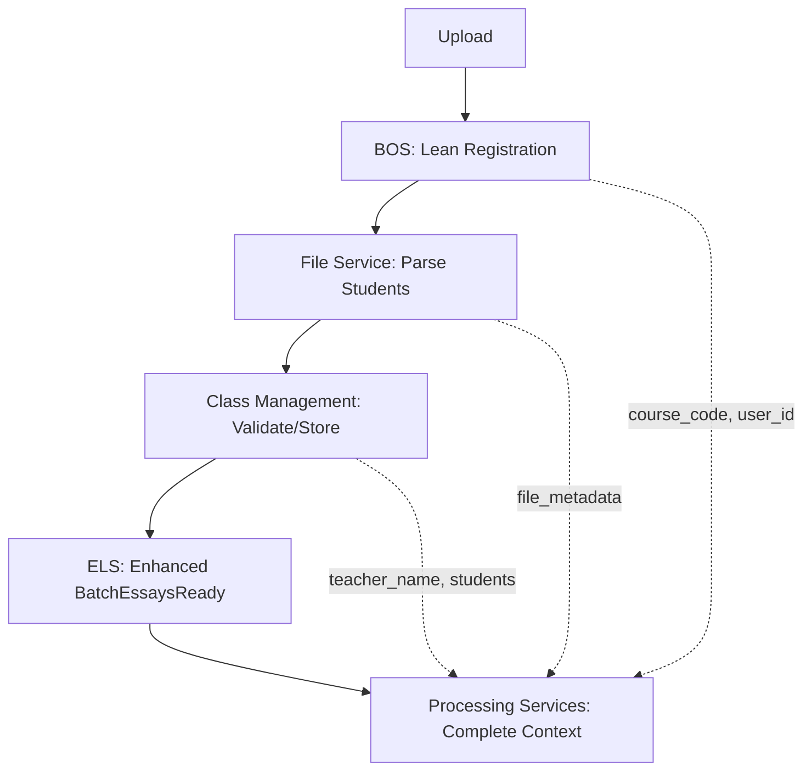

# Lean Batch Registration Refactoring Task

This document outlines the critical refactoring required to implement lean batch registration and proper service boundaries for the HuleEdu platform.

## 🎯 **Task Purpose and Scope**

### **Problem Statement**

The current `BatchRegistrationRequestV1` captures too much processing data upfront during upload, violating single source of truth principles and creating tight coupling between services:

- `teacher_name` should come from Class Management Service (not batch registration)
- `class_designation` should be deferred until validation (not captured upfront)
- Student data is mixed with batch metadata inappropriately
- BOS becomes involved in validation concerns it shouldn't handle

### **Solution Overview**

Implement lean batch registration that captures only essential upload data and defers educational context to appropriate services:

- **BOS**: Owns `course_code`, `essay_instructions`, `user_id` (orchestration essentials)
- **Class Management Service**: Owns `teacher_name`, `class_designation`, student data (educational context)
- **File Service**: Handles parsing and publishes to Class Management Service
- **Processing Services**: Receive all needed data only when actually required

## 🚫 **BLOCKING DEPENDENCIES**

**ALL OTHER IMPLEMENTATION TASKS ARE BLOCKED UNTIL THIS REFACTORING IS COMPLETED:**

- ❌ `ENHANCED_CLASS_AND_FILE_MANAGEMENT_IMPLEMENTATION.md` - Phase 2 onwards blocked
- ❌ `API_GATEWAY_WEBSOCKET_SERVICE_TASK_TICKET_2.md` - Implementation blocked
- ❌ `API_GATEWAY_WEBSOCKET_SERVICE_TASK_TICKET_3.md` - Implementation blocked
- ❌ Any new feature development requiring batch/student data

**Reason**: This refactoring changes fundamental data contracts that affect all services.

## 📋 **Implementation Phases**

### **Phase 1: Update Common Core (enums, events, batch service models)** ✅ COMPLETED

**Objective**: Update shared contracts to support lean registration and proper data flow.

**Files Updated:**

1. **`common_core/src/common_core/enums.py`** ✅
   - Added validation batch states: `AWAITING_STUDENT_VALIDATION`, `VALIDATION_TIMEOUT_PROCESSED`, `GUEST_CLASS_READY`
   - Added validation workflow events: `STUDENT_ASSOCIATIONS_CONFIRMED`, `VALIDATION_TIMEOUT_PROCESSED`
   - Updated topic mappings for new events

2. **`common_core/src/common_core/events/batch_coordination_events.py`** ✅
   - Enhanced `BatchEssaysReady` with lean registration fields:
     - `course_code`, `course_language`, `essay_instructions` (from BOS)
     - `class_type`, `teacher_first_name`, `teacher_last_name` (from Class Management Service)
   - Updated docstrings to reflect enhanced purpose

3. **`common_core/src/common_core/batch_service_models.py`** ✅
   - Updated `BatchServiceAIFeedbackInitiateCommandDataV1` with lean registration fields
   - Updated `BatchServiceCJAssessmentInitiateCommandDataV1` with lean registration fields
   - Replaced educational context fields with proper data source attribution

4. **`common_core/src/common_core/events/validation_events.py` (NEW)** ✅
   - Created `StudentAssociation` model with confidence scoring
   - Created `StudentAssociationsConfirmedV1` event for teacher confirmations
   - Created `ValidationTimeoutProcessedV1` event for automatic processing

**Results**:

- ✅ All 107 common_core tests pass
- ✅ Enhanced events support student validation flow
- ✅ Processing service commands have clear data source mapping  
- ✅ Validation events defined for Class Management Service integration

### **Phase 2: Update BOS to Lean Registration and Class Management Integration** ✅ COMPLETED

**Objective**: Transform BOS to use lean registration and integrate with Class Management Service for educational context.

**Files Updated:**

1. **`services/batch_orchestrator_service/api_models.py`** ✅
   - Updated `BatchRegistrationRequestV1` to lean registration model
   - Removed: `teacher_name`, `class_designation`
   - Kept: `course_code`, `essay_instructions`, `user_id` (required), CJ parameters

2. **Core Implementation Updates:** ✅
   - `implementations/ai_feedback_initiator_impl.py` - Updated to use lean context, TODO marked for Class Management Service integration
   - `implementations/cj_assessment_initiator_impl.py` - Updated to use lean context, TODO marked for Class Management Service integration
   - `services/essay_lifecycle_service/implementations/batch_essay_tracker_impl.py` - Updated BatchEssaysReady creation with placeholder values

**Integration Pattern**: Processing services now receive placeholder GUEST class data. Full integration with Class Management Service deferred to Phase 5.

**Current State**:

- ✅ Lean registration captures only essential upload data (course_code, essay_instructions, user_id)
- ✅ Processing service commands use new lean fields with GUEST placeholders
- ✅ BOS no longer tries to access removed educational context fields
- ✅ All test files updated to use lean registration model (Phase 3 completed)

**Technical Debt Created**:

- TODO: ELS batch tracker uses hardcoded placeholder values for enhanced BatchEssaysReady fields
- TODO: Processing initiators use GUEST class type until Class Management Service integration
- TODO: Phase initiation flow needs refactoring to use enhanced BatchEssaysReady instead of direct batch context

### **Phase 3: Update All Test Fixtures and Functional Tests** ✅ COMPLETED

**Objective**: Update all test infrastructure to use lean registration model and new data flow.

**Files to Update (20+ files):**

**BOS Unit Tests (4 files):**

- `test_batch_repository_integration.py`
- `test_ai_feedback_initiator_impl.py`
- `test_nlp_initiator_impl.py`
- `test_simplified_retry_logic.py`

**Integration Tests (6 files):**

- `pipeline_state_management_utils.py`
- `test_pipeline_state_management_progression.py`
- `test_pipeline_state_management_scenarios.py`
- `test_pipeline_state_management_failures.py`
- `test_pipeline_state_management_edge_cases.py`

**Functional Tests (9 files):**

- `test_validation_coordination_*.py` (4 files)
- `test_e2e_file_workflows.py`
- `comprehensive_pipeline_utils.py`
- `validation_coordination_utils.py`
- `test_simple_validation_e2e.py`

**Service Utilities (3 files):**

- `service_test_manager.py`
- `test_phase_outcome_contracts.py`
- ELS tests with teacher/class references

**Update Pattern**: All test fixtures must use lean `BatchRegistrationRequestV1` model and mock Class Management Service responses for educational context.

**Core Infrastructure Updates:**

- ✅ `tests/utils/service_test_manager.py` - Updated core `create_batch` method to use lean registration model
- ✅ `tests/functional/validation_coordination_utils.py` - Updated `create_validation_batch` wrapper function

**Test Fixture Updates (Unit & Integration Tests):**

- ✅ `services/batch_orchestrator_service/tests/test_simplified_retry_logic.py` - Updated BatchRegistrationRequestV1 fixture
- ✅ `tests/integration/test_pipeline_state_management_scenarios.py` - Updated batch context fixture
- ✅ `tests/integration/test_pipeline_state_management_progression.py` - Updated 2 batch context instances  
- ✅ `tests/integration/test_pipeline_state_management_failures.py` - Updated 2 batch context instances
- ✅ `tests/integration/test_pipeline_state_management_edge_cases.py` - Updated 2 batch context instances
- ✅ `tests/contract/test_phase_outcome_contracts.py` - Updated CJ command model and assertions
- ✅ `services/batch_orchestrator_service/tests/test_ai_feedback_initiator_impl.py` - Updated 4 fixtures and assertions
- ✅ `services/batch_orchestrator_service/tests/test_batch_repository_integration.py` - Updated fixture and retrieval assertions
- ✅ `services/essay_lifecycle_service/tests/unit/test_cj_assessment_command_handler.py` - Updated 3 command data instances

**Functional Test Updates:**

- ✅ `tests/functional/test_validation_coordination_partial_failures.py` - Updated lean registration calls
- ✅ `tests/functional/test_validation_coordination_success.py` - Updated lean registration calls
- ✅ `tests/functional/test_validation_coordination_complete_failures.py` - Updated lean registration calls
- ✅ `tests/functional/test_simple_validation_e2e.py` - Updated batch creation call
- ✅ `tests/functional/test_e2e_file_workflows.py` - Updated complete workflow test

**Update Patterns Applied:**

- Removed `teacher_name`, `class_designation` from `BatchRegistrationRequestV1` fixtures
- Added required `user_id` field to all lean registration instances  
- Replaced `class_designation` with `class_type` in command data models
- Updated assertions to expect placeholder values (`class_type="GUEST"`, `teacher_first_name=None`, `teacher_last_name=None`)
- Maintained test intent while aligning with lean registration architecture

**Results**:

- ✅ All type-checking errors resolved (320 source files pass mypy)
- ✅ Test fixtures use lean registration model exclusively
- ✅ Educational context assertions expect placeholder values until Class Management Service integration
- ✅ Processing service command tests validate new field structure

### **Phase 4: Update Task Documentation** ✅ COMPLETED

**Objective**: Update all task documentation to remove references to old overloaded batch registration process.

**Implementation Summary:**

**Files Updated:**

1. **`ENHANCED_CLASS_AND_FILE_MANAGEMENT_IMPLEMENTATION.md`** ✅
   - Updated Part 2 introduction to reflect lean registration architecture
   - Updated Educational Context Flow to show correct data sources and timing
   - Removed blocking dependencies, marked refactoring as completed
   - Aligned all checkpoints with lean registration principles

2. **`API_GATEWAY_WEBSOCKET_SERVICE_TASK_TICKET_1.md`** ✅
   - Updated Checkpoint 1.4 to reflect completed lean registration foundation
   - Removed outdated architectural gap descriptions
   - Aligned user ID propagation with completed refactoring

3. **`API_GATEWAY_WEBSOCKET_SERVICE_TASK_TICKET_2.md`** ✅
   - Removed blocking dependency warnings
   - Updated `EnhancedBatchRegistrationRequest` to `LeanBatchRegistrationRequest`
   - Aligned API endpoints with lean registration model
   - Updated registration flow to use proper BOS endpoints

4. **`API_GATEWAY_WEBSOCKET_SERVICE_TASK_TICKET_3.md`** ✅
   - Removed blocking dependency warnings
   - Aligned WebSocket events with lean registration architecture
   - Updated backend modification examples for proper service boundaries

5. **`.cursor/rules/023-batch-orchestrator-service-architecture.mdc`** ✅
   - Updated BatchRegistrationRequestV1 description to show lean fields only
   - Updated technical debt section to reflect completed educational context management
   - Added notes about Class Management Service ownership of educational context

**Results:**

- ✅ All task documents reference lean registration architecture
- ✅ Examples show proper data flow with deferred educational context
- ✅ No references to old overloaded batch registration remain
- ✅ Developers have clear updated implementation guidance aligned with completed refactoring
- ✅ Service rules updated to reflect new architectural boundaries

### **Phase 5: Implement Class Management Service**

**Objective**: Build the Class Management Service to provide educational context deferred from batch registration.

**Scope**: Implement the complete Class Management Service as outlined in the original enhanced implementation plan.

## 🎯 **Success Criteria**

### **Technical Validation**

- ✅ All tests pass (150+ test files updated)
- ✅ Lean registration captures only essential data
- ✅ Processing services get educational context from appropriate sources
- ✅ Clean service boundaries established

### **Architectural Validation**

- ✅ BOS focused on orchestration (not validation)
- ✅ Class Management Service owns educational context
- ✅ File Service handles parsing without premature data capture
- ✅ Single source of truth principle enforced

### **Development Readiness**

- ✅ Updated task documentation provides clear guidance aligned with lean registration
- ✅ All blocking dependencies resolved across all task documents  
- ✅ Foundation ready for enhanced features implementation
- ✅ Service rules updated to reflect new architectural boundaries

## 📊 **Impact Summary**

| **Component** | **Files** | **Impact Level** |
|---------------|-----------|------------------|
| Common Core | 4 files | 🔥 Critical - All services affected |
| BOS Implementation | 11 files | 🔥 Critical - Core registration logic |
| Test Infrastructure | 20+ files | 🔶 High - All test patterns change |
| Documentation | 4 files | 🔶 High - Developer guidance |
| **Total** | **40+ files** | **Complete system refactoring** |

## ⚡ **Execution Timeline**

- **Phase 1**: 2-3 days (Common Core contracts)
- **Phase 2**: 3-4 days (BOS lean implementation)  
- **Phase 3**: 4-5 days (Test infrastructure updates)
- **Phase 4**: 1-2 days (Documentation updates)
- **Total**: 10-14 days before unblocking other tasks

**Priority**: This refactoring is the foundation for all enhanced features and must be completed before any other implementation work can proceed.

## 📊 **Single Source of Truth Data Mapping**

### **After API Gateway Tasks Complete - Final Data Architecture**

| **Data Domain** | **Single Source of Truth** | **When Available** | **Used By** |
|-----------------|----------------------------|-------------------|-------------|
| **Orchestration Data** | **BOS** | Upload | All Services |
| `course_code` | BOS (lean registration) | Upload | Processing Services |
| `essay_instructions` | BOS (lean registration) | Upload | AI Feedback Service |
| `user_id` | BOS (from API Gateway JWT) | Upload | All Services |
| `pipeline_state` | BOS | During Processing | API Gateway, Frontend |
| **Educational Context** | **Class Management Service** | After Student Validation | Processing Services |
| `teacher_first_name`, `teacher_last_name` | Class Management Service | User Profile/Class Creation | AI Feedback, Reports |
| `class_designation` | Class Management Service | Class Creation | CJ Assessment, Reports |
| `student_data` (first/last/email) | Class Management Service | Student Parsing/Validation | Processing Services |
| `student_associations` | Class Management Service | After Validation | All Processing Services |
| **File Operations** | **File Service** | Upload/Parse | Class Management Service |
| `file_metadata` | File Service | Upload | Content Service |
| `parsing_results` | File Service | Parse Phase | Class Management Service |
| `file_events` | File Service | Real-time | API Gateway WebSocket |
| **Processing Context** | **Enhanced BatchEssaysReady** | When Needed | Processing Services |
| All above combined | ELS → BatchEssaysReady | Essays Ready | AI Feedback, CJ Assessment |

### **Key Architectural Benefits**

1. **Clean Service Boundaries**: Each service owns its appropriate domain
2. **Deferred Data Capture**: Educational context captured when needed, not prematurely
3. **Single Source of Truth**: No duplicate data storage across services
4. **Event-Driven Integration**: Services get data via enhanced events when required
5. **Validation Separation**: File Service + Class Management handle validation, not BOS

### **Data Flow After Refactoring**

This architecture ensures processing services get complete context exactly when needed while maintaining proper service autonomy.
