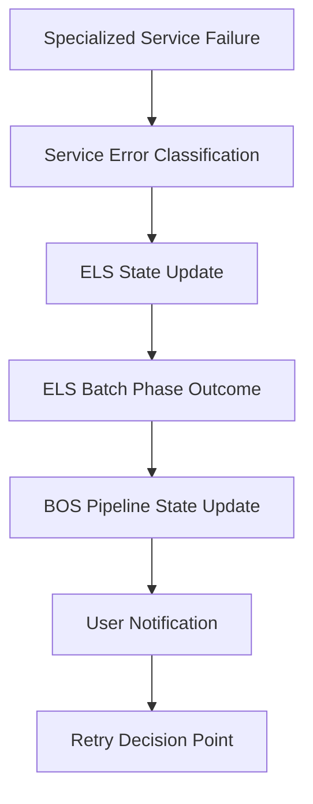

# Research Task: Pipeline Retry Mechanism and Failure Handling Analysis

**Ticket ID**: HULEDU-PIPELINE-RETRY-RESEARCH  
**Date Created**: January 21, 2025  
**Priority**: High  
**Estimated Effort**: 12-16 hours  
**Type**: Research & Analysis

**Title**: 🔍 **Pipeline Retry Mechanism and Failure Handling Research**

## 🎯 **RESEARCH OBJECTIVES**

### **Primary Goals**

1. **Map Current Retry Infrastructure**: Document existing retry mechanisms across all services
2. **Analyze Failure Propagation**: Understand how failures flow from specialized services → ELS → BOS → Users
3. **Evaluate Error Classification**: Assess current error code enums and their retry suitability
4. **Identify Retry Capabilities**: Determine what user/programmatic retry mechanisms exist
5. **Gap Analysis**: Document missing retry functionality and architectural improvements needed

### **Success Criteria**

- [ ] Complete inventory of existing retry mechanisms per service
- [ ] Documented failure propagation flows with current error handling
- [ ] Analysis of error code enums for retry classification (temporary vs persistent)
- [ ] Assessment of user/programmatic retry capabilities
- [ ] Recommendations for retry mechanism improvements
- [ ] Implementation roadmap for enhanced pipeline retry functionality

---

## 📋 **RESEARCH SCOPE**

### **🔍 Area 1: Service-Level Retry Mechanisms**

#### **1.1 Specialized Services Retry Analysis**

**Services to Investigate:**

- `spell_checker_service` - Current retry logic in processing
- `cj_assessment_service` - LLM API retry mechanisms
- `file_service` - File processing and validation retries
- `content_service` - Storage operation retries

**Research Questions:**

- What retry mechanisms exist within each specialized service?
- How do services differentiate between temporary vs persistent failures?
- What error codes/enums are used to classify retry suitability?
- How are retry attempts tracked and limited?
- What happens when service-level retries are exhausted?

**Investigation Tasks:**

```yaml
Spell Checker Service:
  - Analyze kafka_consumer.py retry logic
  - Document error classification in core_logic.py
  - Check L2 dictionary loading retry mechanisms
  - Evaluate result publishing retry logic

CJ Assessment Service:
  - Review RetryManagerImpl comprehensive retry patterns
  - Analyze LLM provider retry configurations
  - Document error code classification for retries
  - Check batch processing failure handling

File Service:
  - Investigate file upload retry mechanisms
  - Analyze content validation retry logic
  - Check file processing pipeline error handling
  - Document storage operation retry patterns

Content Service:
  - Analyze filesystem storage retry logic
  - Check content retrieval retry mechanisms
  - Document storage operation error classification
```

#### **1.2 Core Services Retry Analysis**

**Services to Investigate:**

- `batch_orchestrator_service` (BOS) - Pipeline orchestration retries
- `essay_lifecycle_service` (ELS) - State transition and command retries
- `batch_conductor_service` (BCS) - Pipeline resolution retries

**Research Questions:**

- How do core services handle upstream service failures?
- What retry logic exists for inter-service communication?
- How are pipeline-level failures propagated and handled?
- What mechanisms exist for pipeline restart/resume?

### **🔍 Area 2: Error Classification and Retry Suitability**

#### **2.1 Error Code Enum Analysis**

**Investigation Focus:**

- Document all error enums across services
- Classify errors as temporary vs persistent failures
- Analyze current error propagation patterns
- Evaluate error information preservation across service boundaries

**Key Enums to Analyze:**

```yaml
common_core/src/common_core/enums.py:
  - EssayStatus: Document failure states and retry implications
  - BatchStatus: Analyze batch failure states and recovery paths
  - PipelineExecutionStatus: Evaluate pipeline state retry capabilities

Service-specific error enums:
  - SpellcheckResult error codes
  - CJAssessmentResult error classifications  
  - FileProcessingResult failure types
  - ContentStorageResult error states
```

#### **2.2 Failure Type Classification**

**Research Categories:**

**Temporary Failures (Should Retry):**

- Service temporarily inaccessible (network issues, restarts)
- Rate limiting or quota exhaustion
- Concurrent operation conflicts (Redis WATCH failures)
- Transient resource unavailability
- Dropped events due to messaging issues

**Persistent Failures (Should Not Auto-Retry):**

- Invalid data format or content
- Authentication/authorization failures
- Malformed pipeline configurations
- Resource limits exceeded (file size, content length)
- Business logic validation failures

### **🔍 Area 3: Pipeline Failure Propagation Analysis**

#### **3.1 Failure Flow Documentation**

**Trace Failure Paths:**



**Investigation Tasks:**

- Map complete failure propagation from service → user
- Document error information preservation at each step
- Analyze where retry decision points exist
- Identify information loss during failure propagation

#### **3.2 Current Pipeline State Management**

**Research Areas:**

- How are failed pipeline states persisted?
- What retry metadata is currently tracked?
- How are partial pipeline failures handled?
- What restart/resume capabilities exist?

### **🔍 Area 4: User and Programmatic Retry Capabilities**

#### **4.1 Current User Retry Mechanisms**

**Investigation Questions:**

- Do users have API endpoints to retry failed pipelines?
- Can users retry individual phases vs entire pipelines?
- What retry history/status is exposed to users?
- How do users discover retry eligibility?

**API Endpoints to Analyze:**

```yaml
batch_orchestrator_service/api/:
  - Check for retry-related endpoints
  - Analyze batch restart capabilities
  - Document pipeline resume functionality

essay_lifecycle_service/api/:
  - Check for essay-level retry endpoints
  - Analyze phase restart capabilities
  - Document state reset functionality
```

#### **4.2 Programmatic Retry Infrastructure**

**Research Areas:**

- Automated retry triggers based on error patterns
- Dead letter queue processing for failed events
- Scheduled retry mechanisms for temporary failures
- Circuit breaker patterns for service protection

### **🔍 Area 5: Infrastructure and Messaging Retry Analysis**

#### **5.1 Kafka Event Retry Mechanisms**

**Investigation Tasks:**

- Analyze event publishing retry logic
- Document dead letter queue usage patterns
- Check event ordering preservation during retries
- Evaluate idempotency handling for retry scenarios

#### **5.2 Database and Storage Retry Patterns**

**Research Areas:**

- PostgreSQL connection and transaction retry logic
- Redis operation retry mechanisms (BCS atomic operations)
- File storage operation retry patterns
- SQLite operation retry handling (ELS development mode)

---

## 🔬 **RESEARCH METHODOLOGY**

### **Phase 1: Code Analysis (4-5 hours)**

1. **Service-by-Service Code Review**
   - Read all retry-related code in each service
   - Document retry configurations and patterns
   - Map error handling and classification logic

2. **Error Enum Documentation**
   - Catalog all error states across services
   - Classify temporary vs persistent failure types
   - Analyze error information propagation

### **Phase 2: Flow Analysis (3-4 hours)**

3. **Failure Propagation Mapping**
   - Trace failure flows from service to user
   - Document retry decision points
   - Identify information preservation gaps

4. **API and Interface Analysis**
   - Check existing retry endpoints
   - Analyze user-facing retry capabilities
   - Document programmatic retry infrastructure

### **Phase 3: Gap Analysis and Recommendations (4-5 hours)**

1. **Current Capability Assessment**
   - Document what retry mechanisms exist vs needed
   - Identify architectural gaps in retry handling
   - Analyze user experience for pipeline failures

2. **Improvement Recommendations**
   - Propose enhanced retry mechanisms
   - Design user/programmatic retry interfaces
   - Create implementation roadmap

### **Phase 4: Documentation and Validation (2-3 hours)**

1. **Research Report Creation**
   - Comprehensive current state documentation
   - Gap analysis with specific recommendations
   - Implementation priority matrix

2. **Stakeholder Review Preparation**
   - Create summary findings presentation
   - Prepare technical design proposals
   - Develop implementation timeline estimates

---

## 📊 **DELIVERABLES**

### **Primary Deliverables**

1. **Current State Analysis Report**
   - Service-by-service retry mechanism inventory
   - Failure propagation flow documentation
   - Error classification analysis

2. **Gap Analysis Document**
   - Missing retry functionality identification
   - User experience improvement opportunities
   - Infrastructure enhancement requirements

3. **Implementation Recommendations**
   - Enhanced retry mechanism designs
   - User/programmatic retry interface proposals
   - Infrastructure improvement roadmap

### **Supporting Documentation**

1. **Error Code Reference Guide**
   - Complete enum documentation with retry classifications
   - Failure type decision matrix
   - Error propagation flow diagrams

2. **API Enhancement Proposals**
   - User retry endpoint specifications
   - Programmatic retry interface designs
   - Error reporting improvement suggestions

---

## 🎯 **KEY RESEARCH QUESTIONS TO ANSWER**

### **Current Capabilities**

1. **What retry mechanisms currently exist at each service level?**
2. **How are pipeline failures currently propagated to users?**
3. **What user-facing retry capabilities exist today?**
4. **How are retry attempts tracked and limited?**

### **Error Handling**

1. **How are temporary vs persistent failures currently classified?**
2. **What error information is preserved during failure propagation?**
3. **Where do retry decision points exist in the current architecture?**

### **User Experience**

1. **Can users retry failed pipelines? If so, how?**
2. **Can users retry individual phases vs entire pipelines?**
3. **What retry status/history is exposed to users?**

### **Infrastructure**

1. **What programmatic retry mechanisms exist?**
2. **How are dead letter queues used for failed events?**
3. **What automated retry triggers exist based on error patterns?**

### **Architecture**

1. **Where should retry logic be implemented (service vs orchestration level)?**
2. **How should retry eligibility be determined?**
3. **What retry metadata needs to be tracked and persisted?**

---

## 🚀 **POST-RESEARCH IMPLEMENTATION AREAS**

### **Expected Follow-Up Tasks**

Based on research findings, anticipate these implementation areas:

1. **Enhanced Error Classification**
   - Retry-aware error enum definitions
   - Error code propagation improvements
   - Failure type decision matrices

2. **User Retry Interfaces**
   - API endpoints for pipeline retries
   - Phase-specific retry capabilities
   - Retry status and history endpoints

3. **Service-Level Retry Enhancements**
   - Improved specialized service retry logic
   - Better error classification and reporting
   - Enhanced failure state persistence

4. **Pipeline Orchestration Improvements**
   - BOS retry coordination capabilities
   - ELS retry state management
   - Cross-service retry synchronization

5. **Infrastructure Enhancements**
   - Dead letter queue improvements
   - Automated retry scheduling
   - Circuit breaker implementations

---

## 📋 **RESEARCH EXECUTION CHECKLIST**

### **Preparation Phase**

- [ ] Review existing architecture documentation
- [ ] Set up analysis environment and tools
- [ ] Create research data collection templates

### **Service Analysis Phase**

- [ ] Analyze spell_checker_service retry mechanisms
- [ ] Analyze cj_assessment_service retry patterns
- [ ] Analyze file_service retry logic
- [ ] Analyze content_service retry mechanisms
- [ ] Analyze BOS pipeline retry capabilities
- [ ] Analyze ELS state management retry logic
- [ ] Analyze BCS resolution retry patterns

### **Error Classification Phase**

- [ ] Document all error enums across services
- [ ] Classify temporary vs persistent failure types
- [ ] Map error propagation flows
- [ ] Analyze retry decision points

### **User Interface Analysis Phase**

- [ ] Check existing user retry endpoints
- [ ] Analyze pipeline restart capabilities
- [ ] Document retry status exposure
- [ ] Evaluate user retry experience

### **Infrastructure Analysis Phase**

- [ ] Analyze Kafka retry mechanisms
- [ ] Check dead letter queue usage
- [ ] Document database retry patterns
- [ ] Evaluate programmatic retry infrastructure

### **Documentation Phase**

- [ ] Create comprehensive current state report
- [ ] Document gap analysis with recommendations
- [ ] Prepare implementation roadmap
- [ ] Create stakeholder presentation materials

---

**This research will provide the foundation for implementing robust, user-friendly pipeline retry mechanisms that appropriately handle both temporary and persistent failures while preserving excellent user experience.**
