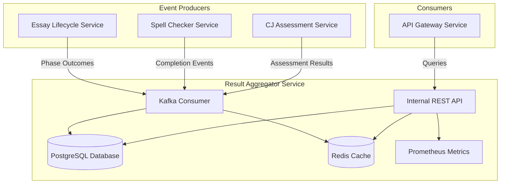

# Result Aggregator Service: Implementation Guide v2.0 (REVISED)

This document provides the corrected implementation guide for the `result_aggregator_service`, incorporating lessons learned from the actual implementation and removing all architectural hallucinations.

## Executive Summary

The Result Aggregator Service (RAS) serves as a **materialized view layer** for the event-driven backend, providing fast, query-optimized access to processing results for the API Gateway. This service exemplifies our commitment to Domain-Driven Design, maintaining clear boundaries while aggregating data from multiple processing services.

### Key Architectural Decisions

1. **Event Sourcing Pattern**: RAS consumes completion events to build its materialized view
2. **CQRS Implementation**: Separates write operations (event consumption) from read operations (API queries)
3. **Security-First Design**: Internal API with service-to-service authentication
4. **Performance Optimization**: Normalized schema with strategic indexes and caching
5. **Resilience Patterns**: Idempotency (NO DLQ - that's BOS responsibility)

## Important Architectural Clarifications

### 1. Common Core Philosophy
- `common_core` contains ONLY shared contracts: events (Pydantic models), enums, and interfaces
- It does NOT contain implementations, database utilities, or Kafka utilities
- Services implement their own bounded contexts

### 2. DLQ (Dead Letter Queue) Handling
- DLQ is the responsibility of the Batch Orchestrator Service (BOS) ONLY
- Individual services should NOT implement DLQ handling
- Services should log errors and continue processing

### 3. Import Patterns
```python
# CORRECT - Event contracts from common_core
from common_core.events import (
    CJAssessmentCompletedV1,  # NOT CJAssessmentCompletedDataV1
    ELSBatchPhaseOutcomeV1,
    EventEnvelope,
    SpellcheckResultDataV1  # NOT SpellcheckCompletedDataV1
)

# CORRECT - Utilities from service libs
from huleedu_service_libs.kafka_bus import KafkaBus
from huleedu_service_libs.logging_utils import create_service_logger
from huleedu_service_libs.protocols import RedisClientProtocol  # NOT from redis_client module

# WRONG - These don't exist
from common_core.database import SQLAlchemyEnum  # ❌ common_core has no database module
from common_core.kafka import DLQProducer  # ❌ common_core has no kafka module
from huleedu_service_libs.redis_client import RedisClientProtocol  # ❌ Wrong module
```

## Service Architecture Overview



## Database Schema (models_db.py)

```python
"""Database models for Result Aggregator Service."""
from datetime import datetime
from enum import Enum
from typing import Optional

from sqlalchemy import Column, DateTime, Float, ForeignKey, Index, Integer, JSON, String, UniqueConstraint
from sqlalchemy.ext.asyncio import AsyncAttrs
from sqlalchemy.orm import DeclarativeBase, Mapped, mapped_column, relationship

# CORRECT - Import from sqlalchemy, not common_core
from sqlalchemy import Enum as SQLAlchemyEnum


class Base(AsyncAttrs, DeclarativeBase):
    """Base class for all database models."""
    pass


# Service-specific enums - NOT shared
class BatchResultStatus(str, Enum):
    """Overall batch processing status."""
    REGISTERED = "REGISTERED"
    PROCESSING = "PROCESSING"
    PARTIALLY_COMPLETED = "PARTIALLY_COMPLETED"
    COMPLETED = "COMPLETED"
    FAILED = "FAILED"
    CANCELLED = "CANCELLED"


class ProcessingPhaseStatus(str, Enum):
    """Individual processing phase status."""
    PENDING = "PENDING"
    IN_PROGRESS = "IN_PROGRESS"
    COMPLETED = "COMPLETED"
    FAILED = "FAILED"
    SKIPPED = "SKIPPED"
```

## Kafka Consumer Implementation

```python
"""Hardened Kafka consumer for Result Aggregator Service."""
import asyncio
import json
from typing import Any

from aiokafka import ConsumerRecord
from dishka import AsyncContainer

from common_core.enums import ServiceName
from common_core.events import EventEnvelope
from huleedu_service_libs.idempotency import idempotent_consumer
from huleedu_service_libs.logging_utils import create_service_logger

# NO DLQ imports - this is BOS responsibility

logger = create_service_logger("result_aggregator.kafka_consumer")


class ResultAggregatorKafkaConsumer:
    """Kafka consumer with production-grade error handling."""
    
    def __init__(
        self,
        kafka_bus: Any,  # KafkaBus type
        container: AsyncContainer,
        metrics: Any,  # ResultAggregatorMetrics
        redis_client: Any,  # RedisClientProtocol
    ):
        """Initialize the consumer."""
        self.kafka_bus = kafka_bus
        self.container = container
        self.metrics = metrics
        self.redis_client = redis_client
        self._running = False
        
        # Topic subscription list
        self.topics = [
            "huleedu.els.batch.phase.outcome.v1",
            "huleedu.essay.spellcheck.completed.v1", 
            "huleedu.cj_assessment.completed.v1",
        ]
        
    async def _process_message(self, record: ConsumerRecord) -> None:
        """Process a single message with idempotency check."""
        # Create idempotent wrapper
        @idempotent_consumer(redis_client=self.redis_client, ttl_seconds=86400)
        async def process_message_idempotently(msg: ConsumerRecord) -> bool:
            await self._process_message_impl(msg)
            return True  # Indicate successful processing
        
        # Call the idempotent wrapper
        await process_message_idempotently(record)
    
    async def _process_message_impl(self, record: ConsumerRecord) -> None:
        """Actual message processing logic."""
        try:
            # Parse the event envelope
            envelope_data = json.loads(record.value.decode('utf-8'))
            envelope = EventEnvelope.model_validate(envelope_data)
            
            # Route to appropriate handler based on topic
            async with self.container() as request_container:
                processor = await request_container.get(EventProcessorProtocol)
                
                if record.topic == "huleedu.els.batch.phase.outcome.v1":
                    from common_core.events import ELSBatchPhaseOutcomeV1
                    data = ELSBatchPhaseOutcomeV1.model_validate(envelope.data)
                    await processor.process_batch_phase_outcome(envelope, data)
                    
                elif record.topic == "huleedu.essay.spellcheck.completed.v1":
                    from common_core.events import SpellcheckResultDataV1
                    data = SpellcheckResultDataV1.model_validate(envelope.data)
                    await processor.process_spellcheck_completed(envelope, data)
                    
                elif record.topic == "huleedu.cj_assessment.completed.v1":
                    from common_core.events import CJAssessmentCompletedV1
                    data = CJAssessmentCompletedV1.model_validate(envelope.data)
                    await processor.process_cj_assessment_completed(envelope, data)
                    
        except Exception as e:
            # Log error - NO DLQ handling
            logger.error("Failed to process message", error=str(e), exc_info=True)
            raise
```

## Cache Design Issue and Solutions

### Current Problem

The cache protocol expects SQLAlchemy models but we can only serialize Pydantic models:

```python
# Protocol expects DB model
async def get_batch_status(self, batch_id: str) -> Optional[BatchResult]:

# But we cache API response model
response = BatchStatusResponse.from_domain(status)
json_data = response.model_dump_json()
await self.redis.setex(cache_key, ttl, json_data)

# So cache reads always return None
```

### Recommended Solution: API-Level Caching

```python
@query_bp.route("/batches/<batch_id>/status")
async def get_batch_status(batch_id: str):
    # Check Redis for cached JSON response
    cache_key = f"api:batch:{batch_id}"
    cached = await redis_client.get(cache_key)
    
    if cached:
        # Return cached response directly
        return Response(cached, mimetype='application/json'), 200
    
    # Cache miss - query service
    result = await query_service.get_batch_status(batch_id)
    if not result:
        return jsonify({"error": "Batch not found"}), 404
    
    # Convert to API response and cache
    response = BatchStatusResponse.from_domain(result)
    response_json = response.model_dump_json()
    
    # Cache for 5 minutes
    await redis_client.setex(cache_key, 300, response_json)
    
    return Response(response_json, mimetype='application/json'), 200
```

## Dependency Injection Setup

```python
"""Dependency injection configuration for Result Aggregator Service."""
from huleedu_service_libs.kafka_bus import KafkaBus
# NO DLQ imports
from huleedu_service_libs.logging_utils import create_service_logger
from huleedu_service_libs.protocols import RedisClientProtocol
from huleedu_service_libs.redis_client import RedisClient


class CoreInfrastructureProvider(Provider):
    """Provider for core infrastructure components."""
    
    @provide
    async def provide_redis_client(self, settings: Settings) -> AsyncIterator[RedisClientProtocol]:
        """Provide Redis client instance."""
        redis_client = RedisClient(
            client_id=f"ras-{settings.SERVICE_NAME}",
            redis_url=settings.REDIS_URL
        )
        await redis_client.start()
        try:
            yield cast(RedisClientProtocol, redis_client)
        finally:
            await redis_client.stop()
    
    # NO DLQ provider - this is BOS responsibility
    
    @provide
    def provide_kafka_consumer(
        self,
        kafka_bus: KafkaBus,
        redis_client: RedisClientProtocol,
        container: AsyncContainer,
        metrics: ResultAggregatorMetrics,
        settings: Settings
    ) -> ResultAggregatorKafkaConsumer:
        """Provide Kafka consumer instance."""
        return ResultAggregatorKafkaConsumer(
            kafka_bus=kafka_bus,
            redis_client=redis_client,
            container=container,
            metrics=metrics
        )
```

## Key Implementation Notes

1. **Event Contract Names**: Use the exact names from common_core:
   - `SpellcheckResultDataV1` (NOT `SpellcheckCompletedDataV1`)
   - `CJAssessmentCompletedV1` (NOT `CJAssessmentCompletedDataV1`)

2. **No DLQ Handling**: Result Aggregator Service does NOT handle DLQ - this is BOS's responsibility

3. **Service-Specific Enums**: Define your own enums for internal state tracking, don't try to share DB enums

4. **Idempotency Pattern**: Use the decorator pattern with Redis client passed directly

5. **Cache Limitations**: Current design prevents effective read caching - implement at API level instead

## Testing Considerations

1. **Event Processing Tests**: Mock the protocols, not implementations
2. **Integration Tests**: Use actual Redis and PostgreSQL containers
3. **Contract Tests**: Validate event envelope structure matches producers
4. **Cache Tests**: Test both cache hits and misses, ensure service works without cache

## Conclusion

This revised guide removes all architectural hallucinations and provides the correct patterns for implementing the Result Aggregator Service. The key lessons are:
- Respect bounded contexts - don't add to common_core
- DLQ is centralized in BOS
- Cache at the appropriate level (API responses, not DB models)
- Use correct event names and import paths