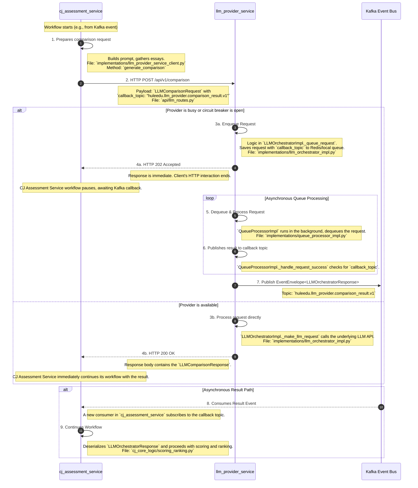

# Overview: From Polling to Pub/Sub Callback

The fundamental change is moving from a synchronous polling model to an asynchronous, event-driven callback model.

* **Before (Current Anti-Pattern):** The `cj_assessment_service` makes an HTTP request, and if it receives a `202 Accepted`, it is forced to enter a complex polling loop, repeatedly calling the `/status` endpoint until a result is available. This is inefficient and tightly couples the client to the provider.

* **After (Proposed Architecture):** The `cj_assessment_service` makes a single HTTP request that includes a `callback_topic`. The `llm_provider_service` immediately returns `202 Accepted` if the request is queued. The client's HTTP interaction is now finished. Later, when the task is complete, the `llm_provider_service` publishes the result to the specified Kafka topic. The `cj_assessment_service` consumes this result event to continue its workflow.

## Detailed Interaction Map & Sequence Diagram

This diagram illustrates the complete, end-to-end flow of the proposed architecture.

-----

## Step-by-Step Implementation Breakdown

Here is the explicit mapping of actions to the codebase files.

### Stage 1: Request Initiation (Client: `cj_assessment_service`)

1. **Prepare Request:** The `LLMProviderServiceClient` within the `cj_assessment_service` constructs the request payload.
      * **Action:** The `generate_comparison` method will be modified.
      * **Evidence:** `services/cj_assessment_service/implementations/llm_provider_service_client.py`
      * **Details:** The JSON body sent to the `llm_provider_service` will now include `"callback_topic": "huleedu.llm_provider.comparison_result.v1"`. This topic name will be read from the service's configuration.

### Stage 2: Request Handling (Provider: `llm_provider_service`)

1. **Receive and Route Request:** The `generate_comparison` endpoint in `llm_routes.py` receives the `POST` request.

      * **Action:** The request is parsed into the `LLMComparisonRequest` model.
      * **Evidence:** `services/llm_provider_service/api/llm_routes.py`
      * **Details:** The Pydantic model (`api_models.py`) is updated to include the optional `callback_topic` field.

2. **Queue or Process:** The `LLMOrchestratorImpl` decides whether to process the request immediately or queue it based on provider availability.

      * **Action:** If queuing, the `_queue_request` method is called.
      * **Evidence:** `services/llm_provider_service/implementations/llm_orchestrator_impl.py`
      * **Details:** The `QueuedRequest` model (`queue_models.py`) is updated to store the `callback_topic` alongside the original request data.

3. **Acknowledge Client:** The provider sends an immediate HTTP response.

      * **Action:** Returns `200 OK` with the result if processed directly, or `202 Accepted` with a queue ID if queued.
      * **Evidence:** `services/llm_provider_service/api/llm_routes.py`
      * **Details:** The client (`cj_assessment_service`) no longer needs to care about the queue ID. Its HTTP interaction is complete.

### Stage 3: Asynchronous Processing & Callback (Provider: `llm_provider_service`)

1. **Process from Queue:** The `QueueProcessorImpl` background task dequeues the request.

    * **Action:** The `_process_request` method orchestrates the LLM call.
    * **Evidence:** `services/llm_provider_service/implementations/queue_processor_impl.py`

2. **Publish Result:** Upon successful completion, the processor publishes the result.

    * **Action:** The `_handle_request_success` method checks if the `QueuedRequest` contains a `callback_topic`.
    * **Evidence:** `services/llm_provider_service/implementations/queue_processor_impl.py`
    * **Details:** It will construct a standard `EventEnvelope` with the `LLMOrchestratorResponse` as the `data` payload and publish it to the specified topic using the injected `KafkaBus`.

### Stage 4: Result Consumption (Client: `cj_assessment_service`)

1. **Consume Result Event:** The `cj_assessment_service` will have a new Kafka consumer handler.

    * **Action:** A new method within the service's consumer logic will subscribe to the `huleedu.llm_provider.comparison_result.v1` topic.
    * **Evidence:** This requires adding logic to `services/cj_assessment_service/kafka_consumer.py` and `event_processor.py`.
    * **Details:** The handler will be responsible for deserializing the `EventEnvelope[LLMOrchestratorResponse]`.

2. **Continue Workflow:** The handler passes the deserialized result to the core business logic.

    * **Action:** The logic that was previously waiting for a polling result will now be triggered by this Kafka event.
    * **Evidence:** The `cj_core_logic/scoring_ranking.py` module will be called to record the comparison and update scores.

This architecture fully decouples the services, simplifies the client implementation immensely, and aligns perfectly with our event-driven principles.
