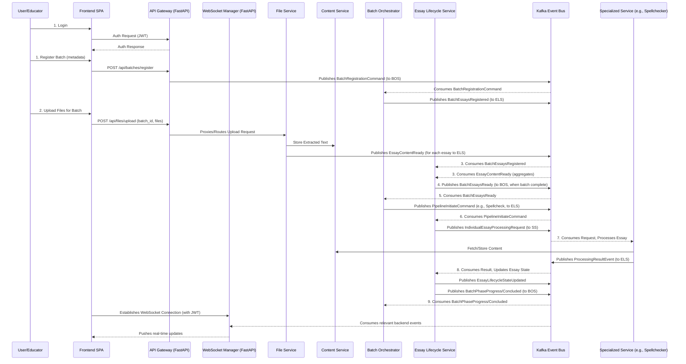

# HuleEdu Platform: Master Product Requirements Document

**Version:** 3.1
**Date:** June 10, 2025
**Status:** Integrated Backend & Frontend Vision (Incorporating Client Interaction Layer Design)

## 1. Introduction & Platform Vision

### 1.1. Overall Platform Overview

The HuleEdu platform aims to provide a comprehensive suite of tools for essay processing, analysis, and feedback. The current development phase focuses on establishing a working event-driven coordination pattern between core backend microservices: File Service, Essay Lifecycle Service (ELS), and Batch Orchestrator Service (BOS), initially for a spellcheck-only pipeline. This backend architecture emphasizes microservice autonomy with event-driven communication via Kafka, where each service maintains clear boundaries and communicates through typed Pydantic event models defined in the `common_core` package. Client interactions will be mediated by a new **API Gateway (FastAPI-based)** and **WebSocket Manager (FastAPI/Starlette-based)** service layer.

### 1.2. Vision for the HuleEdu Experience (Backend + Frontend)

The broader vision is to create a modern, highly responsive, and intuitive platform. This includes a Single Page Application (SPA) frontend that will offer users (initially educators/teachers) a seamless experience for submitting essays for processing, monitoring their progress in real-time, and accessing detailed results and analytics. The frontend will be an authenticated application, interacting with the backend via the API Gateway and WebSocket Manager, prioritizing functionality and real-time updates. The backend's event-driven microservice architecture is designed to support this rich, interactive user experience.

### 1.3. Purpose of this PRD

This PRD defines the scope, features, and key requirements for the HuleEdu Platform, encompassing both the backend processing pipeline and the frontend application. It serves as a guiding document for design, development, and testing. For the backend, it solidifies the "walking skeleton" for inter-service coordination and defines the architecture for the client-facing interface services. For the frontend, it outlines the initial requirements and technical direction. The primary goal of this integrated document is to help developers understand how the backend components they are currently working on will serve an end-user client and what connecting surfaces will be necessary.

---

## 2. Platform Goals & Objectives 🎯

* **Backend - Inter-Service Coordination:** Establish working event-driven communication between File Service, ELS, and BOS for batch processing coordination.
* **Backend - Interface Services:** Implement robust, scalable, and secure API Gateway and WebSocket Manager services using FastAPI.
* **Backend - Spellcheck Pipeline:** Implement end-to-end spellcheck processing from file upload through corrected text output as the initial "walking skeleton" pipeline.
* **Backend - Batch Aggregation:** Validate the count-based aggregation pattern where ELS coordinates batch readiness between File Service and BOS.
* **Backend - Event-Driven Architecture:** Prove asynchronous communication via Kafka with typed Pydantic event models, extending to client interactions via the interface services.
* **Backend - Service Autonomy:** Demonstrate clear service boundaries with File Service (file processing), ELS (essay state management), BOS (batch orchestration), Specialized Services, Content Service, and the new Interface Services.
* **Backend - Architectural Foundation:** Establish patterns for future pipeline expansion while keeping the walking skeleton minimal and focused.
* **Frontend - Intuitive Workflows:** Provide clear and efficient user workflows for registering batches, uploading essay files, and initiating processing pipelines via the API Gateway.
* **Frontend - Real-Time Visibility:** Offer users immediate feedback and live updates on the status of their batches and individual essays, powered by the WebSocket Manager.
* **Frontend - Accessible Results:** Clearly present processing results, such as spellcheck corrections, NLP metrics, and AI-generated feedback.
* **Platform - Secure Access:** Ensure all interactions are authenticated (JWT-based) and authorized appropriately via the API Gateway and WebSocket Manager.
* **Platform - Performant Experience:** Deliver a fast-loading and responsive user interface and efficient backend processing, supported by high-performance FastAPI-based interface services.
* **Platform - Maintainable & Scalable Design:** Build upon a modern tech stack that promotes code quality, maintainability, and can scale with future feature enhancements.

---

## 3. Target Audience & User Personas 👥

(This section to be expanded based on detailed user research. Initial focus is on educators.)

* **Primary Persona: Educator/Teacher**
  * Needs to manage essay assignments for multiple classes/courses.
  * Submits batches of student essays for automated processing and feedback.
  * Requires clear visibility into processing progress and timely access to results.
  * May need to configure processing parameters for different assignments.
* **Future Personas (to consider in long-term roadmap):**
  * Student (e.g., for submitting essays directly, viewing their own feedback).
  * Platform Administrator (e.g., for user management, system monitoring).

---

## 4. Core Architectural Principles 🏗️

* **Microservice Autonomy:** Each service (File Service, ELS, BOS, Spell Checker, Content Service, API Gateway, WebSocket Manager, Result Aggregator) operates independently with clear domain boundaries.
* **Event-Driven Communication:** Backend services communicate asynchronously via Kafka events with typed Pydantic models. The API Gateway translates client commands into Kafka events. The WebSocket Manager consumes Kafka events to update clients.
* **Thin Events:** Events carry identifiers and essential context; large data objects are stored in Content Service and referenced via `StorageReferenceMetadata`.
* **Explicit Contracts:** All inter-service communication and client-facing API/WebSocket messages use versioned Pydantic models defined in `common_core`.
* **EventEnvelope Standard:** All Kafka events are wrapped in a standardized `EventEnvelope` with metadata (`event_id`, `event_type`, `source_service`, `correlation_id`).
* **Serialization Format:** **JSON** is used for all internal Kafka messages (via Pydantic) and for all external client communication (HTTP requests/responses via API Gateway, WebSocket messages), ensuring simplicity and web compatibility.
* **Service Boundaries:**
  * File Service: Owns file processing and initial content ingestion.
  * ELS: Owns essay state management and batch readiness aggregation.
  * BOS: Owns batch orchestration and pipeline initiation decisions.
  * Specialized Services: Own their specific processing tasks.
  * Content Service: Owns raw content storage.
  * **API Gateway Service (FastAPI)**: Owns client-facing HTTP API, authentication, request validation, routing (commands to Kafka, queries to services).
  * **WebSocket Manager Service (FastAPI/Starlette)**: Owns client WebSocket connections, consumes relevant Kafka events, and routes real-time updates to clients.
  * Result Aggregator Service: Owns aggregation of data for queryable views.

---

## 5. High-Level User Experience & System Flow UX

### 5.1. User Journey Overview

The primary user journey for an Educator will involve:

1. **Logging In**: Securely accessing the HuleEdu platform via the **FastAPI-based API Gateway**.
2. **Batch Registration**: Defining a new batch of essays with associated metadata.
3. **File Upload**: Uploading essay files for the registered batch.
4. **Processing Monitoring**: Observing the status of the batch and individual essays in real-time via the **FastAPI/Starlette-based WebSocket Manager**.
5. **Results Viewing**: Accessing and reviewing the outcomes of the processing.

### 5.2. Mapping Frontend Interactions to Backend Processes

* **Login**: Frontend interacts with the **API Gateway's** authentication endpoint (likely using JWT/OAuth2 patterns).
* **Batch Registration**:
  * Frontend sends batch metadata to an **API Gateway** endpoint.
  * **API Gateway** validates the request (using Pydantic models), authenticates, and then publishes a command event (e.g., `ClientBatchRegistrationCommandV1`) to a Kafka topic consumed by BOS.
  * BOS processes this command, stores batch context, and publishes a `BatchEssaysRegistered` event to ELS.
* **File Upload**:
  * Frontend uploads files for a specific `batch_id` to an **API Gateway** endpoint.
  * **API Gateway** authenticates, validates, and proxies the upload request to the File Service's HTTP API.
  * File Service processes each file, coordinates with Content Service to store extracted text, and publishes `EssayContentReady` events to ELS.
* **Real-Time Monitoring**:
  * Frontend establishes an authenticated WebSocket connection with the **WebSocket Manager Service**.
  * As backend services (ELS, BOS, Specialized Services) process essays and batches, they emit status update events to Kafka. The WebSocket Manager consumes these events, filters them, and pushes relevant updates (as JSON payloads based on Pydantic models) to the connected frontend clients.
  * The Batch Status Dashboard and Individual Essay Status views on the frontend are updated dynamically.
  * Initial data for dashboards can be fetched via the **API Gateway** querying the Result Aggregator Service.
* **Results Viewing**:
  * Frontend requests specific results (e.g., spellcheck report for an essay) via an **API Gateway** endpoint.
  * The **API Gateway** authenticates, validates, and routes this query, potentially to the ELS (which knows storage IDs via its state) or a Result Aggregator Service, which in turn might fetch data from the Content Service.

---

## 6. Backend Architecture & Services ⚙️

### 6.1. Overview of Backend Microservices

* **Batch Orchestrator Service (BOS):** The primary orchestrator of batch processing.
* **File Service:** Responsible for file upload handling and content ingestion.
* **Essay Lifecycle Service (ELS):** Manages the state and lifecycle of individual essays.
* **Content Service:** Stores and retrieves textual content and binary artifacts.
* **Specialized Services (SS):** Perform specific processing tasks (e.g., SpellChecker Service).
* **Kafka:** The distributed event streaming platform.
* **(New) API Gateway Service (FastAPI):** Manages all client-facing HTTP interactions.
* **(New) WebSocket Manager Service (FastAPI/Starlette):** Manages real-time client updates via WebSockets.
* **(New/Formalized) Result Aggregator Service:** Consolidates data for efficient querying by the API Gateway.

### 6.2. Batch Readiness Coordination Architecture

(This section remains largely accurate but interactions from the client now go via the API Gateway.)

#### 6.2.1. Coordination Pattern: BOS → ELS → File Service → ELS → BOS (Client interactions via API Gateway)

The coordination follows this refined flow:

1. **Registration Phase (Client → API Gateway → BOS → ELS)**: Client sends request to API Gateway, which publishes command to BOS. BOS informs ELS about batch expectations by publishing `BatchEssaysRegistered`.
2. **Content Ingestion & Essay Readiness Reporting (Client → API Gateway → File Service → ELS)**: Client uploads files to API Gateway, which proxies to File Service. File Service processes files and emits `EssayContentReady` to ELS.
3. **Aggregation Phase (ELS)**: ELS consumes `EssayContentReady` events and tracks readiness.
4. **Batch Ready Notification (ELS → BOS)**: ELS publishes `BatchEssaysReady`.
5. **Pipeline Orchestration (BOS)**: BOS consumes `BatchEssaysReady`, stores essay metadata and storage references in persistent database, and awaits client requests to initiate processing pipelines.

#### 6.2.2. Key Coordination Events

(Remains the same)

#### 6.2.3. Service Boundary Responsibilities

(Updated to reflect API Gateway's role)

| **Service** | **Responsibility** | **Rationale** |
| :----------------- | :--------------------------------------------------------------------------------------------------------------------------------------------- | :--------------------------------------------------------------------- |
| **API Gateway** | Client request handling (HTTP), auth, validation, command-to-event translation, query orchestration.                                             | Single entry point, security, decouples frontend from backend topology |
| **File Service** | File upload handling (from API Gateway), text extraction, content ingestion coordination, emit `EssayContentReady` events                     | Dedicated service for file processing                                  |
| **ELS** | Aggregate readiness from `EssayContentReady`, track batch expectations from `BatchEssaysRegistered`, coordinate with BOS via `BatchEssaysReady` | Natural essay state manager, has batch context                         |
| **BOS** | Batch orchestration (consuming commands from API Gateway via Kafka), pipeline initiation upon `BatchEssaysReady`, overall batch state management | Primary orchestrator for batch processing workflows                    |
| **WebSocket Mgr** | Manages client WebSocket connections, consumes Kafka events, pushes real-time updates to clients.                                              | Dedicated service for real-time client communication                   |

#### 6.2.4. Architectural Benefits

(Remains the same)

### 6.3. Detailed Pipeline Flows (Example: Spell Checking)

(This section describing internal backend flow remains largely the same, but the initiation point is now via API Gateway -> BOS)

### 6.4. Walking Skeleton Implementation Details & Current Focus

(Remains relevant for backend core services)

### 6.5. Walking Skeleton Success Metrics (Backend-focused)

(Remains relevant for backend core services)

---

## 7. Frontend Application Architecture & Requirements 🖥️

### 7.1. Frontend Vision & Objectives

(Remains the same)

### 7.2. Key Frontend Features & User Stories

(Interactions now explicitly mention API Gateway)

* **Authentication & Authorization**: Login via **API Gateway**.
* **Batch Management & File Upload**: Batch registration and file upload via **API Gateway**.
* **Real-Time Processing Monitoring**: Updates via **WebSocket Manager**. Data fetched via **API Gateway**.
* **Results Viewing**: Results requested via **API Gateway**.

### 7.3. Functional Requirements

* **UI Framework**: SPA built with Svelte 5 + SvelteKit.
* **Client-Side Routing**: Navigation without full page reloads.
* **Authentication**: JWT-based against the **FastAPI-based API Gateway**.
* **API Communication**: All backend interactions for commands/queries via the **FastAPI-based API Gateway Service** over HTTP/S.
* **Real-time Communication**: Utilize WebSockets for asynchronous updates from the **FastAPI/Starlette-based WebSocket Manager Service**.
* **File Uploads**: Support robust multi-file uploads associated with a batch identifier, submitted to the **API Gateway**.
* **Data Presentation**: Clear, organized, responsive display of batch/essay information and results.
* **Error Handling**: Graceful display of API/WebSocket errors.
* **Responsiveness**: UI adaptable to different screen sizes (desktop-first initially).

### 7.4. Non-Functional Requirements

(Remains the same)

### 7.5. Proposed Frontend Tech Stack

(References to backend services updated)

* **Core**: Svelte 5 + SvelteKit with Vite (using `sv create` template).
* **Language**: TypeScript.
* **Routing**: SvelteKit built-in file-based routing.
* **State Management**:
  * Server State & Caching: TanStack Query Svelte (`@tanstack/svelte-query`).
  * Global UI/Client State: Svelte 5 runes ($state, $derived) and context API.
* **Data Fetching**: Custom `apiFetch` wrapper around native `fetch` for interactions with the **FastAPI-based API Gateway**.
* **WebSocket Integration**: Custom Svelte 5 runes-based WebSocket store using native browser WebSocket API to connect to the **FastAPI/Starlette-based WebSocket Manager Service**.
* **Styling**: Tailwind CSS, potentially with shadcn/ui.
* **DTOs/Type Sharing**: Generate TypeScript interfaces from backend `common_core` Pydantic models.
* **Environment Variables**: Vite's `import.meta.env` (e.g., `VITE_API_URL`, `VITE_WS_URL`).

---

## 8. Key System Integration Points: Frontend & Backend 🔌

The frontend application will interact with the backend microservices primarily through a set of dedicated interface services built with **FastAPI**:

### 8.1. API Gateway Service (FastAPI)

* **Technology**: To be built with **FastAPI (Python)**.
* **Role**: The API Gateway will serve as the single, unified entry point for all HTTP/S requests from the frontend. It will be responsible for:
  * Request routing: Translating client commands into Kafka events for backend services, and routing client queries to appropriate backend services (initially via direct synchronous calls).
  * Authentication and authorization of incoming requests using JWT (e.g., via FastAPI's `OAuth2PasswordBearer` mechanism).
  * Request validation using Pydantic models defined in `common_core`.
  * Rate limiting.
  * Aggregating results from multiple services if needed for certain queries.
* **Interaction**: The frontend will use a base URL (configured via `VITE_API_URL`) for all commands and queries. Responses for commands will typically be HTTP 202 Accepted with a correlation ID.
* **Current Status**: To be developed in Sprint 2.

### 8.2. WebSocket Manager Service (FastAPI/Starlette)

* **Technology**: To be built with **FastAPI/Starlette (Python)**.
* **Role**: This service will manage persistent WebSocket connections with active frontend clients. It will:
  * Authenticate WebSocket connections using JWT.
  * Consume internal backend events from relevant Kafka topics.
  * Filter and push relevant real-time updates (as JSON payloads based on `common_core` Pydantic models) to the subscribed frontend clients.
* **Interaction**: The frontend will establish an authenticated WebSocket connection to this service (configured via `VITE_WS_URL`) for server-pushed events.
* **Current Status**: To be developed in Sprint 2.

### 8.3. Result Aggregator Service

* **Role**: This service is responsible for collecting, aggregating, and providing access to processing results and statuses from various microservices.
* **Interaction**: The frontend (via the API Gateway) will query this service for consolidated data, e.g., for dashboards.
* **Current Status**: Skeleton to be developed in Sprint 2. Technology choice (e.g., FastAPI for API, Kafka consumer for updates) to align with overall architecture.

### 8.4. Data Transfer Objects (DTOs) & Type Consistency

* All data exchanged between the frontend and backend (via API Gateway or WebSockets) will conform to versioned Pydantic models defined in the `common_core` package. FastAPI's native Pydantic support in the API Gateway and WebSocket Manager will enforce this.
* For frontend type safety, TypeScript interfaces will be generated from these Pydantic models.

### 8.5. File Upload Flow Clarification

* The frontend uploads files (associated with a `batch_id`) to an **API Gateway** endpoint. The API Gateway then proxies these file uploads directly to the File Service's HTTP API, after performing authentication and initial validation.

---

## 9. Platform Development Roadmap 🗺️

### Phase 1: Backend Walking Skeleton & Core Infrastructure (Current Focus - Target Sprint 1-2)

(This phase describes the internal backend service readiness. Its outputs are prerequisites for the interface services in Phase 2.)

* **Objective**: Validate core event-driven inter-service coordination for a single pipeline (spellcheck).
* **Key Deliverables**:
  * (Deliverables remain largely the same, focusing on BOS, ELS, File Service, Content Service, Spell Checker Service, and their Kafka interactions.)

### Phase 2: Frontend MVP & Essential Interface Services (Target Sprint 3-4)

* **Objective**: Deliver a minimum viable frontend for educators and establish the primary backend interfaces required for client interaction using **FastAPI**.
* **Key Deliverables (Backend)**:
  * **Initial API Gateway Service (FastAPI)**:
    * Implement JWT-based authentication endpoints (e.g., using FastAPI's `OAuth2PasswordBearer`).
    * Route batch registration requests by publishing commands to Kafka for BOS.
    * Route file upload requests by proxying to the File Service.
    * Provide a basic query endpoint for fetching batch list and status (integrating with Result Aggregator Service).
  * **Initial WebSocket Manager Service (FastAPI/Starlette)**:
    * Establish WebSocket connection handling with JWT authentication.
    * Implement logic to consume key backend events from Kafka and forward them to subscribed clients.
  * **Stub/Initial Result Aggregator Service**:
    * Develop a basic version capable of storing and providing a list of batches and their high-level statuses.
  * **Hardening of Phase 1 Services**:
    * Improve error handling, logging, and Prometheus metrics for all services.
* **Key Deliverables (Frontend - MVP)**:
  * **Build the Class and Student Management UI**: Develop the core UI components for managing educational structures. These components will interact directly with the `class_management_service` API, providing a seamless data management experience.
    * **Component Breakdown & API Mapping:**
      * **ClassList Panel:** A primary view component that lists all existing classes for the authenticated user. It will fetch data using `GET /v1/classes/`.
      * **CreateClassModal:** A modal dialog containing a form to create a new class. On submission, it will send a request to `POST /v1/classes/`.
      * **StudentTable:** A detailed table view to display all students associated with a selected class. It will retrieve student data via `GET /v1/classes/students/<student_id>`.
      * **AddStudentToClassForm:** A form, likely in a modal, for adding new students and associating them with one or more classes. This will interact with the `POST /v1/classes/students` endpoint.
      * **EditStudentForm:** A form to update the details of an existing student, which will send requests to `PUT /v1/classes/students/<student_id>`.
  * **Construct the Real-Time Processing Dashboard**: Implement UI elements that provide live feedback on backend processes by consuming events from the WebSocket Manager.
    * **UI Element Descriptions:**
      * **Dynamic Status Badges:** Color-coded badges (e.g., blue for "Processing", green for "Completed", red for "Failed") that update in real-time for both batches and individual essays.
      * **Individual Essay Progress Bars:** Visual progress bars for each essay, illustrating its journey through the processing pipeline (e.g., "Uploaded", "Spellcheck", "NLP Analysis").
      * **Live File List:** Within a batch view, the list of associated files will populate dynamically as `EssayContentReady` events are received from the backend, confirming successful ingestion.

### Phase 3: Expanding Processing Capabilities & Frontend Richness (Target Sprint 5-7)

(Interactions will continue through the established FastAPI interface layer.)

* **Objective**: Integrate additional specialized backend processing services and enhance the frontend.
* **Key Deliverables (Backend)**:
  * (Integration of NLP, AI Feedback services; ELS/BOS orchestration updates)
  * **Mature API Gateway (FastAPI)**: Add new endpoints for new data types and pipeline commands.
  * **Mature WebSocket Manager (FastAPI/Starlette)**: Support new event types.
* **Key Deliverables (Frontend)**:
  * (Display new result types, enhanced batch management.)

### Phase 4: Advanced Features, Observability & Scalability (Target Sprint 8+)

(Focus on scaling and observability, including the FastAPI interface layer.)

* **Objective**: Introduce advanced user features, establish robust system-wide monitoring.
* **Key Deliverables (Backend)**:
  * (Integration of further services, full observability stack including tracing for API Gateway and WebSocket interactions, advanced error handling, performance optimization of interface services.)
* **Key Deliverables (Frontend)**:
  * (Configurable pipelines, advanced batch actions, analytics dashboards.)

### Continuous Improvement (Ongoing - All Phases)

## 10. Open Questions & Areas for Further Design ❓

* Detailed UI/UX mockups and design specifications for all frontend screens and workflows.
* Specific list of all user roles and their respective permissions/views for API authorization at the **API Gateway**.
* Comprehensive error handling strategies for the **API Gateway** and **WebSocket Manager**, and how they translate errors from backend services or Kafka interactions to client-friendly responses.
* Accessibility (a11y) requirements and standards to adhere to.
* Internationalization (i18n) / Localization (l10n) strategy.
* Specific client-side and server-side metrics from the **API Gateway** and **WebSocket Manager** for performance monitoring and user behavior analysis.
* Finalized Pydantic models in `common_core` for all API Gateway endpoints (requests/responses) and WebSocket messages (server-to-client events, client-to-server subscription messages).
* Data schema and query interface for the Result Aggregator Service, and how the API Gateway will query it.
* Strategy for handling `text_storage_id` propagation consistently through the new API Gateway command flow.

---

## 11. Conclusion 📝

This integrated Product Requirements Document provides a unified view of the HuleEdu platform, combining the immediate goals of implementing a backend "walking skeleton" with the vision for a user-centric frontend application interacting via a modern, **FastAPI-based interface layer (API Gateway and WebSocket Manager)**. The initial backend focus on robust, event-driven inter-service coordination directly enables the future development of a responsive, real-time frontend experience.

By understanding these combined requirements and the phased development roadmap, developers working on current backend services and the new interface services can appreciate how their components fit into the larger ecosystem. The successful implementation of the walking skeleton, followed by the interface services and the frontend MVP, will validate the core HuleEdu architecture and pave the way for a feature-rich educational platform.
