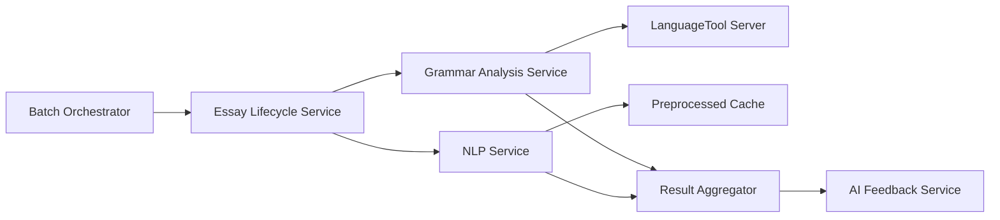

# NLP and Grammar Services Architecture Decision

## Executive Summary

This document outlines the architectural decisions for separating NLP operations and grammar analysis into distinct services within the HuleEdu ecosystem. The separation is driven by different infrastructure requirements, scaling characteristics, and technological dependencies.

## Service Separation Rationale

### Core Principle
Grammar analysis and NLP operations, while related, have fundamentally different characteristics that warrant separation:

1. **Grammar Analysis Service**: Gateway to containerized grammar servers (LanguageTool/Harper)
2. **NLP Service**: Houses custom analytical algorithms and text metrics

## Service Responsibilities

### NLP Service

**Domain**: Custom text analysis algorithms and metrics

**Responsibilities**:
- Fuzzy name matching (student name extraction from essays)
- Readability score calculation (Flesch-Kincaid, etc.)
- Text complexity analysis (CEFR level estimation)
- Sentence and paragraph metrics
- Vocabulary diversity analysis
- Entity extraction (future)
- Sentiment analysis (future)

**Key Characteristics**:
- **Stateless**: Pure computational algorithms
- **CPU-bound**: Processing intensive
- **Library-based**: spaCy, NLTK, TextBlob, rapidfuzz
- **Cacheable**: Can cache preprocessed documents

**Implementation Pattern**:
```python
# Command pattern for extensibility
class NLPCommandHandler:
    async def handle(self, command: NLPCommand):
        match command.type:
            case "FUZZY_MATCH_STUDENT":
                return await self.fuzzy_matcher.process(command)
            case "CALCULATE_METRICS":
                return await self.metrics_calculator.process(command)
            case "EXTRACT_ENTITIES":
                return await self.entity_extractor.process(command)
```

### Grammar Analysis Service

**Domain**: Grammar, spelling, and style checking via external servers

**Responsibilities**:
- Grammar error detection and correction suggestions
- Advanced spell checking (context-aware)
- Style and tone analysis
- Language-specific rule application
- Writing quality suggestions

**Key Characteristics**:
- **Stateful server dependency**: Requires LanguageTool/Harper server
- **Memory-intensive**: Grammar servers need significant RAM
- **Network I/O bound**: Communicates with grammar server
- **Language-specific**: Different rules per language

**Infrastructure Pattern**:
```yaml
# Docker Compose setup
grammar_analysis_service:
  build: ./services/grammar_analysis_service
  depends_on:
    - languagetool_server
  environment:
    - GRAMMAR_SERVER_URL=http://languagetool_server:8010

languagetool_server:
  image: erikvl87/languagetool
  ports:
    - "8010:8010"
  environment:
    - Java_Xmx=2048m
  volumes:
    - ./grammar_rules:/ngrams  # Custom rules
```

## Architectural Benefits

### 1. Shared Infrastructure Within NLP Service

**Efficient Preprocessing**:
```python
# One preprocessing pass, multiple analyses
async def process_text(text: str):
    # Cache this expensive operation
    doc = await nlp_pipeline(text)  # Tokenization, POS tagging, etc.
    
    # Reuse for multiple operations
    readability = calculate_readability(doc)
    complexity = estimate_complexity(doc)
    entities = extract_entities(doc)
    fuzzy_matches = find_student_names(doc)
    
    return NLPAnalysisResult(
        readability=readability,
        complexity=complexity,
        entities=entities,
        student_matches=fuzzy_matches
    )
```

### 2. Independent Scaling

**NLP Service Scaling**:
- Scale horizontally based on CPU usage
- Stateless = easy autoscaling
- Can run multiple instances without coordination

**Grammar Analysis Service Scaling**:
- Scale with grammar server capacity
- May need connection pooling
- Load balance across multiple grammar servers

### 3. Technology Flexibility

**Grammar Analysis**:
- Can switch between LanguageTool, Harper, Grammarly API
- Service interface remains constant
- Only implementation changes

**NLP Service**:
- Can swap spaCy for Stanza
- Can upgrade to transformer models
- Can add new metrics without affecting grammar

## Integration Pattern

### Event Flow



### Parallel Processing

Both services process essays in parallel:

```python
# Essay Lifecycle Service
async def process_essay_analysis(essay_id: str):
    # Publish both events simultaneously
    await asyncio.gather(
        publish_event(BatchGrammarAnalysisRequestedV1(essay_id=essay_id)),
        publish_event(BatchNLPAnalysisRequestedV1(essay_id=essay_id))
    )
    
    # Result Aggregator combines results for AI Feedback Service
```

## Migration Strategy

### Current State
- NLP operations may be scattered or combined with other services
- Grammar checking might be part of spellchecker or inline

### Phase 1: Consolidate NLP Operations
1. Create NLP Service with command pattern
2. Move fuzzy matching from Class Management (if applicable)
3. Move readability metrics from wherever they live
4. Implement caching layer for preprocessed documents

### Phase 2: Implement Grammar Analysis Service
1. Deploy LanguageTool/Harper server container
2. Create Grammar Analysis Service as gateway
3. Implement chunking for large texts
4. Add connection pooling for performance

### Phase 3: Integration
1. Update Essay Lifecycle Service to call both services
2. Update Result Aggregator to combine results
3. Update AI Feedback Service to use aggregated data

## Decision: Keep Services Separate

### Rationale for Separation

✅ **Different Infrastructure**: Container server vs pure algorithms
✅ **Different Scaling**: Memory-bound vs CPU-bound
✅ **Different Dependencies**: Grammar server client vs ML libraries
✅ **Different Failure Modes**: Server availability vs algorithmic errors
✅ **Clear Boundaries**: Third-party tool gateway vs custom analytics

### When to Consider Merging

Only consider merging if:
- Grammar server becomes a simple library (unlikely)
- NLP operations become trivially small (unlikely)
- Operational overhead becomes problematic (monitor this)

## Future Considerations

### Potential NLP Service Splits

Using the command pattern, these could become separate services when needed:

1. **Entity Extraction Service**: If it grows complex with NER models
2. **Sentiment Analysis Service**: If it requires specialized models
3. **Translation Service**: If multi-language support is added

### Grammar Service Extensions

1. **Style Guide Service**: Custom institutional writing rules
2. **Plagiarism Detection**: If integrated with grammar checking
3. **Citation Checker**: Academic writing support

## Implementation Guidelines

### NLP Service Guidelines

1. **Use command pattern** for all operations
2. **Cache aggressively** - preprocessed documents are expensive
3. **Make operations idempotent** - same input = same output
4. **Version your models** - track which model version produced results

### Grammar Analysis Service Guidelines

1. **Implement retry logic** for grammar server communication
2. **Handle chunking** for large documents (LanguageTool has limits)
3. **Cache results** with TTL (grammar rules change infrequently)
4. **Support multiple languages** from day one

## Success Metrics

### NLP Service
- Processing time per essay < 500ms
- Cache hit rate > 80%
- CPU utilization < 70%

### Grammar Analysis Service
- Grammar check time per essay < 2 seconds
- Grammar server availability > 99.9%
- Connection pool utilization < 80%

## Conclusion

The separation of NLP Service and Grammar Analysis Service follows the single responsibility principle while maintaining pragmatic consolidation where it makes sense. The NLP Service consolidates related analytical operations that share preprocessing and libraries, while Grammar Analysis Service acts as a dedicated gateway to specialized grammar infrastructure.

This architecture provides:
- **Efficiency**: Shared preprocessing within NLP, dedicated grammar server management
- **Flexibility**: Easy to evolve each service independently
- **Scalability**: Each service scales according to its characteristics
- **Maintainability**: Clear boundaries and responsibilities