# NLP Service Phase 2 End-to-End Integration Testing - REVISED

## ULTRATHINK: Post-Gateway Implementation Integration Testing

### Architectural Context Update ✅

We have successfully implemented the ELS Gateway pattern for NLP Service Phase 2, aligning it with the established spellcheck architecture:

#### Key Architectural Changes Implemented
1. **NLP Service Consumer Update**: Now consumes `BATCH_NLP_PROCESSING_REQUESTED` from ELS
2. **ELS Gateway Pattern**: ELS acts as the gateway for NLP requests, maintaining state control
3. **Event Flow Alignment**: Matches spellcheck pattern exactly
4. **Clean Architecture**: No dual consumption anti-patterns

### Current Event Flow Architecture

```mermaid
graph LR
    Client[Client] -->|Pipeline Request| BCS[Batch Control Service]
    BCS -->|Orchestration Commands| BOS[Batch Orchestrator Service]
    
    %% Phase 1 Flow
    BOS -->|BATCH_STUDENT_MATCHING_INITIATE_COMMAND| ELS1[Essay Lifecycle Service]
    ELS1 -->|BATCH_STUDENT_MATCHING_REQUESTED| NLP_P1[NLP Service Phase 1]
    NLP_P1 -->|BATCH_AUTHOR_MATCHES_SUGGESTED| CMS[Class Management Service]
    NLP_P1 -->|BATCH_STUDENT_MATCHING_COMPLETED| ELS1
    
    %% Phase 2 Flow - NEW PATTERN
    BOS -->|BATCH_NLP_INITIATE_COMMAND| ELS2[Essay Lifecycle Service]
    ELS2 -->|BATCH_NLP_PROCESSING_REQUESTED| NLP_P2[NLP Service Phase 2]
    NLP_P2 -->|ESSAY_NLP_COMPLETED| RAS[Result Aggregation Service]
    NLP_P2 -->|BATCH_NLP_ANALYSIS_COMPLETED| ELS2
```



## ULTRATHINK Task 1: Event Flow Mapping

### Objective
Map the complete event flow from client request through both NLP phases with the new gateway pattern.

### Event Flow Sequence

#### 1. Pipeline Initiation
```
Client → BCS: POST /api/v1/pipelines/initiate
{
    "batch_id": "batch-123",
    "pipeline_type": "NLP_ANALYSIS",
    "class_id": "class-456",
    "course_code": "ENG5"
}
```

#### 2. BCS Pipeline Resolution
```
BCS → BOS: Resolves pipeline dependencies
- Phase 1: Student Matching (required)
- Phase 2: NLP Analysis (depends on Phase 1)
```

#### 3. Phase 1 Execution (Student Matching)
```
BOS → ELS: BATCH_STUDENT_MATCHING_INITIATE_COMMAND
ELS → NLP: BATCH_STUDENT_MATCHING_REQUESTED
NLP → CMS: BATCH_AUTHOR_MATCHES_SUGGESTED (rich data)
NLP → ELS: BATCH_STUDENT_MATCHING_COMPLETED (thin event)
ELS → BCS: Updates batch state
```

#### 4. Phase 2 Execution (NLP Analysis) - NEW FLOW
```
BOS → ELS: BATCH_NLP_INITIATE_COMMAND
ELS (Gateway):
  - Updates essay states to "nlp_initiated"
  - Transforms command to service request
ELS → NLP: BATCH_NLP_PROCESSING_REQUESTED (NEW EVENT)
NLP Processes:
  - Consumes BatchNlpProcessingRequestedV1
  - Performs linguistic analysis
NLP → RAS: ESSAY_NLP_COMPLETED (rich data)
NLP → ELS: BATCH_NLP_ANALYSIS_COMPLETED (thin event)
ELS → BCS: Updates batch completion
```

## ULTRATHINK Task 2: Integration Test Requirements

### Test Structure Location
```
tests/
├── integration/
│   └── pipeline/
│       ├── test_nlp_phase2_e2e_gateway.py  # NEW
│       ├── test_nlp_phase1_e2e.py          # Existing
│       └── conftest.py                     # Shared fixtures
```

### Critical Test Scenarios

#### Scenario 1: Complete Two-Phase Pipeline
```python
async def test_complete_nlp_pipeline_with_gateway_pattern():
    """
    Verify Phase 1 → Phase 2 transition with ELS gateway.
    
    Test Flow:
    1. Client initiates NLP_ANALYSIS pipeline
    2. BCS resolves to Phase 1 + Phase 2
    3. Phase 1 completes (student matching)
    4. BOS sends BATCH_NLP_INITIATE_COMMAND to ELS
    5. ELS transforms to BATCH_NLP_PROCESSING_REQUESTED
    6. NLP Service Phase 2 processes from ELS (not BOS)
    7. Dual events published correctly
    8. Pipeline completes successfully
    """
```

#### Scenario 2: Gateway Pattern Validation
```python
async def test_nlp_service_only_consumes_from_els():
    """
    Verify NLP Service does NOT consume from BOS directly.
    
    Test:
    1. Publish BATCH_NLP_INITIATE_COMMAND to BOS topic
    2. Verify NLP Service does NOT process it
    3. Verify ELS processes it and transforms
    4. Verify NLP Service processes ELS event
    """
```

#### Scenario 3: State Tracking Through Gateway
```python
async def test_els_maintains_state_control():
    """
    Verify ELS properly tracks essay states.
    
    Test:
    1. Check essay states before NLP phase
    2. BOS sends command to ELS
    3. Verify ELS updates states to "nlp_initiated"
    4. Verify states passed in BATCH_NLP_PROCESSING_REQUESTED
    5. Verify final state updates after completion
    """
```

## ULTRATHINK Task 3: TestContainers Configuration

### Required Services
```python
@pytest.fixture
async def nlp_e2e_environment():
    """Complete microservices environment for E2E testing."""
    
    async with AsyncDockerCompose(
        compose_file_name="docker-compose.test.yml",
        pull=True,
        build=True
    ) as compose:
        # Required services for full pipeline
        services = {
            "kafka": {"port": 9092},
            "postgres": {"port": 5432},
            "redis": {"port": 6379},
            "batch_control_service": {"port": 8001},
            "batch_orchestrator_service": {"port": 8002},
            "essay_lifecycle_service": {"port": 8003},
            "nlp_service": {"port": 8004},
            "class_management_service": {"port": 8005},
            "result_aggregation_service": {"port": 8006},
        }
        
        # Wait for all services to be healthy
        await wait_for_services_healthy(compose, services)
        
        yield compose
```

### Kafka Topic Verification
```python
async def verify_topic_configuration():
    """Verify all required topics exist with correct configuration."""
    
    required_topics = [
        # BOS → ELS
        "huleedu.batch.nlp.initiate.command.v1",
        
        # ELS → NLP (NEW)
        "huleedu.batch.nlp.processing.requested.v1",
        
        # NLP → RAS
        "huleedu.essay.nlp.completed.v1",
        
        # NLP → ELS
        "huleedu.batch.nlp.analysis.completed.v1",
    ]
    
    for topic in required_topics:
        assert await kafka_admin.topic_exists(topic)
```

## ULTRATHINK Task 4: Event Validation

### Event Structure Validation

#### BatchNlpProcessingRequestedV1 (NEW)
```python
def validate_nlp_processing_requested_event(event: dict):
    """Validate event from ELS to NLP."""
    assert event["event_type"] == "huleedu.batch.nlp.processing.requested.v1"
    assert "essays_to_process" in event["data"]
    assert "language" in event["data"]
    assert "batch_id" in event["data"]  # Now included in event
    
    # Verify it's from ELS, not BOS
    assert event["source_service"] == "essay_lifecycle_service"
```

#### Handler Update Validation
```python
async def test_batch_nlp_handler_processes_new_event_type():
    """Verify handler processes BatchNlpProcessingRequestedV1."""
    
    handler = BatchNlpAnalysisHandler(...)
    
    # Should handle new event type
    assert await handler.can_handle(
        topic_name(ProcessingEvent.BATCH_NLP_PROCESSING_REQUESTED)
    )
    
    # Should NOT handle old direct BOS event
    assert not await handler.can_handle(
        topic_name(ProcessingEvent.BATCH_NLP_INITIATE_COMMAND)
    )
```

## ULTRATHINK Task 5: Performance Validation

### Latency Requirements
```python
async def test_gateway_pattern_performance():
    """Verify gateway pattern doesn't add significant latency."""
    
    timings = {
        "bos_to_els": 0,
        "els_transform": 0,
        "els_to_nlp": 0,
        "nlp_processing": 0,
        "total_e2e": 0,
    }
    
    # Measure each segment
    start = time.time()
    
    # ... pipeline execution ...
    
    # Verify < 500ms per essay requirement
    assert timings["nlp_processing"] / essay_count < 0.5
    
    # Verify gateway overhead < 50ms
    assert timings["els_transform"] < 0.05
```

## Critical Implementation Constraints

### 1. No Direct BOS → NLP Communication
- NLP Service MUST NOT subscribe to BOS topics
- All commands flow through ELS gateway
- Maintains service boundaries

### 2. Event Type Consistency
- Use `BatchNlpProcessingRequestedV1` from ELS
- NOT `BatchServiceNLPInitiateCommandDataV1` from BOS
- Follow established event naming patterns

### 3. State Management
- ELS maintains authoritative essay state
- NLP Service is stateless processor
- State updates flow back through thin events

### 4. Error Handling
- Gateway must handle transformation failures
- Maintain correlation IDs through gateway
- Use structured error handling from huleedu_service_libs

## Test Execution Strategy

### Phase 1: Unit Validation
```bash
# Verify handler changes
pdm run pytest services/nlp_service/tests/unit/test_batch_nlp_analysis_handler.py -xvs

# Verify ELS gateway implementation  
pdm run pytest services/essay_lifecycle_service/tests/unit/test_nlp_command_handler.py -xvs
```

### Phase 2: Service Integration
```bash
# Test NLP Service in isolation with mock events
pdm run pytest services/nlp_service/tests/integration/ -xvs
```

### Phase 3: End-to-End Pipeline
```bash
# Full pipeline test with TestContainers
pdm run pytest tests/integration/pipeline/test_nlp_phase2_e2e_gateway.py -xvs
```

## Success Criteria

### ✅ Functional Requirements
1. Phase 1 → Phase 2 transition works seamlessly
2. NLP Service only consumes from ELS
3. Dual event publishing works correctly
4. Pipeline completes end-to-end

### ✅ Architectural Requirements
1. No direct BOS → NLP consumption
2. ELS maintains state control
3. Follows spellcheck pattern exactly
4. Clean service boundaries

### ✅ Performance Requirements
1. < 500ms per essay processing
2. < 50ms gateway transformation overhead
3. No message loss or duplication
4. Proper backpressure handling

## Next Steps

1. Create test file structure in `tests/integration/pipeline/`
2. Implement TestContainers configuration
3. Write gateway pattern validation tests
4. Verify event flow with distributed tracing
5. Load test with multiple concurrent batches
6. Document any discovered integration issues

## Key Files to Reference

### Implementation Files (Updated)
- `services/nlp_service/kafka_consumer.py` - Now consumes from ELS
- `services/nlp_service/command_handlers/batch_nlp_analysis_handler.py` - Handles new event
- `services/essay_lifecycle_service/implementations/nlp_command_handler.py` - Gateway logic
- `services/essay_lifecycle_service/implementations/service_request_dispatcher.py` - Dispatch logic

### Event Definitions
- `libs/common_core/src/common_core/events/nlp_events.py` - BatchNlpProcessingRequestedV1
- `libs/common_core/src/common_core/event_enums.py` - Topic mappings

### Test Patterns
- `tests/integration/test_batch_creation_to_completion.py` - Reference pattern
- `services/spellchecker_service/tests/integration/` - Gateway pattern reference

## Important Notes

⚠️ **DO NOT MODIFY**: Phase 1 student matching implementation remains unchanged
⚠️ **CRITICAL**: NLP Service no longer listens to BOS directly
⚠️ **PATTERN**: Follow spellcheck service as the reference implementation
⚠️ **TESTING**: Use TestContainers for realistic multi-service testing