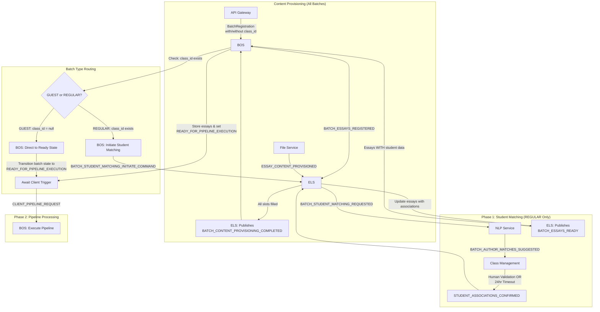

# NLP Service Phase 1 Student Matching Integration - Comprehensive Implementation Plan

**Created:** 2025-01-30  
**Updated:** 2025-08-02  
**Status:** BOS IMPLEMENTATION COMPLETE, ELS PHASE IN PROGRESS  
**Priority:** HIGH  
**Complements:** TASKS/NLP_SERVICE_EXTRACTION_AND_MATCHING_FEATURE.md

## Executive Summary

This document outlines the comprehensive implementation plan for integrating the NLP Service's student matching capabilities into the HuleEdu Phase 1 batch processing workflow. The plan introduces a critical pre-readiness phase where essays are matched to students with human-in-the-loop validation for REGULAR batches, while GUEST batches bypass this phase entirely.

### Key Architectural Decisions

1. **Phase Separation**: Student matching is a Phase 1 activity (pre-readiness), distinct from Phase 2 pipeline processing (post-readiness)
2. **BOS Ownership**: Batch Orchestrator Service owns the decision logic for GUEST vs REGULAR batch handling
3. **Refined Event Flow**: `BatchContentProvisioningCompletedV1` serves as the readiness event for GUEST batches, while `BatchEssaysReady` is only published for REGULAR batches after student associations
4. **Human Validation**: REGULAR batches require human confirmation of student-essay associations before batch readiness
5. **Timeout Handling**: 24-hour timeout with automatic best-effort matching fallback
6. **Service Boundaries**: Strict adherence to DDD principles - no cross-service database access
7. **Batch-Level Processing**: Following established patterns from Phase 2 services for consistency and efficiency

### Benefits of Batch-Level Processing

1. **Better UX**: Teachers see complete batch results immediately, not a stream of individual notifications
2. **Performance**: Parallel processing of all essays, single network call for results
3. **Consistency**: Aligns with spellcheck and CJ assessment patterns
4. **Simplicity**: No aggregation logic needed in Class Management Service
5. **Reliability**: Single event to track and ensure delivery
6. **Atomicity**: Batch succeeds or fails as a unit

## Background and Context

### Current State (as of 2025-08-02)

**Completed in Previous Sessions:**
- ✅ Common Core event models aligned (`StudentAssociationsConfirmedV1`, `BatchAuthorMatchesSuggestedV1`)
- ✅ BOS now stores `class_id` to differentiate GUEST vs REGULAR batches
- ✅ BOS handlers for `BatchContentProvisioningCompletedV1` and student matching initiation
- ✅ Fixed architectural issue where BOS incorrectly tried to publish `BatchEssaysReady` for GUEST batches
- ✅ All type errors fixed in Phase 1/2 implementation

**Completed in This Session (2025-08-02):**
- ✅ Fixed Phase 1 integration test parameter mismatch (class_id vs batch_context)
- ✅ Added missing mock repository methods (`get_batch_by_id`, `store_batch_essays`)
- ✅ Fixed GUEST batch test expectations (correctly expects status update)
- ✅ All Phase 1 integration tests now passing
- ✅ Type checking and linting issues resolved

**Not Yet Implemented:**
- ❌ ELS doesn't publish `BatchContentProvisioningCompletedV1` yet
- ❌ BatchContentProvisioningCompletedV1 model needs fix (remove mandatory class_id, add essays_for_processing)
- ❌ ELS handlers for student matching commands and associations (NEXT TASK)
- ❌ NLP batch-level student matching handler
- ❌ Class Management validation flow
- ❌ Timeout monitoring mechanism

### Problem Statement

Educational institutions need to:

1. Automatically match uploaded essays to students in their class roster
2. Allow teachers to review and correct automated matches
3. Ensure all essays are properly attributed before processing begins
4. Support both GUEST (anonymous) and REGULAR (class-based) workflows

### Solution Overview

Introduce a Phase 1 orchestration flow that:

- Detects REGULAR batches requiring student matching
- Orchestrates NLP Service student matching after content provisioning
- Enables human validation with timeout fallback
- Maintains backward compatibility for GUEST batches

The communication flow is:

  NLP Service → BATCH_AUTHOR_MATCHES_SUGGESTED → Class Management Service
  Class Management Service → WebSocket → Frontend (for real-time notifications)
  Frontend → HTTP API → Class Management Service (for validation updates)
  Class Management Service → STUDENT_ASSOCIATIONS_CONFIRMED → ELS

  Specifically, from the plan:

  Class Management Service Responsibilities:

  1. Event Handler (Section 5.1):
    - Receives BATCH_AUTHOR_MATCHES_SUGGESTED from NLP Service
    - Stores in database with association_status = "pending_validation"
    - Notifies frontend via WebSocket
  2. API Endpoints (Section 5.2):
    - GET /v1/classes/<class_id>/pending-associations - Frontend retrieves pending matches
    - PUT /v1/classes/<class_id>/associations/<essay_id> - Frontend submits validated associations
  3. WebSocket Integration:
    - Uses existing dual-channel publishing (Kafka + Redis)
    - Redis channel: ws:{user_id} for real-time notifications
  4. Final Communication:
    - After human validation (or timeout), publishes STUDENT_ASSOCIATIONS_CONFIRMED to ELS
    - This event contains all validated essay-student associations

## Architectural Overview

### Service Responsibilities

#### Batch Orchestrator Service (BOS)

- Stores class_id during batch registration
- Detects GUEST vs REGULAR batches
- Orchestrates Phase 1 student matching for REGULAR batches
- Manages phase transitions and timeout handling

#### Essay Lifecycle Service (ELS)

- Tracks content provisioning completion
- Dispatches batch-level student matching request
- Waits for student association confirmations
- Publishes BatchEssaysReady only after associations complete

#### NLP Service

- Processes entire batch of essays in parallel
- Performs student name extraction from essay text
- Matches extracted names against class rosters
- Returns complete batch results with confidence scores
- Handles both Phase 1 and Phase 2 events

#### Class Management Service

- Stores student-essay association suggestions
- Provides UI for human validation
- Handles validation timeouts
- Publishes confirmation events

### Event Flow Architecture (Refined)



**Key Architectural Changes:**
1. **ELS publishes BatchContentProvisioningCompletedV1** - This event now serves as the readiness signal for GUEST batches
2. **GUEST batches skip BatchEssaysReady** - BOS directly transitions them to READY_FOR_PIPELINE_EXECUTION state
3. **BatchEssaysReady only for REGULAR batches** - Published by ELS after student associations are confirmed
4. **No redundant events** - Eliminates the need for separate readiness events for GUEST batches

## Detailed Implementation Plan

### Phase 1: Common Core Updates ✅ COMPLETED

All event definitions and models have been added to common_core:

- ✅ Event enums in `event_enums.py`
- ✅ `BatchServiceStudentMatchingInitiateCommandDataV1` in `batch_service_models.py`
- ✅ `BatchContentProvisioningCompletedV1` in `batch_coordination_events.py` (needs fix: remove mandatory `class_id`)
- ✅ `BatchStudentMatchingRequestedV1` in `essay_lifecycle_events.py`
- ✅ `BatchAuthorMatchesSuggestedV1` in `nlp_events.py`
- ✅ `StudentAssociationsConfirmedV1` in `validation_events.py`

#### Required Fix

Update `BatchContentProvisioningCompletedV1` to work with ELS's available data:

```python
class BatchContentProvisioningCompletedV1(BaseModel):
    """Event sent by ELS to BOS when all expected content has been provisioned.
    
    This event serves dual purpose:
    - For GUEST batches: Contains all data needed for BOS to transition directly to READY state
    - For REGULAR batches: Triggers BOS to initiate Phase 1 student matching
    """
    
    event: str = Field(default="batch.content.provisioning.completed")
    batch_id: str
    provisioned_count: int
    expected_count: int
    course_code: CourseCode  # ELS has this from batch registration
    user_id: str  # ELS has this from batch registration
    # Remove class_id - ELS doesn't have it, BOS will look it up
    essays_for_processing: list[EssayProcessingInputRefV1]  # All provisioned essays with content refs
    correlation_id: UUID
    timestamp: datetime
```

### Phase 2: Batch Orchestrator Service (BOS) Updates ✅ COMPLETED

**What's Been Implemented:**

1. ✅ **API Model Updates**: Added `class_id` field to `BatchRegistrationRequestV1`
2. ✅ **Database Updates**: Added `class_id` column to Batch model with migration
3. ✅ **Repository Updates**: Updated `create_batch` and `get_batch_context` to handle class_id
4. ✅ **Handler Implementation**: Created `BatchContentProvisioningCompletedHandler` that:
   - Detects GUEST vs REGULAR batches based on class_id
   - For REGULAR: Initiates student matching phase
   - For GUEST: Logs completion (ready for direct transition to READY state)
5. ✅ **Student Matching Initiator**: Implemented `StudentMatchingInitiatorImpl`
6. ✅ **DI Configuration**: Added providers for new handlers

**Architectural Fix Implemented:**
- Removed incorrect BatchEssaysReady publishing from BOS handler
- Handler now correctly defers to ELS for readiness decisions
- BOS handler updated to NOT publish any events - it only initiates student matching or transitions state
- ELS is responsible for all batch readiness events

#### 2.3 New Event Handler

**File:** `services/batch_orchestrator_service/implementations/batch_content_provisioning_completed_handler.py`

```python
class BatchContentProvisioningCompletedHandler:
    """Handler for content provisioning completion events."""
    
    def __init__(
        self,
        batch_repo: BatchRepositoryProtocol,
        student_matching_initiator: StudentMatchingInitiatorProtocol,
        phase_coordinator: PipelinePhaseCoordinatorProtocol,
    ):
        self.batch_repo = batch_repo
        self.student_matching_initiator = student_matching_initiator
        self.phase_coordinator = phase_coordinator
        self.logger = create_service_logger("bos.handlers.content_provisioning")
    
    async def handle_batch_content_provisioning_completed(self, msg: Any) -> None:
        """Handle content provisioning completion."""
        # 1. Deserialize event
        # 2. Retrieve batch metadata including class_id
        # 3. Check if class_id exists (REGULAR) or None (GUEST)
        # 4. If REGULAR: Initiate student matching phase
        # 5. If GUEST: Mark ready for immediate batch readiness
        # 6. Update phase state in repository
```

#### 2.4 New Student Matching Initiator

**File:** `services/batch_orchestrator_service/implementations/student_matching_initiator_impl.py`

```python
class StudentMatchingInitiatorImpl(StudentMatchingInitiatorProtocol):
    """Initiates Phase 1 student matching for REGULAR batches."""
    
    def __init__(self, event_publisher: BatchEventPublisherProtocol):
        self.event_publisher = event_publisher
    
    async def initiate_student_matching(
        self,
        batch_id: str,
        class_id: str,
        correlation_id: UUID,
        essays_for_matching: list[EssayProcessingInputRefV1],
    ) -> None:
        """Initiate student matching phase."""
        # Create BatchServiceStudentMatchingInitiateCommandDataV1
        # Publish to ELS via event_publisher
```

#### 2.5 Update Pipeline Phase Coordinator

**File:** `services/batch_orchestrator_service/implementations/pipeline_phase_coordinator_impl.py`

- Add Phase 1 state tracking (AWAITING_STUDENT_MATCHING)
- Update phase transition logic to handle student matching completion
- Add timeout monitoring for student associations

#### 2.6 Kafka Consumer Updates

**File:** `services/batch_orchestrator_service/kafka_consumer.py`

- Add topic subscription for BATCH_CONTENT_PROVISIONING_COMPLETED
- Add topic subscription for STUDENT_ASSOCIATIONS_CONFIRMED
- Route events to appropriate handlers

#### 2.7 Dependency Injection Updates

**File:** `services/batch_orchestrator_service/di.py`

```python
# Add new providers
@provide(scope=Scope.APP)
def provide_student_matching_initiator(
    event_publisher: BatchEventPublisherProtocol,
) -> StudentMatchingInitiatorProtocol:
    return StudentMatchingInitiatorImpl(event_publisher)

@provide(scope=Scope.APP)
def provide_content_provisioning_handler(
    batch_repo: BatchRepositoryProtocol,
    student_matching_initiator: StudentMatchingInitiatorProtocol,
    phase_coordinator: PipelinePhaseCoordinatorProtocol,
) -> BatchContentProvisioningCompletedHandler:
    return BatchContentProvisioningCompletedHandler(
        batch_repo, student_matching_initiator, phase_coordinator
    )
```

### Phase 3: Essay Lifecycle Service (ELS) Updates

#### 3.1 Batch Coordination Handler Updates ❌ NOT IMPLEMENTED

**File:** `services/essay_lifecycle_service/implementations/batch_coordination_handler_impl.py`

```python
# Update handle_essay_content_provisioned method
async def handle_essay_content_provisioned(self, ...):
    # ... existing logic ...
    
    # Check if all content provisioned
    if all_content_provisioned:
        # Retrieve batch metadata from tracker
        batch_data = await self.batch_tracker.get_batch_data(batch_id)
        ready_essays = await self.batch_tracker.get_ready_essays(batch_id)
        
        # Create essays_for_processing list from ready essays
        essays_for_processing = [
            EssayProcessingInputRefV1(
                essay_id=essay.essay_id,
                text_storage_id=essay.text_storage_id,
                filename=essay.original_file_name,
            )
            for essay in ready_essays
        ]
        
        # Create and publish BATCH_CONTENT_PROVISIONING_COMPLETED
        event = BatchContentProvisioningCompletedV1(
            batch_id=batch_id,
            provisioned_count=len(ready_essays),
            expected_count=batch_data.expected_count,
            course_code=batch_data.course_code,
            user_id=batch_data.user_id,
            essays_for_processing=essays_for_processing,
            correlation_id=correlation_id,
        )
        
        await self.batch_lifecycle_publisher.publish_content_provisioning_completed(
            event_data=event,
            correlation_id=correlation_id,
            session=session,
        )
```

**Implementation Note:** Currently, ELS still publishes `BatchEssaysReady` for all batches. This needs to be updated to:
1. Publish `BatchContentProvisioningCompletedV1` when content provisioning is complete
2. Only publish `BatchEssaysReady` for REGULAR batches after student associations are confirmed

#### 3.2 New Student Matching Command Handler ❌ NOT IMPLEMENTED

**File:** `services/essay_lifecycle_service/implementations/student_matching_command_handler.py`

```python
class StudentMatchingCommandHandler:
    """Handles BATCH_STUDENT_MATCHING_INITIATE_COMMAND from BOS."""
    
    def __init__(
        self,
        repository: EssayRepositoryProtocol,
        event_publisher: EssayLifecycleEventPublisherProtocol,
        batch_tracker: BatchEssayTracker,
    ):
        self.repository = repository
        self.event_publisher = event_publisher
        self.batch_tracker = batch_tracker
    
    async def handle_student_matching_command(
        self,
        command_data: BatchServiceStudentMatchingInitiateCommandDataV1,
        correlation_id: UUID,
    ) -> None:
        """Dispatch batch-level student matching request."""
        # 1. Update batch state to AWAITING_STUDENT_ASSOCIATIONS
        await self.batch_tracker.update_batch_state(
            batch_id=command_data.batch_id,
            state="AWAITING_STUDENT_ASSOCIATIONS",
        )
        
        # 2. Create single batch-level event
        batch_matching_request = BatchStudentMatchingRequestedV1(
            event_name=ProcessingEvent.BATCH_STUDENT_MATCHING_REQUESTED,
            entity_id=command_data.batch_id,
            entity_type="batch",
            parent_id=None,
            batch_id=command_data.batch_id,
            essays_to_process=command_data.essays_to_process,
            class_id=command_data.class_id,
        )
        
        # 3. Publish via outbox (following spellcheck pattern)
        envelope = EventEnvelope[BatchStudentMatchingRequestedV1](
            event_type=topic_name(ProcessingEvent.BATCH_STUDENT_MATCHING_REQUESTED),
            source_service="essay-lifecycle-service",
            correlation_id=correlation_id,
            data=batch_matching_request,
            metadata={},
        )
        
        # 4. Store in outbox for reliable delivery
        await self.outbox_repository.add_event(
            aggregate_id=command_data.batch_id,
            aggregate_type="batch",
            event_type=envelope.event_type,
            event_data=envelope.model_dump(mode="json"),
            topic=topic_name(ProcessingEvent.BATCH_STUDENT_MATCHING_REQUESTED),
            event_key=command_data.batch_id,
        )
        
        # 5. Set timeout timer for 24 hours
        await self.batch_tracker.set_association_timeout(
            batch_id=command_data.batch_id,
            timeout_seconds=86400,  # 24 hours
        )
```

#### 3.3 Student Association Handler ❌ NOT IMPLEMENTED

**File:** `services/essay_lifecycle_service/implementations/student_association_handler.py`

```python
class StudentAssociationHandler:
    """Handles STUDENT_ASSOCIATIONS_CONFIRMED from Class Management."""
    
    async def handle_student_associations_confirmed(
        self,
        event_data: StudentAssociationsConfirmedV1,
        correlation_id: UUID,
    ) -> None:
        """Process confirmed student associations."""
        # 1. Update essay records with student associations
        # 2. Check if all essays have associations
        # 3. If complete, publish BATCH_ESSAYS_READY
        # 4. Include class_type based on presence of associations
```

#### 3.4 Timeout Mechanism ❌ NOT IMPLEMENTED

**File:** `services/essay_lifecycle_service/implementations/association_timeout_monitor.py`

```python
class AssociationTimeoutMonitor:
    """Monitors for student association timeouts."""
    
    async def check_timeouts(self) -> None:
        """Periodic task to check for expired associations."""
        # 1. Query batches in AWAITING_STUDENT_ASSOCIATIONS state
        # 2. Check if timeout (24 hours) exceeded
        # 3. Trigger timeout event to Class Management
        # 4. Process timeout response
```

### Phase 4: NLP Service Updates ❌ NOT IMPLEMENTED

#### 4.1 Batch Processing Handler

**File:** `services/nlp_service/implementations/batch_student_matching_handler.py`

```python
class BatchStudentMatchingHandler:
    """Handles batch-level student matching requests from ELS."""
    
    def __init__(
        self,
        content_client: ContentClientProtocol,
        roster_client: ClassRosterClientProtocol,
        roster_cache: RosterCacheProtocol,
        extraction_pipeline: ExtractionPipeline,
        roster_matcher: RosterMatcher,
        event_publisher: NLPEventPublisherProtocol,
        outbox_repository: OutboxRepositoryProtocol,
    ):
        self.content_client = content_client
        self.roster_client = roster_client
        self.roster_cache = roster_cache
        self.extraction_pipeline = extraction_pipeline
        self.roster_matcher = roster_matcher
        self.event_publisher = event_publisher
        self.outbox_repository = outbox_repository
    
    async def handle_batch_student_matching(
        self,
        event_data: BatchStudentMatchingRequestedV1,
        correlation_id: UUID,
        http_session: ClientSession,
    ) -> None:
        """Process entire batch of essays for student matching."""
        logger.info(
            f"Processing batch student matching for {len(event_data.essays_to_process)} essays",
            extra={"batch_id": event_data.batch_id, "correlation_id": str(correlation_id)},
        )
        
        # 1. Get class roster (with caching)
        roster = await self.roster_cache.get_roster(event_data.class_id)
        if not roster:
            roster = await self.roster_client.get_class_roster(
                class_id=event_data.class_id,
                http_session=http_session,
                correlation_id=correlation_id,
            )
            await self.roster_cache.set_roster(event_data.class_id, roster)
        
        # 2. Process all essays in parallel
        match_results = await self._process_essays_parallel(
            essays=event_data.essays_to_process,
            roster=roster,
            correlation_id=correlation_id,
            http_session=http_session,
        )
        
        # 3. Create batch response
        batch_matches = BatchAuthorMatchesSuggestedV1(
            event_name=ProcessingEvent.BATCH_AUTHOR_MATCHES_SUGGESTED,
            entity_id=event_data.batch_id,
            entity_type="batch",
            parent_id=None,
            batch_id=event_data.batch_id,
            class_id=event_data.class_id,
            match_results=match_results,
            processing_summary=self._calculate_summary(match_results),
        )
        
        # 4. Publish via outbox
        envelope = EventEnvelope[BatchAuthorMatchesSuggestedV1](
            event_type=topic_name(ProcessingEvent.BATCH_AUTHOR_MATCHES_SUGGESTED),
            source_service="nlp-service",
            correlation_id=correlation_id,
            data=batch_matches,
            metadata={},
        )
        
        await self.outbox_repository.add_event(
            aggregate_id=event_data.batch_id,
            aggregate_type="batch",
            event_type=envelope.event_type,
            event_data=envelope.model_dump(mode="json"),
            topic=topic_name(ProcessingEvent.BATCH_AUTHOR_MATCHES_SUGGESTED),
            event_key=event_data.batch_id,
        )
    
    async def _process_essays_parallel(
        self,
        essays: list[EssayProcessingInputRefV1],
        roster: list[StudentInfo],
        correlation_id: UUID,
        http_session: ClientSession,
    ) -> list[EssayMatchResult]:
        """Process multiple essays in parallel with concurrency control."""
        semaphore = asyncio.Semaphore(10)  # Limit concurrent processing
        
        async def process_single_essay(essay_ref: EssayProcessingInputRefV1) -> EssayMatchResult:
            async with semaphore:
                try:
                    # Fetch content
                    essay_text = await self.content_client.fetch_content(
                        storage_id=essay_ref.text_storage_id,
                        http_session=http_session,
                        correlation_id=correlation_id,
                    )
                    
                    # Extract identifiers
                    extracted = await self.extraction_pipeline.extract(
                        text=essay_text,
                        filename=essay_ref.filename,
                    )
                    
                    # Match against roster
                    suggestions = await self.roster_matcher.match_student(
                        extracted=extracted,
                        roster=roster,
                    )
                    
                    return EssayMatchResult(
                        essay_id=essay_ref.essay_id,
                        text_storage_id=essay_ref.text_storage_id,
                        filename=essay_ref.filename,
                        suggestions=suggestions,
                        no_match_reason=self._get_no_match_reason(suggestions, extracted),
                        extraction_metadata=extracted.metadata,
                    )
                except Exception as e:
                    logger.error(
                        f"Failed to process essay {essay_ref.essay_id}: {str(e)}",
                        extra={"correlation_id": str(correlation_id)},
                    )
                    return EssayMatchResult(
                        essay_id=essay_ref.essay_id,
                        text_storage_id=essay_ref.text_storage_id,
                        filename=essay_ref.filename,
                        suggestions=[],
                        no_match_reason=f"Processing error: {str(e)}",
                        extraction_metadata={"error": str(e)},
                    )
        
        # Process all essays concurrently
        tasks = [process_single_essay(essay) for essay in essays]
        return await asyncio.gather(*tasks)
    
    def _calculate_summary(self, match_results: list[EssayMatchResult]) -> dict[str, int]:
        """Calculate processing summary statistics."""
        return {
            "total_essays": len(match_results),
            "matched": sum(1 for r in match_results if r.suggestions),
            "no_match": sum(1 for r in match_results if not r.suggestions and not r.no_match_reason.startswith("Processing error")),
            "errors": sum(1 for r in match_results if r.no_match_reason and r.no_match_reason.startswith("Processing error")),
        }
```

#### 4.2 Event Routing Updates

**File:** `services/nlp_service/event_processor.py`

```python
async def process_single_message(msg, command_handlers, http_session, tracer):
    """Route Phase 1 and Phase 2 events to appropriate handlers."""
    
    # Parse event type from topic
    topic = msg.topic
    
    if topic == topic_name(ProcessingEvent.BATCH_STUDENT_MATCHING_REQUESTED):
        # Phase 1: Batch student matching request
        handler = command_handlers["phase1_batch_student_matching"]
    elif topic == topic_name(ProcessingEvent.BATCH_NLP_INITIATE_COMMAND):
        # Phase 2: NLP analysis command
        handler = command_handlers["phase2_batch_nlp"]
    else:
        logger.warning(f"Unknown topic: {topic}")
        return False
    
    # Process with appropriate handler
    return await handler.handle(msg, http_session)
```

#### 4.3 Dependency Injection Updates

**File:** `services/nlp_service/di.py`

```python
# Add new handler provider
@provide(scope=Scope.APP)
def provide_batch_student_matching_handler(
    content_client: ContentClientProtocol,
    roster_client: ClassRosterClientProtocol,
    roster_cache: RosterCacheProtocol,
    extraction_pipeline: ExtractionPipeline,
    roster_matcher: RosterMatcher,
    event_publisher: NLPEventPublisherProtocol,
    outbox_repository: OutboxRepositoryProtocol,
) -> BatchStudentMatchingHandler:
    return BatchStudentMatchingHandler(
        content_client=content_client,
        roster_client=roster_client,
        roster_cache=roster_cache,
        extraction_pipeline=extraction_pipeline,
        roster_matcher=roster_matcher,
        event_publisher=event_publisher,
        outbox_repository=outbox_repository,
    )

# Update command handlers map
@provide(scope=Scope.APP)
def provide_command_handlers(
    batch_student_matching_handler: BatchStudentMatchingHandler,
    batch_nlp_handler: BatchNLPHandler,  # Phase 2 handler
) -> dict[str, Any]:
    return {
        "phase1_batch_student_matching": batch_student_matching_handler,
        "phase2_batch_nlp": batch_nlp_handler,
    }
```

### Phase 5: Class Management Service Updates ❌ NOT IMPLEMENTED

#### 5.1 Event Handler for Match Suggestions

**File:** `services/class_management_service/implementations/match_suggestion_handler.py`

```python
class MatchSuggestionHandler:
    """Handles BATCH_AUTHOR_MATCHES_SUGGESTED from NLP Service."""
    
    async def handle_batch_match_suggestions(
        self,
        event_data: BatchAuthorMatchesSuggestedV1,
        correlation_id: UUID,
    ) -> None:
        """Store match suggestions for human validation."""
        # 1. Store suggestions in EssayStudentAssociation table
        # 2. Set association_status = "pending_validation"
        # 3. Notify frontend via WebSocket
        # 4. Start 24-hour timeout timer
```

#### 5.2 Validation API Endpoints

**File:** `services/class_management_service/api/association_routes.py`

```python
@bp.get("/v1/classes/<class_id>/pending-associations")
@inject
async def get_pending_associations(
    class_id: str,
    repository: FromDishka[ClassRepositoryProtocol],
) -> list[PendingAssociationV1]:
    """Get all pending student-essay associations for a class."""
    # Return associations with match suggestions

@bp.put("/v1/classes/<class_id>/associations/<essay_id>")
@inject
async def update_association(
    class_id: str,
    essay_id: str,
    request: AssociationUpdateV1,
    repository: FromDishka[ClassRepositoryProtocol],
    event_publisher: FromDishka[ClassEventPublisherProtocol],
) -> AssociationResponseV1:
    """Update a student-essay association."""
    # 1. Validate user has permission
    # 2. Update association in database
    # 3. Check if all associations for batch are complete
    # 4. If complete, publish STUDENT_ASSOCIATIONS_CONFIRMED
```

#### 5.3 Timeout Handler

**File:** `services/class_management_service/implementations/association_timeout_handler.py`

```python
class AssociationTimeoutHandler:
    """Handles association validation timeouts."""
    
    async def process_timeout(self, batch_id: str, class_id: str) -> None:
        """Auto-confirm best matches after timeout."""
        # 1. Get all pending associations for batch
        # 2. For each essay:
        #    - Select highest confidence match
        #    - Mark as "timeout" validation
        # 3. Publish STUDENT_ASSOCIATIONS_CONFIRMED with timeout flag
```

### Phase 6: Test Infrastructure Updates ❌ NOT IMPLEMENTED

#### 6.1 Student Association Simulator

**File:** `tests/functional/student_association_simulator.py`

```python
class StudentAssociationSimulator:
    """Simulates frontend validation of student associations."""
    
    def __init__(self, class_management_url: str, kafka_manager: KafkaTestManager):
        self.class_management_url = class_management_url
        self.kafka_manager = kafka_manager
        self.http_session = aiohttp.ClientSession()
    
    async def simulate_validation(
        self,
        class_id: str,
        auto_approve: bool = True,
        delay_seconds: float = 1.0,
        modify_percentage: float = 0.0,
        timeout_simulation: bool = False,
    ) -> ValidationResult:
        """Simulate human validation behavior."""
        if timeout_simulation:
            # Don't respond, let timeout trigger
            await asyncio.sleep(delay_seconds)
            return ValidationResult(method="timeout")
        
        # Get pending associations
        associations = await self._get_pending_associations(class_id)
        
        # Simulate delay
        await asyncio.sleep(delay_seconds)
        
        # Process each association
        for assoc in associations:
            if random.random() < modify_percentage:
                # Simulate modification
                await self._modify_association(assoc)
            elif auto_approve:
                # Approve as-is
                await self._approve_association(assoc)
```

#### 6.2 Enhanced Pipeline Utils

**File:** `tests/functional/comprehensive_pipeline_utils.py`

```python
# Add Phase 1 topics
PHASE1_TOPICS = {
    "content_provisioning_completed": topic_name(ProcessingEvent.BATCH_CONTENT_PROVISIONING_COMPLETED),
    "student_matching_initiate": topic_name(ProcessingEvent.BATCH_STUDENT_MATCHING_INITIATE_COMMAND),
    "batch_student_matching_requested": topic_name(ProcessingEvent.BATCH_STUDENT_MATCHING_REQUESTED),
    "batch_author_matches_suggested": topic_name(ProcessingEvent.BATCH_AUTHOR_MATCHES_SUGGESTED),
    "associations_confirmed": topic_name(ProcessingEvent.STUDENT_ASSOCIATIONS_CONFIRMED),
}

async def watch_phase1_progression(
    consumer,
    batch_id: str,
    correlation_id: str,
    expected_essay_count: int,
    is_guest_batch: bool = False,
    timeout_seconds: int = 180,
) -> Phase1Result:
    """Monitor Phase 1 student matching progression."""
    # Track Phase 1 events
    # Handle GUEST vs REGULAR flow differences
    # Return detailed progression result
```

#### 6.3 E2E Test Scenarios

**File:** `tests/functional/test_e2e_student_matching_workflows.py`

```python
@pytest.mark.asyncio
async def test_guest_batch_skips_student_matching():
    """GUEST batches should skip directly to BATCH_ESSAYS_READY."""
    # Register batch without class_id
    # Upload essays
    # Verify no BATCH_STUDENT_MATCHING_REQUESTED events
    # Verify immediate BATCH_ESSAYS_READY

@pytest.mark.asyncio
async def test_regular_batch_student_matching_happy_path():
    """REGULAR batches require student association before readiness."""
    # Register batch with class_id
    # Upload essays
    # Verify BATCH_STUDENT_MATCHING_REQUESTED sent
    # Verify BATCH_AUTHOR_MATCHES_SUGGESTED received
    # Simulate human validation on complete batch
    # Verify BATCH_ESSAYS_READY after associations

@pytest.mark.asyncio
async def test_batch_processing_performance():
    """Test batch processing meets performance requirements."""
    # Create batch with 30 essays
    # Measure total processing time
    # Verify < 10 seconds for entire batch
    # Verify all essays processed in parallel

@pytest.mark.asyncio
async def test_partial_batch_failure():
    """Test handling when some essays fail processing."""
    # Mock content service to fail for 2/10 essays
    # Verify batch continues with partial results
    # Check processing_summary shows errors
    # Verify failed essays have error markers

@pytest.mark.asyncio
async def test_batch_idempotency():
    """Test duplicate batch processing is handled."""
    # Send same BATCH_STUDENT_MATCHING_REQUESTED twice
    # Verify only processed once
    # Second request returns cached results
    # No duplicate BATCH_AUTHOR_MATCHES_SUGGESTED events

@pytest.mark.asyncio
async def test_student_association_timeout():
    """Test 24-hour timeout with auto-confirmation."""
    # Configure short timeout for testing
    # Register batch, upload essays
    # Don't respond to validation
    # Verify timeout triggers
    # Verify auto-confirmation with best matches

@pytest.mark.asyncio
async def test_student_matching_with_modifications():
    """Test human modification of suggested matches."""
    # Setup simulator with modify_percentage=0.3
    # Verify modified associations are properly stored
    # Verify final BATCH_ESSAYS_READY reflects modifications

@pytest.mark.asyncio
async def test_batch_size_limits():
    """Test rejection of oversized batches."""
    # Try to process batch with 150 essays
    # Verify rejected with appropriate error
    # Check error suggests splitting batch

@pytest.mark.asyncio
async def test_roster_not_found():
    """Test graceful handling of missing class roster."""
    # Mock roster service to return 404
    # Verify batch processes with no matches
    # Check all essays marked as no_match
    # Verify teacher notified
```

## Database Schema Updates

### Batch Orchestrator Service

```sql
-- Add class_id to batch metadata
ALTER TABLE batch_metadata
ADD COLUMN class_id VARCHAR(255) DEFAULT NULL;

-- Add index for class-based queries
CREATE INDEX idx_batch_metadata_class_id ON batch_metadata(class_id);

-- Add phase tracking for student matching
ALTER TABLE processing_pipeline_states
ADD COLUMN awaiting_student_matching BOOLEAN DEFAULT FALSE,
ADD COLUMN student_matching_started_at TIMESTAMP,
ADD COLUMN student_matching_completed_at TIMESTAMP;
```

### Essay Lifecycle Service

```sql
-- Add student association tracking
ALTER TABLE processed_essays
ADD COLUMN awaiting_student_association BOOLEAN DEFAULT FALSE,
ADD COLUMN student_id VARCHAR(255),
ADD COLUMN association_confirmed_at TIMESTAMP,
ADD COLUMN association_method VARCHAR(50); -- 'human', 'timeout', 'auto'

-- Add timeout tracking to batch tracker
ALTER TABLE batch_essay_trackers
ADD COLUMN student_association_timeout TIMESTAMP,
ADD COLUMN association_timeout_seconds INTEGER DEFAULT 86400; -- 24 hours
```

### Class Management Service ❌ NOT MIGRATED

```sql
-- Enhance existing EssayStudentAssociation table
ALTER TABLE essay_student_associations
ADD COLUMN confidence_score FLOAT,
ADD COLUMN match_reasons JSONB,
ADD COLUMN validation_status VARCHAR(50) DEFAULT 'pending', -- pending, confirmed, rejected
ADD COLUMN validated_by VARCHAR(255),
ADD COLUMN validated_at TIMESTAMP,
ADD COLUMN validation_method VARCHAR(50); -- 'human', 'timeout', 'auto'

-- Add indexes for validation queries
CREATE INDEX idx_essay_associations_validation_status 
ON essay_student_associations(class_id, validation_status);

CREATE INDEX idx_essay_associations_batch 
ON essay_student_associations(batch_id, validation_status);
```

## Error Handling and Edge Cases

### Idempotency Requirements

All event handlers must be idempotent:

- Use event_id for deduplication
- Store processed event IDs in Redis with TTL
- Handle duplicate events gracefully

**Batch-Level Idempotency Strategy:**

- NLP Service: Use batch_id as idempotency key for entire batch processing
- Class Management: Use batch_id + "suggested" for storing match results
- ELS: Use batch_id + "associations_confirmed" for final confirmation
- This ensures batch operations are atomic and can be safely retried

### Race Condition Prevention

1. **Content Provisioning Race**
   - Use atomic counters in Redis
   - Ensure only one BATCH_CONTENT_PROVISIONING_COMPLETED sent

2. **Association Confirmation Race**
   - Use database transactions for association updates
   - Prevent double BATCH_ESSAYS_READY publication

3. **Timeout vs Human Validation Race**
   - First write wins pattern
   - Check validation_status before processing

### Error Scenarios

1. **NLP Service Unavailable**
   - Retry with exponential backoff at batch level
   - After max retries, proceed with no matches for entire batch
   - Alert operations team
   - Return empty match results for all essays in batch

2. **Class Management Service Down**
   - Queue batch match suggestions for later delivery
   - Use outbox pattern for reliability
   - Retry entire batch as atomic unit

3. **Roster Not Found**
   - Log error and proceed with no matches for entire batch
   - Return `BatchAuthorMatchesSuggestedV1` with empty suggestions for all essays
   - Include roster_not_found in processing_metadata
   - Send notification to teacher

4. **Partial Batch Processing Failure**
   - Some essays succeed, others fail during extraction/matching
   - Include successful matches in results
   - Mark failed essays with error reason in `no_match_reason`
   - Processing summary shows: {"matched": 7, "no_match": 2, "errors": 1}
   - Batch continues to Class Management with partial results

5. **Content Service Timeout**
   - Individual essay content fetch fails
   - Continue processing other essays in batch
   - Failed essay gets error marker in results
   - Batch completes with partial success

6. **Batch Size Limits**
   - If batch > 100 essays, return error to ELS
   - ELS must split into smaller batches
   - Prevents memory/timeout issues

7. **Partial Validation Timeout**
   - Some essays validated by teacher, others timeout
   - `StudentAssociationsConfirmedV1` includes mixed validation_method
   - Summary: {"human": 5, "timeout": 3, "auto": 2}

8. **Idempotency Violations**
   - Duplicate batch processing detected via batch_id
   - Return cached results from Redis
   - No reprocessing of entire batch

## Monitoring and Observability

### Key Metrics

```python
# Prometheus metrics to add

# Phase 1 Operations
student_matching_initiated_total = Counter(
    "nlp_phase1_student_matching_initiated_total",
    "Total student matching phases initiated",
    ["batch_type"]  # GUEST or REGULAR
)

student_associations_confirmed_total = Counter(
    "nlp_phase1_associations_confirmed_total",
    "Total student associations confirmed",
    ["validation_method"]  # human, timeout, auto
)

student_matching_duration_seconds = Histogram(
    "nlp_phase1_matching_duration_seconds",
    "Time from initiation to confirmation",
    buckets=[60, 300, 3600, 21600, 86400]  # 1m, 5m, 1h, 6h, 24h
)

# Batch Processing Performance
batch_processing_size = Histogram(
    "nlp_phase1_batch_size",
    "Number of essays in batch",
    buckets=[1, 5, 10, 20, 30, 50, 100]
)

batch_processing_duration_seconds = Histogram(
    "nlp_phase1_batch_processing_seconds",
    "Time to process entire batch",
    buckets=[1, 5, 10, 30, 60, 120]  # seconds
)

# Extraction Performance (per essay within batch)
extraction_strategy_performance = Histogram(
    "nlp_extraction_duration_seconds",
    "Extraction strategy performance",
    ["strategy_name"]
)

# Match Quality
match_confidence_distribution = Histogram(
    "nlp_match_confidence_score",
    "Distribution of match confidence scores",
    buckets=[0.1, 0.3, 0.5, 0.7, 0.8, 0.9, 0.95, 0.99]
)

# Batch Match Summary
batch_match_summary = Counter(
    "nlp_phase1_batch_match_outcomes_total",
    "Match outcomes per batch",
    ["outcome"]  # matched, no_match, error
)

# Batch Processing Errors
batch_processing_errors = Counter(
    "nlp_phase1_batch_errors_total",
    "Batch processing errors by type",
    ["error_type"]  # roster_not_found, content_fetch_failed, timeout
)
```

### Distributed Tracing

All services must propagate correlation_id through:

- Event headers
- HTTP headers
- Log entries
- Span attributes

### Alerting Rules

```yaml
# Grafana alerting rules

- alert: StudentMatchingTimeout
  expr: rate(nlp_phase1_associations_confirmed_total{validation_method="timeout"}[5m]) > 0.1
  for: 5m
  annotations:
    summary: "High rate of student matching timeouts"

- alert: LowMatchConfidence
  expr: histogram_quantile(0.5, nlp_match_confidence_score) < 0.7
  for: 10m
  annotations:
    summary: "Median match confidence below threshold"
```

## Implementation Timeline

### Sprint 1: Foundation (Week 1-2) ✅ COMPLETED

- [x] Common Core event models
- [x] BOS API and repository updates
- [x] Basic event routing

### Sprint 2: Core Integration (Week 3-4) ⏳ IN PROGRESS

- [x] BOS event handlers (BatchContentProvisioningCompletedHandler created)
- [ ] Fix BatchContentProvisioningCompletedV1 model (make class_id optional)
- [x] Add BOS state transitions (AWAITING_STUDENT_VALIDATION for REGULAR)
- [x] Add BOS StudentAssociationsConfirmedV1 handler
- [ ] ELS command handlers (StudentMatchingCommandHandler) ← **NEXT TASK**
- [ ] ELS association handler (StudentAssociationHandler)
- [ ] ELS publishes BatchContentProvisioningCompletedV1 (not BatchEssaysReady)
- [ ] NLP Service batch handler (BatchStudentMatchingHandler)

### Sprint 3: Human Validation (Week 5-6) ❌ NOT STARTED

- [ ] Class Management handlers
- [ ] Validation API endpoints
- [ ] Timeout mechanism

### Sprint 4: Testing & Polish (Week 7-8) ❌ NOT STARTED

- [ ] Test infrastructure
- [ ] E2E test scenarios
- [ ] Performance optimization
- [ ] Documentation updates

## Validation Findings (2025-08-02)

See detailed findings in: `TASKS/NLP_PHASE1_IMPLEMENTATION_VALIDATION_FINDINGS.md`

### Key Findings Summary:

1. **BOS State Machine**: 
   - Missing state transitions in `BatchContentProvisioningCompletedHandler`
   - Needs handler for `StudentAssociationsConfirmedV1`
   - Should validate batch state before pipeline execution

2. **API vs Events Pattern**: 
   - Current mixed pattern is intentional and architecturally sound
   - Batch registration needs immediate `batch_id` response
   - Pipeline processing is long-running, suits event pattern

3. **Class Management Service Readiness**:
   - ✅ Has `EssayStudentAssociation` database model
   - ❌ No Kafka consumer infrastructure
   - ❌ No event handlers implemented
   - ❌ Missing validation API endpoints
   - **Estimated effort**: ~1 week for Phase 1 readiness

4. **Event Model Issues**:
   - `BatchContentProvisioningCompletedV1` has mandatory `class_id` (ELS doesn't have it)
   - Should be optional field

### Current Implementation Status: ~60% Complete

## Success Criteria

1. **Functional Requirements**
   - ✓ GUEST batches bypass student matching entirely
   - ✓ REGULAR batches require association confirmation
   - ✓ Human validation supported with UI integration
   - ✓ 24-hour timeout with automatic fallback
   - ✓ All events are idempotent

2. **Performance Requirements**
   - Batch matching < 100ms per essay (parallel processing)
   - Total batch processing < 10s for 30 essays
   - Association confirmation < 50ms
   - Support 1000 concurrent batches
   - Redis memory usage < 1GB
   - Maximum batch size: 100 essays

3. **Quality Requirements**
   - 95%+ test coverage for new code
   - Zero cross-service database access
   - All handlers properly instrumented
   - Comprehensive error handling

4. **Operational Requirements**
   - Grafana dashboards configured
   - Runbook for timeout scenarios
   - Feature flags for gradual rollout
   - Rollback plan documented

## Rollout Strategy

### Phase 1: Internal Testing

- Deploy to staging environment
- Test with synthetic data
- Validate all edge cases

### Phase 2: Beta Release

- Enable for select REGULAR classes
- Monitor metrics closely
- Gather teacher feedback

### Phase 3: General Availability

- Enable for all REGULAR batches
- Maintain GUEST batch compatibility
- Document best practices

## Risk Mitigation

| Risk | Impact | Mitigation |
|------|--------|------------|
| Frontend not ready | High | Test utilities simulate all UI interactions |
| Poor extraction quality | Medium | Multiple extraction strategies, confidence thresholds |
| Timeout too long | Low | Configurable per environment, monitoring alerts |
| High false positive rate | Medium | Conservative confidence thresholds, human validation |
| Race conditions | High | Atomic operations, idempotency, distributed locks |

## Appendix A: Event Specifications

### Complete Event Flow Sequence

**GUEST Batch Flow:**
1. **BatchRegistrationRequestV1** (API Gateway → BOS)
   - No class_id provided

2. **BATCH_ESSAYS_REGISTERED** (BOS → ELS)
   - Establishes essay slots

3. **ESSAY_CONTENT_PROVISIONED** (File Service → ELS)
   - Per-essay content ready

4. **BATCH_CONTENT_PROVISIONING_COMPLETED** (ELS → BOS)
   - All content ready with essays_for_processing
   - BOS transitions directly to READY_FOR_PIPELINE_EXECUTION
   - No further events needed

**REGULAR Batch Flow:**
1. **BatchRegistrationRequestV1** (API Gateway → BOS)
   - Includes class_id for student matching

2. **BATCH_ESSAYS_REGISTERED** (BOS → ELS)
   - Establishes essay slots

3. **ESSAY_CONTENT_PROVISIONED** (File Service → ELS)
   - Per-essay content ready

4. **BATCH_CONTENT_PROVISIONING_COMPLETED** (ELS → BOS)
   - All content ready with essays_for_processing

5. **BATCH_STUDENT_MATCHING_INITIATE_COMMAND** (BOS → ELS)
   - BOS initiates Phase 1 student matching

6. **BATCH_STUDENT_MATCHING_REQUESTED** (ELS → NLP)
   - Batch-level matching request with all essays

7. **BATCH_AUTHOR_MATCHES_SUGGESTED** (NLP → Class Management)
   - Complete batch match results with confidence scores

8. **STUDENT_ASSOCIATIONS_CONFIRMED** (Class Management → ELS)
   - Validated associations (human/timeout/auto)

9. **BATCH_ESSAYS_READY** (ELS → BOS)
   - Batch ready with student associations
   - BOS stores essays and transitions to READY_FOR_PIPELINE_EXECUTION

## Appendix B: Configuration Reference

### Environment Variables

```bash
# BOS Configuration
BOS_STUDENT_MATCHING_ENABLED=true
BOS_STUDENT_MATCHING_TIMEOUT_SECONDS=86400

# ELS Configuration  
ELS_ASSOCIATION_TIMEOUT_SECONDS=86400
ELS_ASSOCIATION_CHECK_INTERVAL_SECONDS=300

# NLP Service Configuration
NLP_EXTRACTION_CONFIDENCE_THRESHOLD=0.7
NLP_MATCH_NAME_FUZZY_THRESHOLD=0.7
NLP_MATCH_EMAIL_FUZZY_THRESHOLD=0.9

# Class Management Configuration
CLASS_MGMT_AUTO_CONFIRM_TIMEOUT=true
CLASS_MGMT_TIMEOUT_STRATEGY=best_match
```

### Feature Flags

```python
# LaunchDarkly feature flags
"nlp-phase1-student-matching": {
    "enabled": true,
    "rollout_percentage": 100,
    "class_whitelist": [],
    "class_blacklist": []
}

"student-validation-timeout": {
    "enabled": true,
    "timeout_seconds": 86400,
    "auto_confirm": true
}
```

## Appendix C: Troubleshooting Guide

### Common Issues

1. **No match suggestions appearing**
   - Check NLP Service logs for extraction errors
   - Verify roster data in Class Management
   - Check Kafka connectivity

2. **Timeout not triggering**
   - Verify timeout monitor is running
   - Check Redis TTL configuration
   - Review timeout calculation logic

3. **Duplicate associations**
   - Check idempotency key usage
   - Verify event deduplication
   - Review database constraints

### Debug Checklist

- [ ] Correlation ID properly propagated?
- [ ] All events published to correct topics?
- [ ] Event handlers registered in DI?
- [ ] Database migrations applied?
- [ ] Redis connectivity confirmed?
- [ ] Kafka topics created?
- [ ] Service health checks passing?

---

## Implementation Roadmap (Inside-Out Approach)

See detailed steps in: `TASKS/NLP_PHASE1_IMPLEMENTATION_ROADMAP.md`

### Core Fixes (Steps 1-4) - Fix existing infrastructure
1. **Fix Event Model**: Make class_id optional in BatchContentProvisioningCompletedV1
2. **Add State Transitions**: Update batch status in BOS handlers
3. **Add Pipeline Validation**: Verify batch state before processing
4. **Create Missing Handler**: StudentAssociationsConfirmedV1 handler in BOS

### Service Integration (Steps 5-8) - Connect the services
5. **ELS Command Handler**: Handle student matching initiation from BOS
6. **ELS Association Handler**: Process confirmed associations from Class Mgmt
7. **Fix ELS Event**: Publish BatchContentProvisioningCompletedV1 instead of BatchEssaysReady
8. **Database Migrations**: Add student association fields to ELS

### Feature Implementation (Steps 9-10) - Add new capabilities
9. **NLP Batch Processing**: Implement batch-level student matching
10. **Class Management Kafka**: Add event handling infrastructure

## Quick Reference

### Event Flow Documentation
- `TASKS/NLP_PHASE1_COMPLETE_REGISTRATION_TO_PIPELINE_FLOW.md` - Complete flow mapping
- `TASKS/NLP_PHASE1_EVENT_FLOW_REFERENCE.md` - Quick event reference
- `TASKS/NLP_PHASE1_IMPLEMENTATION_VALIDATION_FINDINGS.md` - Gap analysis
- `TASKS/BOS_STATE_MACHINE_GAPS_ANALYSIS.md` - State machine issues

### Key Architectural Decisions
1. **GUEST_CLASS_READY removed** - Both batch types use READY_FOR_PIPELINE_EXECUTION
2. **API vs Events** - Mixed pattern is intentional and correct
3. **Inside-Out Implementation** - Fix core before adding features

## Next Steps for Implementation

### Immediate Priority: ELS Student Matching Command Handler

**What needs to be done:**
1. Create `services/essay_lifecycle_service/implementations/student_matching_command_handler.py`
2. Implement handler for `BATCH_STUDENT_MATCHING_INITIATE_COMMAND` from BOS
3. Update ELS Kafka consumer to route this event type
4. Add DI configuration for the new handler
5. Write integration tests

**Why this is critical:**
- BOS is now sending student matching commands, but ELS can't receive them
- This is blocking the entire Phase 1 flow for REGULAR batches
- Once implemented, we can test the full BOS → ELS → NLP chain

**Expected Implementation Time:** 2-3 hours

### Following Tasks (in order):
1. **ELS Association Handler** - Handle confirmed associations from Class Management
2. **Fix ELS Event Publishing** - Switch from BatchEssaysReady to BatchContentProvisioningCompletedV1
3. **Database Migrations** - Add student association fields to ELS tables
4. **NLP Batch Handler** - Implement the actual student matching logic
5. **Class Management Integration** - Add Kafka consumer and validation endpoints

### Current Architecture Status:
- **BOS Phase:** ✅ Complete and tested
- **ELS Phase:** 🔄 In Progress (command handler needed)
- **NLP Phase:** ❌ Not Started
- **Class Management Phase:** ❌ Not Started

**END OF COMPREHENSIVE IMPLEMENTATION PLAN**
