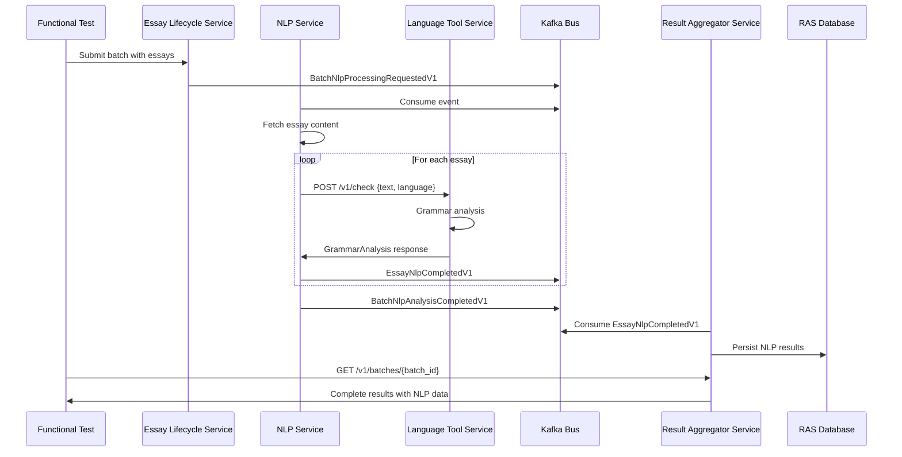

# TASK-052I: NLP → Language Tool Service Integration Functional Test

## Executive Summary

Implement end-to-end functional test validating the complete data flow from NLP Service through Language Tool Service to Result Aggregator Service. This test will verify grammar analysis processing, event publishing, and data persistence across the entire pipeline.

## Current State Analysis

### Working Components ✅
1. **NLP Service → Language Tool Service HTTP Integration**
   - Endpoint: POST `/v1/check`
   - Client: `LanguageToolServiceClient` with retry and circuit breaker
   - Response: `GrammarAnalysis` with errors and metrics
   - Category filtering: Excludes TYPOS/SPELLING/MISSPELLING

2. **NLP Service Event Publishing**
   - Event: `EssayNlpCompletedV1` (rich data for RAS)
   - Event: `BatchNlpAnalysisCompletedV1` (thin state for ELS)
   - Publishing via outbox pattern

3. **Language Tool Service**
   - Dual-mode: Stub (development) / Real (production)
   - Java process management with health checks
   - Prometheus metrics emission

### Critical Gaps ❌

#### 1. Result Aggregator Service - Missing NLP Event Handler
**File**: `services/result_aggregator_service/implementations/nlp_event_handler.py` (DOES NOT EXIST)
```python
# MUST CREATE:
class NlpEventHandler:
    async def process_essay_nlp_completed(
        self,
        envelope: EventEnvelope[EssayNlpCompletedV1],
        data: EssayNlpCompletedV1,
    ) -> None:
        # Implementation needed
```

#### 2. Result Aggregator Service - Database Schema
**File**: `services/result_aggregator_service/models_db.py` (lines 150-157 commented out)
```python
# MUST UNCOMMENT AND IMPLEMENT:
nlp_status: Mapped[Optional[ProcessingStage]]
nlp_word_count: Mapped[Optional[int]]
nlp_sentence_count: Mapped[Optional[int]]
nlp_grammar_error_count: Mapped[Optional[int]]
nlp_processing_time_ms: Mapped[Optional[int]]
nlp_grammar_categories: Mapped[Optional[dict[str, int]]]  # JSON field
nlp_completed_at: Mapped[Optional[datetime]]
nlp_error_detail: Mapped[Optional[dict[str, Any]]]
```

#### 3. Result Aggregator Service - Event Processor Registration
**File**: `services/result_aggregator_service/implementations/event_processor_impl.py`
```python
# MUST ADD:
async def process_essay_nlp_completed(
    self,
    envelope: EventEnvelope[EssayNlpCompletedV1],
    data: EssayNlpCompletedV1,
) -> None:
    await self.nlp_handler.process_essay_nlp_completed(envelope, data)
```

#### 4. Result Aggregator Service - Kafka Consumer Registration
**File**: `services/result_aggregator_service/kafka_consumer.py`
```python
# MUST ADD topic subscription:
ProcessingEvent.ESSAY_NLP_COMPLETED: self.event_processor.process_essay_nlp_completed
```

#### 5. Database Migration
**File**: `services/result_aggregator_service/alembic/versions/YYYYMMDD_add_nlp_fields.py` (NEW)
```sql
-- Add NLP analysis columns to essay_results table
ALTER TABLE essay_results ADD COLUMN nlp_status processingstage;
ALTER TABLE essay_results ADD COLUMN nlp_word_count INTEGER;
ALTER TABLE essay_results ADD COLUMN nlp_sentence_count INTEGER;
ALTER TABLE essay_results ADD COLUMN nlp_grammar_error_count INTEGER;
ALTER TABLE essay_results ADD COLUMN nlp_processing_time_ms INTEGER;
ALTER TABLE essay_results ADD COLUMN nlp_grammar_categories JSON;
ALTER TABLE essay_results ADD COLUMN nlp_completed_at TIMESTAMP;
ALTER TABLE essay_results ADD COLUMN nlp_error_detail JSON;
```

## Data Flow Architecture



## Boundary Objects & Contracts

### 1. HTTP Request/Response (NLP → Language Tool)
```python
# Request
{
    "text": str,           # Essay text to analyze
    "language": str        # "en-US", "sv-SE", or "auto"
}

# Response (GrammarAnalysis)
{
    "error_count": int,
    "errors": [
        {
            "rule_id": str,
            "message": str,
            "offset": int,
            "length": int,
            "replacements": list[str],
            "category": str,       # e.g., "grammar", "confused_words"
            "category_id": str,    # e.g., "GRAMMAR", "CONFUSED_WORDS"
            "severity": str        # "error", "warning", "info"
        }
    ],
    "language": str,
    "processing_time_ms": int,
    "grammar_category_counts": dict[str, int],
    "grammar_rule_counts": dict[str, int]
}
```

### 2. Kafka Event (NLP → RAS)
```python
class EssayNlpCompletedV1(BaseEventData):
    event_name: ProcessingEvent = ProcessingEvent.ESSAY_NLP_COMPLETED
    essay_id: str
    text_storage_id: str
    nlp_metrics: NlpMetrics  # spaCy analysis
    grammar_analysis: GrammarAnalysis  # Language Tool results
    processing_metadata: dict[str, Any]
```

### 3. Database Schema (RAS)
```python
class EssayResult:
    # Existing fields...
    
    # NLP Analysis Results (TO BE ADDED)
    nlp_status: ProcessingStage
    nlp_word_count: int
    nlp_sentence_count: int
    nlp_grammar_error_count: int
    nlp_processing_time_ms: int
    nlp_grammar_categories: dict[str, int]  # JSON
    nlp_completed_at: datetime
    nlp_error_detail: dict[str, Any]  # JSON
```

## Test Implementation Requirements

### Test File Structure
```
tests/functional/
├── test_e2e_nlp_language_tool_integration.py
├── nlp_test_data/
│   ├── english_grammar_errors.txt
│   ├── swedish_grammar_errors.txt
│   └── mixed_language_test.txt
└── nlp_validation_utils.py
```

### Test Scenarios

#### Scenario 1: English Grammar Analysis
```python
test_text = """
I goes to the store yesterday. There cat is sleeping on the couch.
Me and him are best friends. The data are processed incorrect.
"""
# Expected: 4+ grammar errors detected
```

#### Scenario 2: Swedish Grammar Analysis
```python
test_text = """
Jag är på skolan. Han har gåt till affären.
Vi ska åker till Stockholm imorgon.
"""
# Expected: 3+ grammar errors detected
```

#### Scenario 3: Circuit Breaker Resilience
- Simulate Language Tool Service unavailability
- Verify circuit breaker opens
- Confirm graceful degradation (empty GrammarAnalysis)
- Check circuit breaker recovery

#### Scenario 4: Performance & Metrics
- Submit 10 essays concurrently
- Measure end-to-end processing time
- Validate Prometheus metrics:
  - `wrapper_duration_seconds{language}`
  - `api_errors_total{endpoint,error_type}`
  - Processing time < 2s per essay

### Validation Points

1. **HTTP Integration**
   - Request format correctness
   - Response parsing accuracy
   - Retry logic on 5xx errors
   - Circuit breaker behavior

2. **Grammar Analysis Quality**
   - Error detection accuracy
   - Category filtering (no TYPOS/SPELLING)
   - Language detection
   - Replacement suggestions

3. **Event Publishing**
   - EssayNlpCompletedV1 structure
   - Correlation ID propagation
   - Outbox pattern execution

4. **Data Persistence**
   - All NLP fields populated in RAS
   - JSON fields correctly stored
   - Processing timestamps accurate
   - Error details captured

5. **Observability**
   - Prometheus metrics emission
   - Structured logging with correlation IDs
   - Error tracking and reporting

## Implementation Steps

### Phase 1: RAS Integration (REQUIRED FIRST)
1. Create `nlp_event_handler.py` in RAS implementations
2. Uncomment NLP fields in `models_db.py`
3. Add handler to `EventProcessorImpl`
4. Register topic in `kafka_consumer.py`
5. Create and run database migration
6. Add unit tests for NLP event handler

### Phase 2: Test Data Preparation
1. Create test text files with known grammar errors
2. Document expected error patterns
3. Create validation utilities
4. Prepare multi-language test cases

### Phase 3: Functional Test Implementation
1. Create main test file
2. Implement test harness integration
3. Add Kafka event monitoring
4. Implement database validation
5. Add metrics verification

### Phase 4: CI/CD Integration
1. Ensure Docker services configured
2. Add test to CI pipeline
3. Configure test timeouts
4. Add retry logic for flaky scenarios

## Configuration Requirements

### NLP Service
```python
LANGUAGE_TOOL_SERVICE_URL = "http://language-tool-service:8085"
LANGUAGE_TOOL_REQUEST_TIMEOUT = 30
LANGUAGE_TOOL_MAX_RETRIES = 3
LANGUAGE_TOOL_RETRY_DELAY = 1.0
```

### Language Tool Service
```python
LANGUAGE_TOOL_SERVICE_HTTP_PORT = 8085
LANGUAGE_TOOL_SERVICE_LANGUAGE_TOOL_PORT = 8081
LANGUAGE_TOOL_SERVICE_LANGUAGE_TOOL_JAR_PATH = "/app/languagetool/languagetool-server.jar"
LANGUAGE_TOOL_SERVICE_LANGUAGE_TOOL_HEAP_SIZE = "512m"
USE_STUB_LANGUAGE_TOOL = "false"  # Use real mode for functional tests
```

### Result Aggregator Service
```python
# No new configuration needed, uses existing Kafka and DB settings
```

## Success Criteria

### Functional Requirements
- [ ] End-to-end flow completes without errors
- [ ] Grammar errors correctly identified (>80% accuracy)
- [ ] Language detection works for en-US and sv-SE
- [ ] Events published and consumed successfully
- [ ] Data persisted in RAS database
- [ ] API returns complete NLP results

### Non-Functional Requirements
- [ ] Processing time < 2s per essay
- [ ] Circuit breaker activates on 3 consecutive failures
- [ ] Metrics visible in /metrics endpoints
- [ ] No memory leaks after 100 essays
- [ ] Test passes 10 consecutive runs

### Quality Gates
- [ ] Unit test coverage > 80% for new code
- [ ] Integration tests pass in CI/CD
- [ ] No critical security vulnerabilities
- [ ] Documentation updated
- [ ] Code review approved

## Risk Mitigation

### Risk 1: Language Tool JAR Missing
**Mitigation**: Test both stub and real modes, ensure graceful fallback

### Risk 2: Kafka Event Loss
**Mitigation**: Use outbox pattern, implement idempotency

### Risk 3: Database Migration Failure
**Mitigation**: Test migration on staging first, have rollback plan

### Risk 4: Performance Degradation
**Mitigation**: Implement circuit breaker, add timeouts, monitor metrics

## Dependencies

### External Services
- Language Tool JAR (version 6.3+)
- PostgreSQL (RAS database)
- Kafka (event bus)
- Redis (state management)

### Internal Services
- Essay Lifecycle Service (orchestration)
- NLP Service (analysis)
- Language Tool Service (grammar)
- Result Aggregator Service (persistence)
- Content Service (essay storage)

## Timeline Estimate

- **Phase 1 (RAS Integration)**: 2 days
- **Phase 2 (Test Data)**: 1 day
- **Phase 3 (Test Implementation)**: 2 days
- **Phase 4 (CI/CD)**: 1 day
- **Buffer for issues**: 2 days
- **Total**: 8 days

## References

- Rule 070: Testing and Quality Assurance
- Rule 075: Test Creation Methodology
- Rule 020.15: NLP Service Architecture
- Rule 020.18: Language Tool Service Architecture
- Rule 020.12: Result Aggregator Service Architecture
- TASK-052H: Language Tool Integration Tests
- TASK-051: NLP Service Implementation