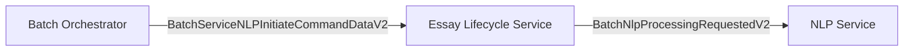

# Essay Instructions Integration Implementation Plan

**Status**: Ready for Implementation
**Priority**: HIGH
**Estimated Effort**: 2-3 hours

## Architecture Overview

### Event Flow


### Scope
**Field to enforce**: `essay_instructions` (string) — required across the BOS → ELS → NLP chain. No backwards-compatibility paths or feature flags will remain after implementation.

## Current State Analysis

### ✅ **ALREADY IMPLEMENTED**

- **BOS Registration**: `BatchRegistrationRequestV1.essay_instructions` field captures prompts
- **BOS Storage**: Essay instructions stored in batch context via `BatchContextOperations.store_batch_context()`
- **CJ Assessment Integration**: Full pipeline working - BOS → ELS → CJ Assessment with essay instructions
- **AI Feedback Integration**: AI Feedback initiator includes essay instructions (service not yet built)

### ❌ **KEY INTEGRATION GAPS**

1. **BOS → ELS Command**: `BatchServiceNLPInitiateCommandDataV1` still uses legacy schema without instructions
2. **ELS → NLP Event**: `BatchNlpProcessingRequestedV1` omits the instructions payload
3. **ELS Dispatcher Protocol**: `dispatch_nlp_requests()` signature lacks an instructions argument
4. **ELS Command Handler**: Doesn't extract/forward essay instructions from the command
5. **NLP Service Handler**: Cannot ingest instructions, preventing prompt-aware analysis
6. **Contract Versioning**: No v2 models/events exist to represent the required payload

## Implementation Phases

### Phase 1: Contract Version Upgrade (Common Core)

**Files to Update**:

- `libs/common_core/src/common_core/batch_service_models.py`
- `libs/common_core/src/common_core/events/nlp_events.py`
- `libs/common_core/src/common_core/enums/processing_event.py` (if event types enumerated)

**Changes**:

```python
# Introduce v2 contracts with required instructions
class BatchServiceNLPInitiateCommandDataV2(BaseEventData):
    essays_to_process: list[EssayProcessingInputRefV1]
    language: str
    essay_instructions: str

class BatchNlpProcessingRequestedV2(BaseEventData):
    essays_to_process: list[EssayProcessingInputRefV1]
    language: str
    batch_id: str
    essay_instructions: str

# Extend ProcessingEvent / EventType enums with *_V2 identifiers
```

**Operational Notes**:
- Retain v1 models only long enough to remove usages; mark them deprecated and add CI guards to prevent new references.
- Update shared factories, fixtures, and outbox serialization helpers to the v2 schema immediately.

### Phase 2: BOS Refactor to v2 Command

**Files to Update**:

- `services/batch_orchestrator_service/implementations/nlp_initiator_impl.py`
- `services/batch_orchestrator_service/events/*.py` (if wrappers exist)
- `services/batch_orchestrator_service/tests/test_nlp_initiator_impl.py`

**Changes**:

```python
nlp_command = BatchServiceNLPInitiateCommandDataV2(
    event_name=ProcessingEvent.BATCH_NLP_INITIATE_COMMAND_V2,
    entity_id=batch_id,
    entity_type="batch",
    essays_to_process=essays_for_processing,
    language=language,
    essay_instructions=batch_context.essay_instructions,
)

envelope = EventEnvelope[
    BatchServiceNLPInitiateCommandDataV2
](
    event_type="huleedu.els.batch.nlp.initiate.command.v2",
    data=nlp_command,
    metadata={"user_id": batch_context.user_id, "org_id": batch_context.org_id},
    # ... remaining fields
)
```

**Operational Notes**:
- Remove any fallbacks to v1 or default instructions; tests should fail fast if instructions are blank.
- Ensure deterministic event ID generation includes the new payload.

### Phase 3: ELS Protocol & Implementation Enhancement

**Files to Update**:

- `services/essay_lifecycle_service/protocols.py`
- `services/essay_lifecycle_service/implementations/service_request_dispatcher.py`
- `services/essay_lifecycle_service/implementations/nlp_command_handler.py`
- `services/essay_lifecycle_service/tests/unit/test_service_request_dispatcher.py`
- `services/essay_lifecycle_service/tests/unit/test_nlp_command_handler.py`

**Changes**:

```python
# Protocol requires instructions explicitly
async def dispatch_nlp_requests(
    self,
    essays_to_process: list[EssayProcessingInputRefV1],
    language: Language,
    batch_id: str,
    essay_instructions: str,
    correlation_id: UUID,
    session: AsyncSession | None = None,
) -> None:
    """Dispatch NLP requests to NLP Service."""

# Dispatcher emits v2 event exclusively
nlp_event = BatchNlpProcessingRequestedV2(
    event_name=ProcessingEvent.BATCH_NLP_PROCESSING_REQUESTED_V2,
    entity_id=batch_id,
    entity_type="batch",
    essays_to_process=essays_to_process,
    language=language.value,
    batch_id=batch_id,
    essay_instructions=essay_instructions,
)

# Command handler guards against missing instructions
if not command_data.essay_instructions:
    raise_processing_error(...)
```

### Phase 4: NLP Service Integration on v2 Event

**Files to Update**:

- `services/nlp_service/event_processor.py`
- `services/nlp_service/command_handlers/batch_nlp_analysis.py`
- `services/nlp_service/tests/` (phase 2 handlers)

**Changes**:

1. Route only `BatchNlpProcessingRequestedV2` events and reject older versions.
2. Persist essay instructions in the processing context and leverage them in analysis routines.
3. Update logging/metrics to confirm instructions presence for tracing.

**Implementation Details**:

```python
# Event processor enforces v2
if envelope.event_type != "huleedu.els.batch.nlp.processing.requested.v2":
    raise_unexpected_event(...)

# Handler extracts required instructions
essay_instructions = event_data.essay_instructions

processing_context = {
    "essay_instructions": essay_instructions,
    # ... existing context
}
```

### Phase 5: Legacy Cleanup & CI Enforcement

**Files to Update**:

- `libs/common_core/src/common_core/batch_service_models.py` (deprecation markers)
- `libs/common_core/src/common_core/events/nlp_events.py`
- `services/*` modules that previously referenced v1 contracts
- CI tooling / lint rules if needed (`pyproject.toml`, custom scripts)

**Changes**:

1. Remove residual imports/usages of v1 contracts across the repo; delete dead code after verifying no references remain.
2. Add assertions or validation hooks to fail fast when instructions are empty.
3. Update CI checks to block new references to v1 models (e.g., forbid-lint patterns or tests).
4. Refresh developer docs/code comments that mention the older schema.

### Phase 6: Testing & Validation

**Files to Update**:

- `services/batch_orchestrator_service/tests/test_nlp_initiator_impl.py`
- `services/essay_lifecycle_service/tests/unit/test_nlp_command_handler.py`
- `services/essay_lifecycle_service/tests/unit/test_service_request_dispatcher.py`
- `services/nlp_service/tests/` (relevant test files)
- `libs/common_core/tests/` contract/serialization suites
- E2E test files

**Test Coverage Required**:

1. **BOS NLP Initiator Tests**: Verify essay instructions in commands
2. **ELS Command Handler Tests**: Verify context extraction and forwarding
3. **ELS Dispatcher Tests**: Verify event creation with context
4. **NLP Service Tests**: Verify essay instructions reception
5. **Contract Tests**: Fail if instructions missing/blank during serialization/deserialization
6. **E2E Tests**: Validate end-to-end flow: API Gateway → BOS → ELS → NLP

## Technical Considerations

### 1. **Event Chain Integrity**

The complete chain must be updated atomically:
- BOS command must include context
- ELS must forward context
- NLP must receive context

Partial implementation will result in silent data loss.

### 2. **Backward Compatibility**

- None. All command and event producers/consumers must adopt v2 before deployment.
- CI should fail on any remaining references to v1 contracts once the refactor lands.
- Deployment must coordinate BOS, ELS, and NLP releases in a single window.

## Validation Criteria

### ✅ **Success Metrics**

1. **BOS Command Generation**: BOS publishes `BatchServiceNLPInitiateCommandDataV2` with instructions populated
2. **ELS Event Forwarding**: ELS emits `BatchNlpProcessingRequestedV2` with instructions copied verbatim
3. **NLP Service Reception**: NLP worker processes only v2 events and logs the received instructions
4. **E2E Flow Integrity**: Essay instructions flow from API Gateway → BOS → ELS → NLP without transformation loss
5. **Test Coverage**: Updated unit, integration, and contract tests enforce the required field
6. **No Silent Failures**: Missing instructions raise structured errors prior to event publication/processing

### 🚫 **Failure Indicators**

- Any invocation of legacy v1 contracts/events after rollout
- NLP events missing essay instructions despite BOS sending them
- ELS command handler errors related to missing instructions
- Type checking failures in any service
- E2E tests showing instruction loss in pipeline

## Implementation Order

1. **Phase 1**: Introduce v2 contracts in common core and deprecate v1 usage.
2. **Phase 2**: Refactor BOS to emit v2 command with required instructions.
3. **Phase 3**: Update ELS protocol/handler/dispatcher to require instructions and publish v2 events.
4. **Phase 4**: Update NLP service to consume v2 events and leverage instructions in analysis.
5. **Phase 5**: Remove residual v1 references, expand testing, and enforce CI guards.
6. **Phase 6**: Execute validation suite (lint/type/tests) and verify observability/monitoring signals.

**Critical**: Phases 1-4 must release simultaneously to prevent schema mismatches; phases 5-6 finalize cleanup and verification.

## Expected Outcomes

### **Immediate Benefits**

- **Context-Aware NLP Analysis**: NLP service can perform prompt-specific linguistic analysis
- **Consistent Service Interfaces**: All processing services receive educational context
- **Enhanced Analysis Quality**: Services can tailor processing based on essay requirements

### **Future Capabilities**

- **Prompt-Specific Metrics**: NLP analysis tailored to essay types
- **Educational Context Awareness**: Different analysis for REGULAR vs GUEST batches
- **AI Feedback Integration**: Ready for AI service that needs essay prompt context

## Risk Assessment

### **Medium Risk**

- **Event Chain Complexity**: Three-layer propagation increases failure points
- **Testing Complexity**: Need comprehensive contract + E2E tests
- **Deployment Coordination**: Simultaneous rollout of BOS, ELS, and NLP required due to breaking change

### **Mitigation Strategies**

- **Atomic Deployment**: Deploy all changes together; no feature flags available
- **Comprehensive Testing**: Test each layer independently and E2E
- **Monitoring**: Add metrics for context propagation at each layer
- **Rollback Plan**: Requires coordinated rollback of all affected services to prior v1-compatible versions

## Architectural Constraints

### **Event Flow Architecture**

All essay processing flows through ELS as the central orchestrator:
- BOS sends commands to ELS (topic prefix: `huleedu.els.*`)
- ELS manages essay state machine and dispatches to specialized services
- ELS tracks processing completion and coordinates phase transitions

---

**Next Steps**: Begin with Phase 1 — introduce `BatchServiceNLPInitiateCommandDataV2` and `BatchNlpProcessingRequestedV2` in common core, mark the v1 contracts deprecated, and update shared factories to the new schema.
