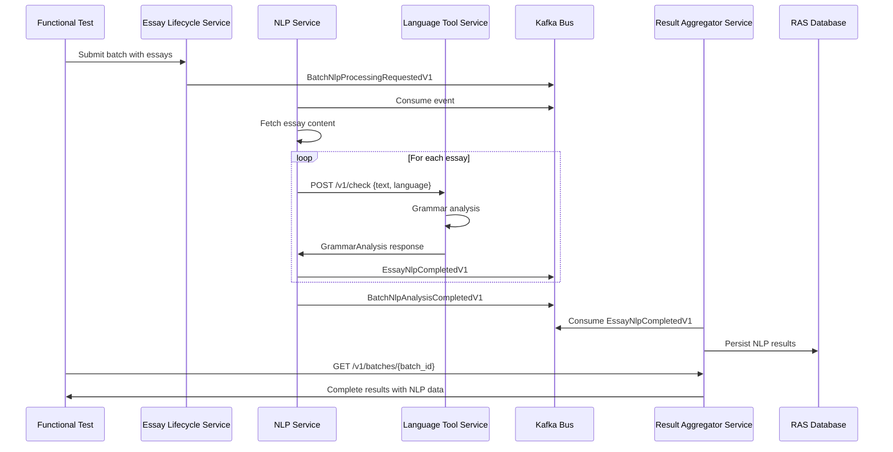

# TASK-052I: NLP → Language Tool Service Integration Functional Test

## Executive Summary

Implement end-to-end functional test validating the complete data flow from NLP Service through Language Tool Service to Result Aggregator Service. This test will verify grammar analysis processing, event publishing, and **persistence of educational metrics** that teachers need for proficiency assessment and student development tracking.

### Why Educational Metrics Matter

Teachers need **interpretable metrics** that:

1. **Map to proficiency bands** - MTLD scores correlate with CEFR levels
2. **Show development over time** - Dependency distance tracks syntactic maturity
3. **Enable class-level analysis** - Aggregate coherence scores reveal teaching effectiveness
4. **Provide actionable insights** - Zipf frequency identifies vocabulary gaps

Basic word counts alone are insufficient for educational assessment, but remain necessary for compliance and context. The implementation stores BOTH educational metrics AND basic metrics.

## Current State Analysis

### Working Components ✅
1. **NLP Service → Language Tool Service HTTP Integration**
   - Endpoint: POST `/v1/check`
   - Client: `LanguageToolServiceClient` with retry and circuit breaker
   - Response: `GrammarAnalysis` with errors and metrics
   - Category filtering: Excludes TYPOS/SPELLING/MISSPELLING

2. **NLP Service Event Publishing**
   - Event: `EssayNlpCompletedV1` (rich data for RAS)
   - Event: `BatchNlpAnalysisCompletedV1` (thin state for ELS)
   - Publishing via outbox pattern

3. **Language Tool Service**
   - Dual-mode: Stub (development) / Real (production)
   - Java process management with health checks
   - Prometheus metrics emission

### Critical Gaps ❌

#### 0. NLP Service - Missing Batch ID in Event Contract
**File**: `libs/common_core/src/common_core/events/nlp_events.py`

**Required Change**: Add batch_id as a direct field in `EssayNlpCompletedV1` (following CJ Assessment pattern):
```python
class EssayNlpCompletedV1(BaseEventData):
    event_name: ProcessingEvent = ProcessingEvent.ESSAY_NLP_COMPLETED
    batch_id: str = Field(description="Batch identifier")  # ADD THIS FIELD
    essay_id: str = Field(description="Essay identifier")
    text_storage_id: str = Field(description="Storage ID of essay content")
    nlp_metrics: NlpMetrics = Field(description="Basic text metrics from spaCy analysis")
    grammar_analysis: GrammarAnalysis = Field(
        description="Grammar analysis from Language Tool Service"
    )
    processing_metadata: dict[str, Any] = Field(
        default_factory=dict, description="Additional metadata about the NLP processing"
    )
```

**Publisher Update**: `services/nlp_service/implementations/event_publisher_impl.py`
```python
async def publish_essay_nlp_completed(
    self,
    batch_id: str,  # ADD this parameter
    essay_id: str,
    # ... rest of existing parameters
```

#### 1. Result Aggregator Service - Missing NLP Event Handler
**File**: `services/result_aggregator_service/implementations/nlp_event_handler.py` (DOES NOT EXIST)

**IMPLEMENTATION PATTERN** (following spellcheck_event_handler.py):
```python
class NlpEventHandler:
    def __init__(
        self,
        batch_repository: BatchRepositoryProtocol,
        state_store: StateStoreProtocol,
        cache_manager: CacheManagerProtocol,
    ):
        self.batch_repository = batch_repository
        self.state_store = state_store
        self.cache_manager = cache_manager

    async def process_essay_nlp_completed(
        self,
        envelope: EventEnvelope[EssayNlpCompletedV1],
        data: EssayNlpCompletedV1,
    ) -> None:
        """Process NLP analysis completion with all metrics."""
        try:
            # STEP 1: Extract identifiers directly from event
            essay_id = data.essay_id
            batch_id = data.batch_id  # Direct field like AssessmentResultV1

            # STEP 2: Extract from NESTED objects
            nlp_metrics = data.nlp_metrics  # NlpMetrics object (18 fields)
            grammar = data.grammar_analysis  # GrammarAnalysis object (5 fields)

            # STEP 3: Map ALL fields to database columns (18 NLP + 4 Grammar + 4 Metadata = 26 total)
            await self.batch_repository.update_essay_nlp_result(
                essay_id=essay_id,
                batch_id=batch_id,
                nlp_status=ProcessingStage.COMPLETED,
                correlation_id=envelope.correlation_id,

                # Basic Metrics (4 fields)
                nlp_word_count=nlp_metrics.word_count,
                nlp_sentence_count=nlp_metrics.sentence_count,
                nlp_avg_sentence_length=nlp_metrics.avg_sentence_length,
                nlp_language_detected=nlp_metrics.language_detected,

                # Lexical Sophistication (2 fields)
                nlp_mean_zipf_frequency=nlp_metrics.mean_zipf_frequency,
                nlp_percent_tokens_zipf_below_3=nlp_metrics.percent_tokens_zipf_below_3,

                # Lexical Diversity (2 fields)
                nlp_mtld_score=nlp_metrics.mtld_score,
                nlp_hdd_score=nlp_metrics.hdd_score,

                # Syntactic Complexity (3 fields)
                nlp_mean_dependency_distance=nlp_metrics.mean_dependency_distance,
                nlp_phrasal_indices=nlp_metrics.phrasal_indices,  # Dict→JSON
                nlp_clausal_indices=nlp_metrics.clausal_indices,  # Dict→JSON

                # Cohesion (2 fields)
                nlp_first_order_coherence=nlp_metrics.first_order_coherence,
                nlp_second_order_coherence=nlp_metrics.second_order_coherence,

                # Phraseology (4 fields)
                nlp_avg_bigram_pmi=nlp_metrics.avg_bigram_pmi,
                nlp_avg_trigram_pmi=nlp_metrics.avg_trigram_pmi,
                nlp_avg_bigram_npmi=nlp_metrics.avg_bigram_npmi,
                nlp_avg_trigram_npmi=nlp_metrics.avg_trigram_npmi,

                # Grammar Analysis (4 fields)
                nlp_grammar_error_count=grammar.error_count,
                nlp_grammar_language=grammar.language,
                nlp_grammar_categories=grammar.grammar_category_counts,  # Dict→JSON
                nlp_grammar_rule_counts=grammar.grammar_rule_counts,  # Dict→JSON

                # Metadata
                nlp_processing_time_ms=(nlp_metrics.processing_time_ms +
                                       grammar.processing_time_ms),
                nlp_completed_at=datetime.now(UTC),
            )

            # STEP 4: Invalidate cache for real-time updates
            await self.state_store.invalidate_batch(batch_id)

            logger.info(
                "NLP analysis processed successfully",
                essay_id=essay_id,
                batch_id=batch_id,
            )

        except Exception as e:
            logger.error(f"Failed to process NLP completed: {e}", exc_info=True)
            # Could store partial results with error status
            raise
```

#### 2. Result Aggregator Service - Database Schema MISMATCH
**File**: `services/result_aggregator_service/models_db.py` (lines 150-157 WRONG fields commented)

**CRITICAL**: The commented fields DO NOT match the actual event structure!

**Currently Commented (INCORRECT)**:
```python
# nlp_status: Mapped[Optional[ProcessingPhaseStatus]]  # Wrong enum type
# nlp_lexical_diversity_score: float  # NOT IN EVENT
# nlp_cohesion_score: float           # NOT IN EVENT
# nlp_grammatical_error_rate: float   # NOT IN EVENT
# nlp_storage_id: str                 # NOT IN EVENT
```

**Required Complete Schema (26 fields: 18 NlpMetrics + 4 GrammarAnalysis + 4 Metadata)**:
```python
# Status and Metadata (4 fields)
nlp_status: Mapped[Optional[ProcessingStage]]  # Use ProcessingStage enum
nlp_completed_at: Mapped[Optional[datetime]]
nlp_error_detail: Mapped[Optional[dict[str, Any]]]  # JSON for structured errors
nlp_processing_time_ms: Mapped[Optional[int]]  # Combined NLP + Grammar time

# Basic Metrics (4 fields) - Essential for compliance
nlp_word_count: Mapped[Optional[int]]
nlp_sentence_count: Mapped[Optional[int]]
nlp_avg_sentence_length: Mapped[Optional[float]]
nlp_language_detected: Mapped[Optional[str]]  # ISO 639-1 code

# Lexical Sophistication (2 fields) - Word frequency analysis
nlp_mean_zipf_frequency: Mapped[Optional[float]]  # Higher = simpler words
nlp_percent_tokens_zipf_below_3: Mapped[Optional[float]]  # % rare/sophisticated

# Lexical Diversity (2 fields) - Vocabulary richness
nlp_mtld_score: Mapped[Optional[float]]  # Measure of Textual Lexical Diversity
nlp_hdd_score: Mapped[Optional[float]]  # Hypergeometric Distribution D

# Syntactic Complexity (3 fields) - Sentence structure analysis
nlp_mean_dependency_distance: Mapped[Optional[float]]  # Syntactic maturity
nlp_phrasal_indices: Mapped[Optional[dict[str, float]]]  # JSON - TAASSC metrics
nlp_clausal_indices: Mapped[Optional[dict[str, float]]]  # JSON - TAASSC metrics

# Cohesion Metrics (2 fields) - Text flow and organization
nlp_first_order_coherence: Mapped[Optional[float]]  # Adjacent sentence similarity
nlp_second_order_coherence: Mapped[Optional[float]]  # Two-gap sentence similarity

# Phraseology Metrics (4 fields) - Collocation analysis
nlp_avg_bigram_pmi: Mapped[Optional[float]]  # Pointwise Mutual Information
nlp_avg_trigram_pmi: Mapped[Optional[float]]
nlp_avg_bigram_npmi: Mapped[Optional[float]]  # Normalized PMI (-1 to 1)
nlp_avg_trigram_npmi: Mapped[Optional[float]]

# Grammar Analysis from Language Tool (4 fields)
nlp_grammar_error_count: Mapped[Optional[int]]
nlp_grammar_language: Mapped[Optional[str]]  # Language used for analysis
nlp_grammar_categories: Mapped[Optional[dict[str, int]]]  # JSON {"GRAMMAR": 2, ...}
nlp_grammar_rule_counts: Mapped[Optional[dict[str, int]]]  # JSON rule counts
```

#### 3. Result Aggregator Service - Event Processor Registration
**File**: `services/result_aggregator_service/implementations/event_processor_impl.py`
```python
# MUST ADD:
async def process_essay_nlp_completed(
    self,
    envelope: EventEnvelope[EssayNlpCompletedV1],
    data: EssayNlpCompletedV1,
) -> None:
    await self.nlp_handler.process_essay_nlp_completed(envelope, data)
```

#### 4. Result Aggregator Service - Kafka Consumer NOT Subscribed
**File**: `services/result_aggregator_service/kafka_consumer.py`

**Current State (lines 50-63)**:
```python
self.topics = [
    # ... other topics ...
    topic_name(ProcessingEvent.SPELLCHECK_RESULTS),
    topic_name(ProcessingEvent.ASSESSMENT_RESULT_PUBLISHED),
    # Future topics to add when services are implemented:
    # "huleedu.essay.nlp.completed.v1",  # <-- COMMENTED OUT!
]
```

**Required Changes**:
1. Uncomment the NLP topic in topics list
2. Add routing in `_process_message_impl` method:
```python
elif record.topic == topic_name(ProcessingEvent.ESSAY_NLP_COMPLETED):
    from common_core.events.nlp_events import EssayNlpCompletedV1
    nlp_envelope = EventEnvelope[EssayNlpCompletedV1].model_validate_json(message_value_str)
    await self.event_processor.process_essay_nlp_completed(
        nlp_envelope, EssayNlpCompletedV1.model_validate(nlp_envelope.data)
    )
```

#### 5. Database Migration - COMPLETE NLP METRICS SCHEMA (26 fields)
**File**: `services/result_aggregator_service/alembic/versions/YYYYMMDD_add_nlp_fields.py` (NEW)

```sql
-- Add NLP analysis columns - ALL 26 fields from event contract
-- Status and Metadata (4 fields)
ALTER TABLE essay_results ADD COLUMN nlp_status processingstage;
ALTER TABLE essay_results ADD COLUMN nlp_completed_at TIMESTAMP;
ALTER TABLE essay_results ADD COLUMN nlp_error_detail JSON;
ALTER TABLE essay_results ADD COLUMN nlp_processing_time_ms INTEGER;

-- Basic Metrics (4 fields)
ALTER TABLE essay_results ADD COLUMN nlp_word_count INTEGER;
ALTER TABLE essay_results ADD COLUMN nlp_sentence_count INTEGER;
ALTER TABLE essay_results ADD COLUMN nlp_avg_sentence_length FLOAT;
ALTER TABLE essay_results ADD COLUMN nlp_language_detected VARCHAR(10);

-- Lexical Sophistication (2 fields)
ALTER TABLE essay_results ADD COLUMN nlp_mean_zipf_frequency FLOAT;
ALTER TABLE essay_results ADD COLUMN nlp_percent_tokens_zipf_below_3 FLOAT;

-- Lexical Diversity (2 fields)
ALTER TABLE essay_results ADD COLUMN nlp_mtld_score FLOAT;
ALTER TABLE essay_results ADD COLUMN nlp_hdd_score FLOAT;

-- Syntactic Complexity (3 fields)
ALTER TABLE essay_results ADD COLUMN nlp_mean_dependency_distance FLOAT;
ALTER TABLE essay_results ADD COLUMN nlp_phrasal_indices JSON;
ALTER TABLE essay_results ADD COLUMN nlp_clausal_indices JSON;

-- Cohesion (2 fields)
ALTER TABLE essay_results ADD COLUMN nlp_first_order_coherence FLOAT;
ALTER TABLE essay_results ADD COLUMN nlp_second_order_coherence FLOAT;

-- Phraseology (4 fields)
ALTER TABLE essay_results ADD COLUMN nlp_avg_bigram_pmi FLOAT;
ALTER TABLE essay_results ADD COLUMN nlp_avg_trigram_pmi FLOAT;
ALTER TABLE essay_results ADD COLUMN nlp_avg_bigram_npmi FLOAT;
ALTER TABLE essay_results ADD COLUMN nlp_avg_trigram_npmi FLOAT;

-- Grammar Analysis (4 fields)
ALTER TABLE essay_results ADD COLUMN nlp_grammar_error_count INTEGER;
ALTER TABLE essay_results ADD COLUMN nlp_grammar_language VARCHAR(10);  -- Language used for analysis
ALTER TABLE essay_results ADD COLUMN nlp_grammar_categories JSON;  -- Category counts
ALTER TABLE essay_results ADD COLUMN nlp_grammar_rule_counts JSON;  -- Rule counts

-- Indexes for key educational metrics
CREATE INDEX idx_essay_results_nlp_mtld ON essay_results(nlp_mtld_score);
CREATE INDEX idx_essay_results_nlp_dependency ON essay_results(nlp_mean_dependency_distance);
CREATE INDEX idx_essay_results_nlp_coherence ON essay_results(nlp_first_order_coherence);
CREATE INDEX idx_essay_results_nlp_zipf ON essay_results(nlp_mean_zipf_frequency);
```

## Data Flow Architecture



## Boundary Objects & Contracts

### Critical Field Mapping (Event → Database)

**Complete Field Extraction Map** - 18 NlpMetrics fields + 4 GrammarAnalysis fields stored + 4 metadata fields = 26 total:

| Event Path | Database Column | Type | Purpose |
|------------|-----------------|------|---------|
| **BASIC METRICS** (4 fields) | | | |
| `data.nlp_metrics.word_count` | `nlp_word_count` | int | Essay length |
| `data.nlp_metrics.sentence_count` | `nlp_sentence_count` | int | Structure analysis |
| `data.nlp_metrics.avg_sentence_length` | `nlp_avg_sentence_length` | float | Sentence complexity |
| `data.nlp_metrics.language_detected` | `nlp_language_detected` | str | Language code |
| **LEXICAL SOPHISTICATION** (2 fields) | | | |
| `data.nlp_metrics.mean_zipf_frequency` | `nlp_mean_zipf_frequency` | float | Word commonality |
| `data.nlp_metrics.percent_tokens_zipf_below_3` | `nlp_percent_tokens_zipf_below_3` | float | % rare words |
| **LEXICAL DIVERSITY** (2 fields) | | | |
| `data.nlp_metrics.mtld_score` | `nlp_mtld_score` | float | Vocabulary diversity |
| `data.nlp_metrics.hdd_score` | `nlp_hdd_score` | float | Alt diversity measure |
| **SYNTACTIC COMPLEXITY** (3 fields) | | | |
| `data.nlp_metrics.mean_dependency_distance` | `nlp_mean_dependency_distance` | float | Syntactic maturity |
| `data.nlp_metrics.phrasal_indices` | `nlp_phrasal_indices` | JSON | TAASSC phrasal |
| `data.nlp_metrics.clausal_indices` | `nlp_clausal_indices` | JSON | TAASSC clausal |
| **COHESION** (2 fields) | | | |
| `data.nlp_metrics.first_order_coherence` | `nlp_first_order_coherence` | float | Adjacent similarity |
| `data.nlp_metrics.second_order_coherence` | `nlp_second_order_coherence` | float | Two-gap similarity |
| **PHRASEOLOGY** (4 fields) | | | |
| `data.nlp_metrics.avg_bigram_pmi` | `nlp_avg_bigram_pmi` | float | Bigram PMI |
| `data.nlp_metrics.avg_trigram_pmi` | `nlp_avg_trigram_pmi` | float | Trigram PMI |
| `data.nlp_metrics.avg_bigram_npmi` | `nlp_avg_bigram_npmi` | float | Normalized bigram |
| `data.nlp_metrics.avg_trigram_npmi` | `nlp_avg_trigram_npmi` | float | Normalized trigram |
| **GRAMMAR ANALYSIS** (4 fields) | | | |
| `data.grammar_analysis.error_count` | `nlp_grammar_error_count` | int | Total errors |
| `data.grammar_analysis.language` | `nlp_grammar_language` | str | Language used |
| `data.grammar_analysis.grammar_category_counts` | `nlp_grammar_categories` | JSON | Error categories |
| `data.grammar_analysis.grammar_rule_counts` | `nlp_grammar_rule_counts` | JSON | Rule counts |
| **STATUS & METADATA** (4 fields) | | | |
| (computed) | `nlp_status` | ProcessingStage | Processing state |
| (computed) | `nlp_completed_at` | datetime | Completion time |
| (computed) | `nlp_error_detail` | JSON | Error details |
| Combined times | `nlp_processing_time_ms` | int | Total processing |

### 1. HTTP Request/Response (NLP → Language Tool)
```python
# Request
{
    "text": str,           # Essay text to analyze
    "language": str        # "en-US", "sv-SE", or "auto"
}

# Response (GrammarAnalysis)
{
    "error_count": int,
    "errors": [
        {
            "rule_id": str,
            "message": str,
            "offset": int,
            "length": int,
            "replacements": list[str],
            "category": str,       # e.g., "grammar", "confused_words"
            "category_id": str,    # e.g., "GRAMMAR", "CONFUSED_WORDS"
            "severity": str        # "error", "warning", "info"
        }
    ],
    "language": str,
    "processing_time_ms": int,
    "grammar_category_counts": dict[str, int],
    "grammar_rule_counts": dict[str, int]
}
```

### 2. Kafka Event (NLP → RAS)
```python
class EssayNlpCompletedV1(BaseEventData):
    event_name: ProcessingEvent = ProcessingEvent.ESSAY_NLP_COMPLETED
    essay_id: str
    text_storage_id: str
    nlp_metrics: NlpMetrics  # spaCy analysis
    grammar_analysis: GrammarAnalysis  # Language Tool results
    processing_metadata: dict[str, Any]
```

### 3. Database Schema (RAS)

```python
class EssayResult:
    # Existing fields...

    # NLP Analysis Results - Complete Schema (26 fields total)

    # Status and Metadata (4 fields)
    nlp_status: ProcessingStage
    nlp_completed_at: datetime
    nlp_error_detail: dict[str, Any]  # JSON if failed
    nlp_processing_time_ms: int  # Combined NLP + Grammar check time

    # Basic Metrics (4 fields)
    nlp_word_count: int  # Essay length
    nlp_sentence_count: int  # Structural units
    nlp_avg_sentence_length: float  # Sentence complexity
    nlp_language_detected: str  # ISO 639-1 code

    # Lexical Sophistication (2 fields)
    nlp_mean_zipf_frequency: float  # Word commonality (higher = simpler)
    nlp_percent_tokens_zipf_below_3: float  # % rare/sophisticated words

    # Lexical Diversity (2 fields)
    nlp_mtld_score: float  # Measure of Textual Lexical Diversity
    nlp_hdd_score: float  # Hypergeometric Distribution D

    # Syntactic Complexity (3 fields)
    nlp_mean_dependency_distance: float  # Syntactic maturity indicator
    nlp_phrasal_indices: dict[str, float]  # JSON - TAASSC phrasal metrics
    nlp_clausal_indices: dict[str, float]  # JSON - TAASSC clausal metrics

    # Cohesion (2 fields)
    nlp_first_order_coherence: float  # Adjacent sentence similarity (0-1)
    nlp_second_order_coherence: float  # Two-gap sentence similarity (0-1)

    # Phraseology (4 fields)
    nlp_avg_bigram_pmi: float  # Pointwise Mutual Information of bigrams
    nlp_avg_trigram_pmi: float  # PMI of trigrams
    nlp_avg_bigram_npmi: float  # Normalized PMI of bigrams (-1 to 1)
    nlp_avg_trigram_npmi: float  # Normalized PMI of trigrams

    # Grammar Analysis from Language Tool (4 fields)
    nlp_grammar_error_count: int  # Total grammar/style errors
    nlp_grammar_language: str  # Language used for analysis
    nlp_grammar_categories: dict[str, int]  # JSON {"GRAMMAR": 2, "PUNCTUATION": 1}
    nlp_grammar_rule_counts: dict[str, int]  # JSON rule violation counts
```

## Test Implementation Requirements

### Test File Structure

```text
tests/functional/
├── test_e2e_nlp_language_tool_integration.py
├── nlp_test_data/
│   ├── english_grammar_errors.txt
│   ├── swedish_grammar_errors.txt
│   └── mixed_language_test.txt
└── nlp_validation_utils.py
```

### Test Scenarios

#### Scenario 1: English Grammar Analysis

```python
test_text = """
I goes to the store yesterday. There cat is sleeping on the couch.
Me and him are best friends. The data are processed incorrect.
"""
# Expected: 4+ grammar errors detected
```

#### Scenario 2: Swedish Grammar Analysis

```python
test_text = """
Jag är på skolan. Han har gåt till affären.
Vi ska åker till Stockholm imorgon.
"""
# Expected: 3+ grammar errors detected
```

#### Scenario 3: Circuit Breaker Resilience

- Simulate Language Tool Service unavailability
- Verify circuit breaker opens
- Confirm graceful degradation (empty GrammarAnalysis)
- Check circuit breaker recovery

#### Scenario 4: Performance & Metrics

- Submit 10 essays concurrently
- Measure end-to-end processing time
- Validate Prometheus metrics:
  - `wrapper_duration_seconds{language}`
  - `api_errors_total{endpoint,error_type}`
  - Processing time < 2s per essay

### Validation Points

1. **HTTP Integration**
   - Request format correctness
   - Response parsing accuracy
   - Retry logic on 5xx errors
   - Circuit breaker behavior

2. **Grammar Analysis Quality**
   - Error detection accuracy
   - Category filtering (no TYPOS/SPELLING)
   - Language detection
   - Replacement suggestions

3. **Event Publishing**
   - EssayNlpCompletedV1 structure
   - Correlation ID propagation
   - Outbox pattern execution

4. **Data Persistence**
   - All NLP fields populated in RAS
   - JSON fields correctly stored
   - Processing timestamps accurate
   - Error details captured

5. **Observability**
   - Prometheus metrics emission
   - Structured logging with correlation IDs
   - Error tracking and reporting

## Implementation Steps

### Phase 1: RAS Integration (REQUIRED FIRST)
1. **Fix Database Schema** (models_db.py)
   - Remove incorrect commented fields (lines 150-157)
   - Add correct NLP fields matching event structure
   - Ensure proper SQLAlchemy type mappings (JSON fields)

2. **Create Database Migration**
   - Generate migration with correct column names and types
   - Include proper indexes for query performance
   - Test rollback capability

3. **Implement NLP Event Handler**
   - Create `nlp_event_handler.py` following spellcheck_event_handler pattern
   - Extract NlpMetrics and GrammarAnalysis from event
   - Map fields correctly to database columns
   - Handle error cases with structured error handling

4. **Wire Up Event Processing**
   - Import NlpEventHandler in EventProcessorImpl
   - Initialize handler in __init__
   - Add process_essay_nlp_completed method
   - Wire to handler.process_essay_nlp_completed

5. **Enable Kafka Consumption**
   - Uncomment ESSAY_NLP_COMPLETED topic in kafka_consumer.py
   - Add routing logic in _process_message_impl
   - Import necessary event classes

6. **Add Repository Method**

   ```python
   # In BatchRepositoryProtocol and implementation:
   async def update_essay_nlp_result(
       self,
       essay_id: str,
       batch_id: str,
       nlp_status: ProcessingStage,
       correlation_id: str,
       # Basic metrics (4 fields)
       nlp_word_count: int,
       nlp_sentence_count: int,
       nlp_avg_sentence_length: float,
       nlp_language_detected: str,
       # Lexical sophistication (2 fields)
       nlp_mean_zipf_frequency: float,
       nlp_percent_tokens_zipf_below_3: float,
       # Lexical diversity (2 fields)
       nlp_mtld_score: float,
       nlp_hdd_score: float,
       # Syntactic complexity (3 fields)
       nlp_mean_dependency_distance: float,
       nlp_phrasal_indices: Optional[dict[str, float]],
       nlp_clausal_indices: Optional[dict[str, float]],
       # Cohesion (2 fields)
       nlp_first_order_coherence: float,
       nlp_second_order_coherence: float,
       # Phraseology (4 fields)
       nlp_avg_bigram_pmi: float,
       nlp_avg_trigram_pmi: float,
       nlp_avg_bigram_npmi: float,
       nlp_avg_trigram_npmi: float,
       # Grammar analysis (4 fields)
       nlp_grammar_error_count: int,
       nlp_grammar_language: str,
       nlp_grammar_categories: Optional[dict[str, int]],
       nlp_grammar_rule_counts: Optional[dict[str, int]],
       # Metadata
       nlp_processing_time_ms: int,
       nlp_completed_at: datetime,
       nlp_error_detail: Optional[dict[str, Any]] = None,
   ) -> None:
       """Update essay with ALL 26 NLP analysis results."""
       # Follow pattern from update_essay_spellcheck_result
   ```

### Phase 2: Test Infrastructure Updates

1. **Add Language Tool Service to Test Manager**
   - Add ServiceEndpoint("language_tool_service", 8085, ...) to SERVICE_ENDPOINTS
   - Ensure health check validation works

2. **Update Pipeline Test Harness**
   - Add Language Tool Service to monitoring
   - Update expected services list

### Phase 3: Functional Test Implementation

1. **Create test_e2e_nlp_language_tool_integration.py**
   - Test complete flow from batch creation to RAS persistence
   - Validate grammar error detection
   - Verify database storage of all NLP fields
   - Check API returns NLP results

2. **Test Data Preparation**
   - English text with known grammar errors
   - Swedish text with known errors
   - Edge cases (empty text, very long text)

### Phase 4: Validation and Monitoring
1. **Manual Testing**
   - Submit real batch through pipeline
   - Monitor Kafka events
   - Check database persistence
   - Verify API response

2. **Performance Validation**
   - Measure end-to-end latency
   - Check Language Tool response times
   - Validate circuit breaker behavior

## Configuration Requirements

### NLP Service
```python
LANGUAGE_TOOL_SERVICE_URL = "http://language-tool-service:8085"
LANGUAGE_TOOL_REQUEST_TIMEOUT = 30
LANGUAGE_TOOL_MAX_RETRIES = 3
LANGUAGE_TOOL_RETRY_DELAY = 1.0
```

### Language Tool Service
```python
LANGUAGE_TOOL_SERVICE_HTTP_PORT = 8085
LANGUAGE_TOOL_SERVICE_LANGUAGE_TOOL_PORT = 8081
LANGUAGE_TOOL_SERVICE_LANGUAGE_TOOL_JAR_PATH = "/app/languagetool/languagetool-server.jar"
LANGUAGE_TOOL_SERVICE_LANGUAGE_TOOL_HEAP_SIZE = "512m"
USE_STUB_LANGUAGE_TOOL = "false"  # Use real mode for functional tests
```

### Result Aggregator Service
```python
# No new configuration needed, uses existing Kafka and DB settings
```

## Success Criteria

### Functional Requirements
- [ ] RAS consumes EssayNlpCompletedV1 events from Kafka
- [ ] Educational metrics correctly persisted (MTLD, dependency distance, coherence scores)
- [ ] Teachers can query proficiency indicators (vocabulary diversity, syntactic maturity)
- [ ] Grammar errors correctly identified via Language Tool (>80% accuracy)
- [ ] Language detection works for en-US and sv-SE
- [ ] API returns educational metrics for student development tracking
- [ ] Metrics suitable for aggregation and longitudinal analysis
- [ ] Circuit breaker activates on Language Tool failures

### Non-Functional Requirements
- [ ] Processing time < 2s per essay
- [ ] Circuit breaker activates on 3 consecutive failures
- [ ] Metrics visible in /metrics endpoints
- [ ] No memory leaks after 100 essays
- [ ] Test passes 10 consecutive runs

### Quality Gates
- [ ] Unit test coverage > 80% for new code
- [ ] Integration tests pass in CI/CD
- [ ] No critical security vulnerabilities
- [ ] Documentation updated
- [ ] Code review approved

## Risk Mitigation

### Risk 1: Language Tool JAR Missing
**Mitigation**: Test both stub and real modes, ensure graceful fallback

### Risk 2: Kafka Event Loss
**Mitigation**: Use outbox pattern, implement idempotency

### Risk 3: Database Migration Failure
**Mitigation**: Test migration on staging first, have rollback plan

### Risk 4: Performance Degradation
**Mitigation**: Implement circuit breaker, add timeouts, monitor metrics

## Dependencies

### External Services
- Language Tool JAR (version 6.3+)
- PostgreSQL (RAS database)
- Kafka (event bus)
- Redis (state management)

### Internal Services
- Essay Lifecycle Service (orchestration)
- NLP Service (analysis)
- Language Tool Service (grammar)
- Result Aggregator Service (persistence)
- Content Service (essay storage)

## Timeline Estimate

- **Phase 1 (RAS Integration)**: 2 days
- **Phase 2 (Test Data)**: 1 day
- **Phase 3 (Test Implementation)**: 2 days
- **Phase 4 (CI/CD)**: 1 day
- **Buffer for issues**: 2 days
- **Total**: 8 days

## References

- Rule 070: Testing and Quality Assurance
- Rule 075: Test Creation Methodology
- Rule 020.15: NLP Service Architecture
- Rule 020.18: Language Tool Service Architecture
- Rule 020.12: Result Aggregator Service Architecture
- TASK-052H: Language Tool Integration Tests
- TASK-051: NLP Service Implementation
