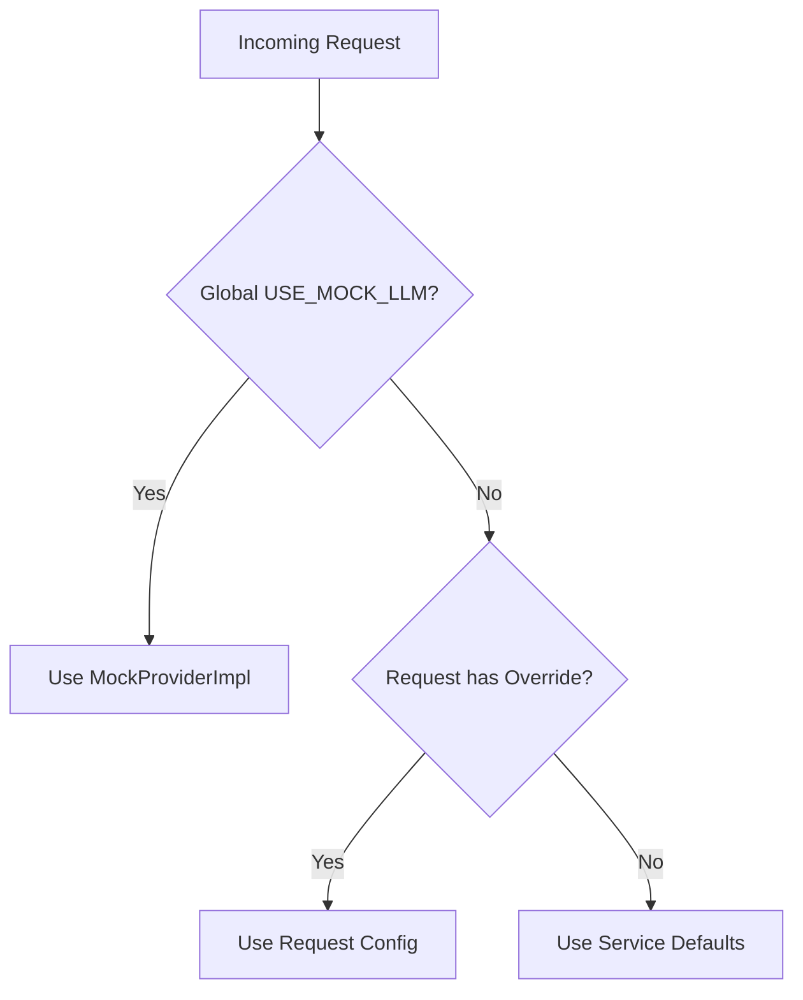

# LLM Provider Configuration Hierarchy

## Purpose

Document the 3-tier configuration override hierarchy for LLM Provider Service to clarify precedence between global mock settings, request-level overrides, and service defaults.

## Configuration Hierarchy



## Tier 1: Global Mock Override (Absolute Precedence)

**Variable**: `LLM_PROVIDER_SERVICE_USE_MOCK_LLM`

When `True`, ALL provider types map to `MockProviderImpl` at DI boot time.

**Mechanism**: In `services/llm_provider_service/di.py:372`:
```python
if settings.USE_MOCK_LLM and mock_provider is not None:
    return {
        LLMProviderType.MOCK: mock_provider,
        LLMProviderType.ANTHROPIC: mock_provider,
        LLMProviderType.OPENAI: mock_provider,
        LLMProviderType.GOOGLE: mock_provider,
        LLMProviderType.OPENROUTER: mock_provider,
    }
```

**Effect**: Even if a request asks for `GPT-4`, it receives a deterministic mock response. Tests never accidentally bill real credits.

**Cannot be overridden by**: Request-level parameters (DI container is `Scope.APP`, immutable after boot).

## Tier 2: Request-Level Overrides (Runtime)

**Condition**: Active only when `USE_MOCK_LLM=False`

**Contract**: `LLMConfigOverrides` in `libs/common_core/src/common_core/events/cj_assessment_events.py:78-108`

| Field | Type | Description |
|-------|------|-------------|
| `provider_override` | `str \| None` | Force provider (e.g., `anthropic`, `openai`) |
| `model_override` | `str \| None` | Force model (e.g., `gpt-4-turbo`) |
| `temperature_override` | `float \| None` | Temperature (0.0-2.0) |
| `max_tokens_override` | `int \| None` | Max response tokens |
| `system_prompt_override` | `str \| None` | Custom system prompt |

**Resolution**: `services/llm_provider_service/implementations/llm_override_utils.py:33-39`
```python
def resolve_provider_from_request(request: QueuedRequest, settings: Settings) -> LLMProviderType:
    overrides = request.request_data.llm_config_overrides
    if overrides and overrides.provider_override:
        return overrides.provider_override
    return getattr(settings, "DEFAULT_LLM_PROVIDER", LLMProviderType.OPENAI)
```

**Propagation Flow**:
1. CJ Assessment Service extracts overrides from Kafka event
2. Forwards via HTTP to LLM Provider Service
3. LLM Provider applies parameters to generation call

## Tier 3: Service Defaults (Fallback)

**Condition**: No global mock, no request overrides

**Variable**: `settings.DEFAULT_LLM_PROVIDER`

**Code ref**: `services/llm_provider_service/implementations/llm_override_utils.py:39`

## Configuration Scenarios

| Scenario | `USE_MOCK_LLM` | `ALLOW_MOCK_PROVIDER` | Behavior |
|----------|----------------|----------------------|----------|
| Pure Development | `true` | any | All requests use mock |
| Mixed Development | `false` | `true` | Request can choose mock OR real |
| Production | `false` | `false` | Only real providers available |

### Environment Examples

**Pure Development (no real API calls)**:
```bash
LLM_PROVIDER_SERVICE_USE_MOCK_LLM=true
```

**Mixed Development (real + mock selectable)**:
```bash
LLM_PROVIDER_SERVICE_USE_MOCK_LLM=false
LLM_PROVIDER_SERVICE_ALLOW_MOCK_PROVIDER=true
```

**Production**:
```bash
LLM_PROVIDER_SERVICE_USE_MOCK_LLM=false
LLM_PROVIDER_SERVICE_ALLOW_MOCK_PROVIDER=false
```

## Verification

Check service mock mode via health endpoint:
```bash
curl http://localhost:8080/healthz | jq '.mock_mode, .mock_provider'
```

Expected output when mock mode enabled:
```json
true
{
  "allowed": true,
  "registered": true,
  "seed": 42
}
```

## Architectural Notes

**Why request overrides cannot bypass `USE_MOCK_LLM`**:

1. **DI Scope**: Provider map is `Scope.APP` (Dishka) - built once at startup
2. **Immutability**: No runtime provider swapping; map is frozen after boot
3. **Design Intent**: Safety feature preventing accidental real API calls in test/dev
4. **Cost Control**: Ensures CI/functional tests never incur charges
5. **Determinism**: Mock provider uses fixed seed for reproducible test output

## ENG5 / CJ Overrides – Queueing Behaviour (Implementation Note)

Request-level overrides only influence model selection if they survive all the
way into the queue processor:

- For CJ callers (ENG5 runner and similar):
  - CJ emits `ELS_CJAssessmentRequestV1.llm_config_overrides`.
  - CJ transforms this into `CJAssessmentRequestData.llm_config_overrides`, persists it
    in `CJBatchUpload.processing_metadata["original_request"]`, and forwards overrides
    via `LLMProviderServiceClient` as HTTP `llm_config_overrides` to LLM Provider.
  - The LLM Provider HTTP API parses these into `LLMComparisonRequest.llm_config_overrides`.
- For queued processing:
  - `LLMOrchestratorImpl.perform_comparison()` must ensure that any request-level
    overrides are propagated into `QueuedRequest.request_data.llm_config_overrides`
    when creating the `QueuedRequest`.
  - Queue strategies (`SingleRequestStrategy`, `SerialBundleStrategy`) rely on
    `request.request_data.llm_config_overrides` when calling
    `build_override_kwargs(request)`; if this field is `None`, model and temperature
    fall back to service defaults (`ANTHROPIC_DEFAULT_MODEL`, etc.).

When debugging model-selection issues (e.g., ENG5 anchor-align runs using Haiku
despite Sonnet overrides), always check:

1. The HTTP request body to LLM Provider includes the expected `llm_config_overrides`.
2. `QueuedRequest.request_data.llm_config_overrides` is populated for that batch.
3. Anthropic/OpenAI provider logs show `using_override=True` and the expected model id.
