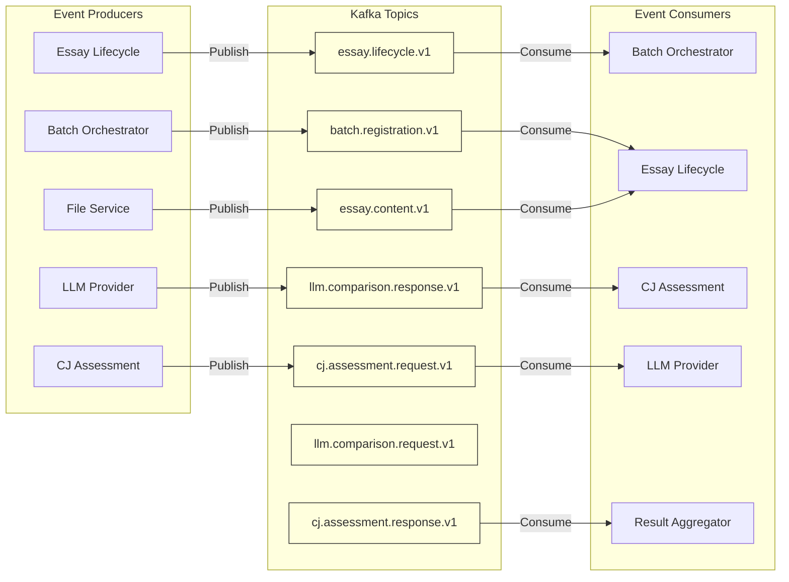
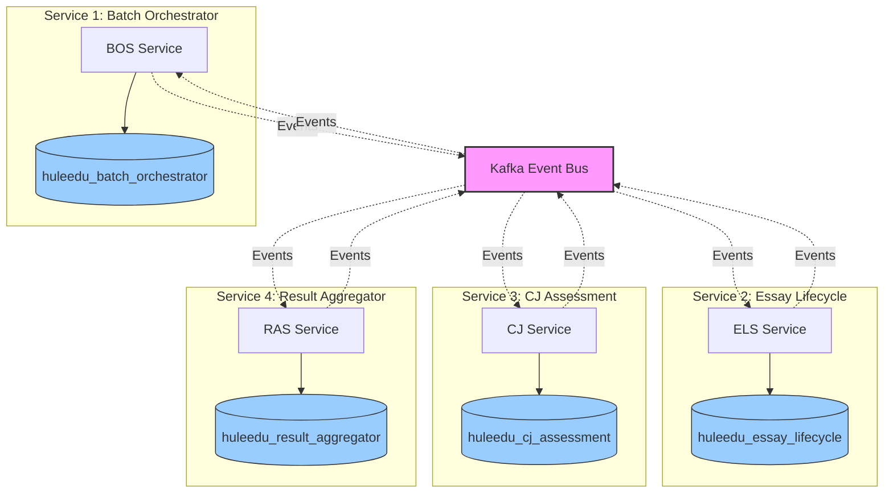
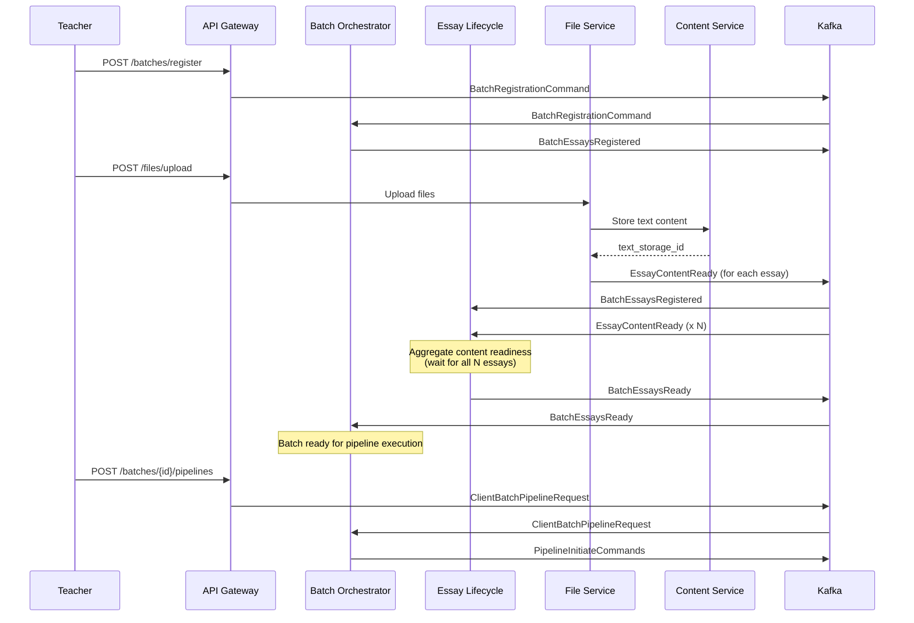
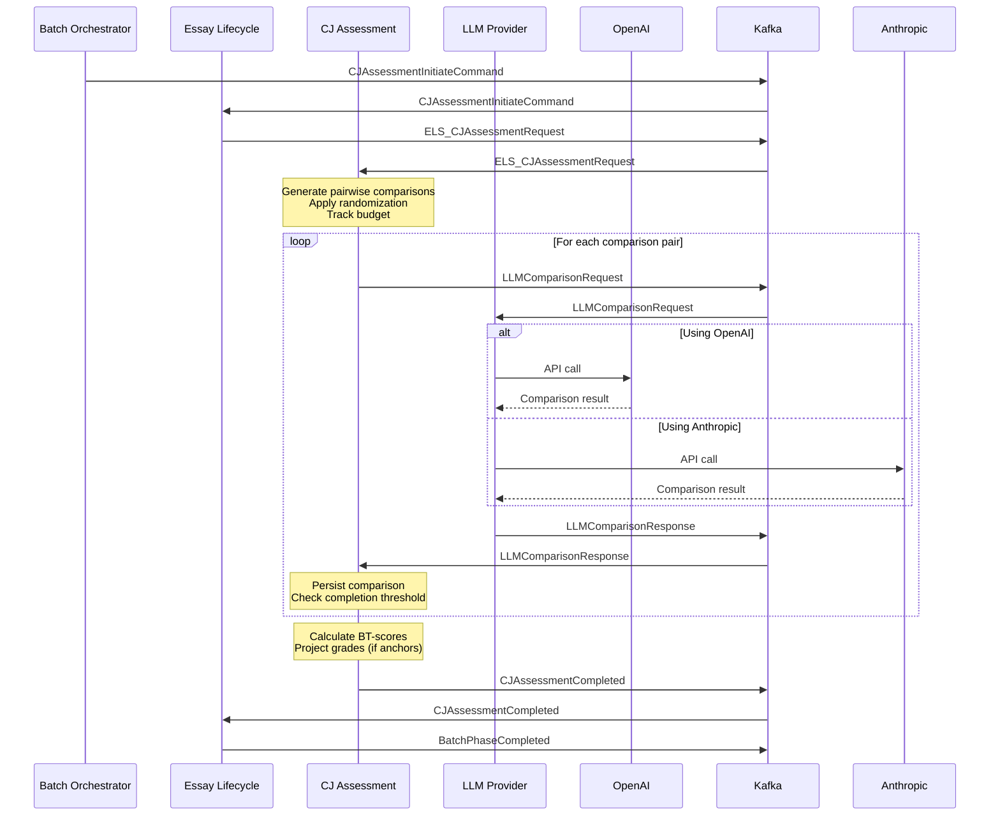
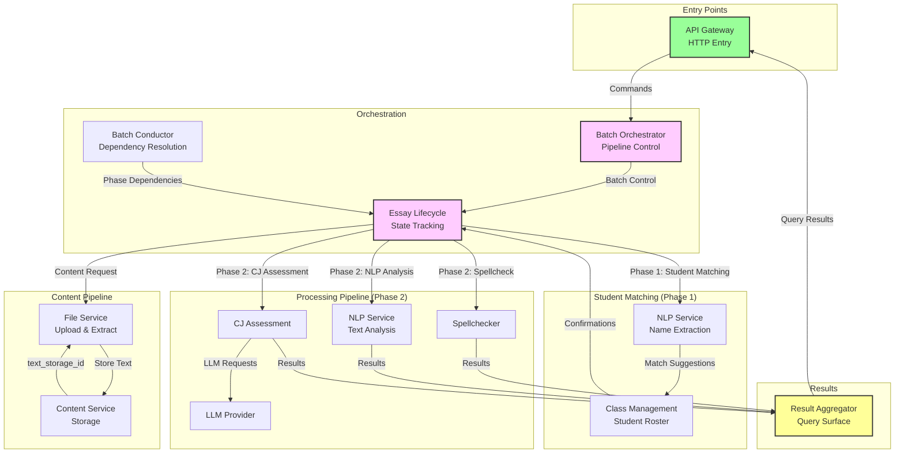
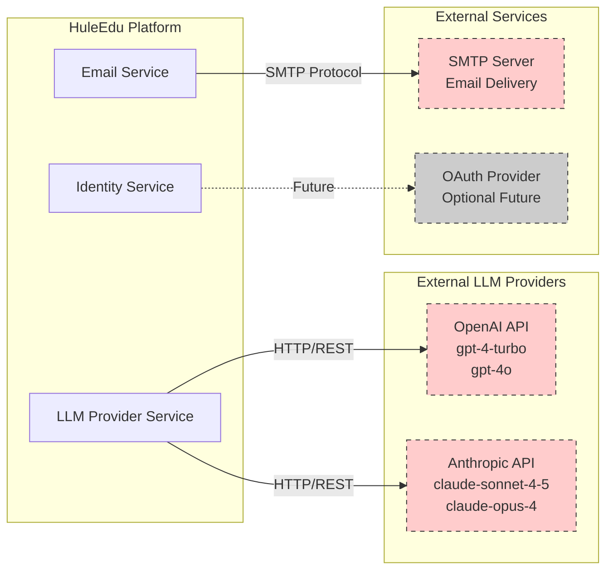
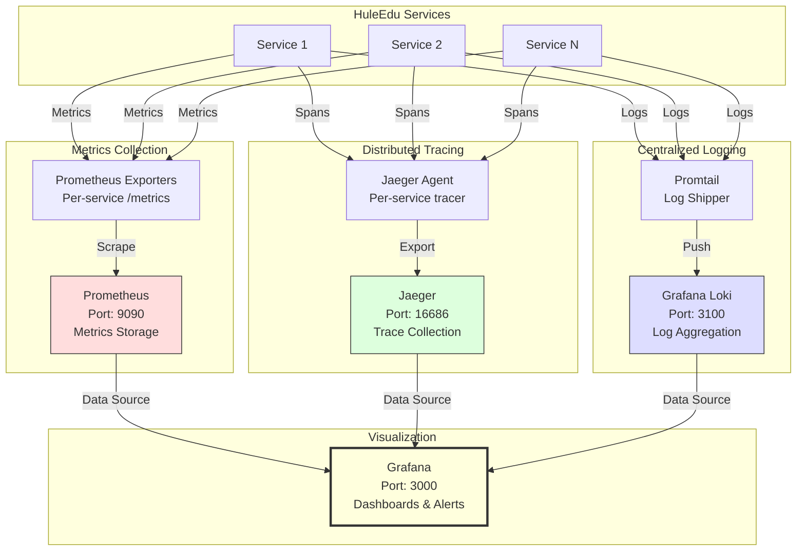
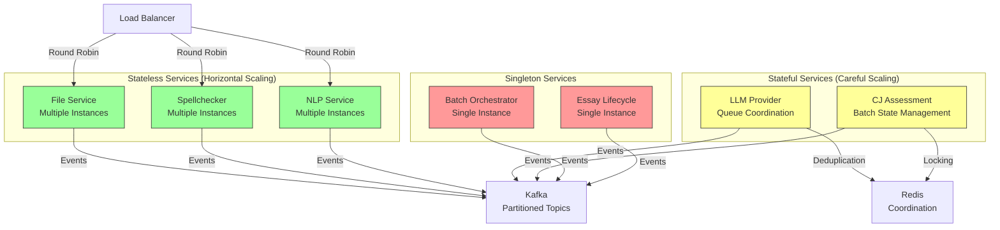

# HuleEdu System Architecture Diagrams

This document provides visual representations of the HuleEdu platform architecture, showing service topology, event flows, and integration points.

## System Topology Overview

```mermaid
graph TB
    subgraph "External Clients"
        USER[Teacher/Educator]
        BROWSER[Web Browser]
    end

    subgraph "Client Interface Layer"
        APIGW[API Gateway Service<br/>Port: 8000<br/>FastAPI]
        WSM[WebSocket Manager<br/>Port: 8001<br/>FastAPI/Starlette]
    end

    subgraph "Orchestration Layer"
        BOS[Batch Orchestrator<br/>Port: 8010<br/>Quart]
        BCS[Batch Conductor<br/>Port: 8011<br/>Quart]
        ELS[Essay Lifecycle<br/>Port: 8020<br/>Quart]
    end

    subgraph "Processing Services"
        FS[File Service<br/>Port: 8030<br/>Quart]
        CS[Content Service<br/>Port: 8040<br/>Quart]
        NLP[NLP Service<br/>Port: 8050<br/>Quart]
        SC[Spellchecker<br/>Port: 8060<br/>Quart]
        LT[Language Tool<br/>Port: 8061<br/>Quart+Java]
        CJ[CJ Assessment<br/>Port: 8070<br/>Quart]
        LPS[LLM Provider<br/>Port: 8080<br/>Quart]
    end

    subgraph "Support Services"
        CM[Class Management<br/>Port: 8090<br/>Quart]
        RAS[Result Aggregator<br/>Port: 8100<br/>Quart]
        ENT[Entitlements<br/>Port: 8110<br/>Quart]
        EMAIL[Email Service<br/>Port: 8120<br/>Quart]
        ID[Identity Service<br/>Port: 8130<br/>FastAPI]
    end

    subgraph "Infrastructure Services"
        KAFKA[Apache Kafka<br/>Port: 9092<br/>Event Bus]
        ZOOKEEPER[Zookeeper<br/>Port: 2181<br/>Kafka Coordination]
        REDIS[Redis<br/>Port: 6379<br/>Cache & Dedup]
    end

    subgraph "Data Persistence"
        PG_BOS[(PostgreSQL<br/>huleedu_batch_orchestrator)]
        PG_ELS[(PostgreSQL<br/>huleedu_essay_lifecycle)]
        PG_FS[(PostgreSQL<br/>huleedu_file)]
        PG_CS[(PostgreSQL<br/>huleedu_content)]
        PG_CM[(PostgreSQL<br/>huleedu_class_management)]
        PG_CJ[(PostgreSQL<br/>huleedu_cj_assessment)]
        PG_RAS[(PostgreSQL<br/>huleedu_result_aggregator)]
        PG_ENT[(PostgreSQL<br/>huleedu_entitlements)]
        PG_ID[(PostgreSQL<br/>huleedu_identity)]
    end

    subgraph "External Integrations"
        OPENAI[OpenAI API<br/>GPT-4]
        ANTHROPIC[Anthropic API<br/>Claude]
        SMTP[SMTP Server<br/>Email Delivery]
    end

    USER -->|HTTPS| BROWSER
    BROWSER -->|REST API| APIGW
    BROWSER -.->|WebSocket| WSM

    APIGW -->|Events| KAFKA
    APIGW -->|Queries| BOS
    APIGW -->|Queries| RAS
    WSM -.->|Subscribe| KAFKA

    BOS <-->|Events| KAFKA
    BCS <-->|Events| KAFKA
    ELS <-->|Events| KAFKA
    FS <-->|Events| KAFKA
    CS <-->|Events| KAFKA
    NLP <-->|Events| KAFKA
    SC <-->|Events| KAFKA
    LT <-->|Events| KAFKA
    CJ <-->|Events| KAFKA
    LPS <-->|Events| KAFKA
    CM <-->|Events| KAFKA
    RAS <-->|Events| KAFKA
    ENT <-->|Events| KAFKA
    EMAIL <-->|Events| KAFKA

    BOS --> PG_BOS
    ELS --> PG_ELS
    FS --> PG_FS
    CS --> PG_CS
    CM --> PG_CM
    CJ --> PG_CJ
    RAS --> PG_RAS
    ENT --> PG_ENT
    ID --> PG_ID

    BOS --> REDIS
    LPS --> REDIS
    CJ --> REDIS
    ELS --> REDIS

    LPS -->|API Calls| OPENAI
    LPS -->|API Calls| ANTHROPIC
    EMAIL -->|SMTP| SMTP

    KAFKA --> ZOOKEEPER

    style KAFKA fill:#f9f,stroke:#333,stroke-width:3px
    style REDIS fill:#ff9,stroke:#333,stroke-width:2px
    style APIGW fill:#9f9,stroke:#333,stroke-width:3px
    style WSM fill:#9f9,stroke:#333,stroke-width:3px
```

## Event Bus Architecture

## Database Isolation Pattern

**Key Principle**: Each service owns its database exclusively. No direct database access between services. All data sharing occurs via events or HTTP queries.

## Batch Processing Flow

## CJ Assessment Pipeline

## Service Dependencies and Data Flow

## External Integration Points

**Note**: External integrations are isolated within specific services (LPS, Email, Identity) to centralize configuration, rate limiting, and error handling.

## Observability Stack

## Network Communication Patterns

### Asynchronous (Kafka Events)
- **Use case**: State changes, pipeline orchestration, cross-service notifications
- **Pattern**: Fire-and-forget with at-least-once delivery
- **Examples**: `BatchEssaysRegistered`, `EssayContentReady`, `CJAssessmentCompleted`

### Synchronous (HTTP Queries)
- **Use case**: Immediate data retrieval, file upload proxying
- **Pattern**: Request-response with timeout handling
- **Examples**: API Gateway → RAS queries, File upload → File Service

### WebSocket (Real-time Updates)
- **Use case**: Client-side real-time notifications
- **Pattern**: Server-push from Kafka event subscriptions
- **Examples**: Batch status changes, essay processing progress

## Service Scaling Patterns

**Scaling Guidance**:
- **Stateless services**: Scale horizontally based on CPU/memory metrics
- **Stateful services**: Require Redis coordination for distributed state
- **Singleton services**: Currently designed for single instance (future: leader election)

## Key Architectural Properties

### 1. Loose Coupling
Services communicate via events and never import from other services. All contracts defined in `libs/common_core`.

### 2. Database Per Service
Each service owns its database schema and data. No shared databases or cross-service queries.

### 3. Event Sourcing Lite
Critical state transitions published as events to Kafka for audit trail and downstream processing.

### 4. Circuit Breaker Pattern
External integrations (LLM APIs, SMTP) protected by circuit breakers with fallback behavior.

### 5. Idempotency
All event consumers use correlation_id-based deduplication via Redis to safely handle duplicate events.

### 6. Observability First
Metrics, traces, and logs built into every service from day one, not retrofitted later.

## Reference Documentation

- **Service Architectures**: `.claude/rules/020.x-*-architecture.md`
- **Event Standards**: `.claude/rules/052-event-contract-standards.md`
- **Processing Flows**: `.claude/rules/035-complete-processing-flow-overview.md`
- **Testing Patterns**: `.claude/rules/075-test-creation-methodology.md`
- **Docker Setup**: `.claude/rules/081.1-docker-development-workflow.md`
