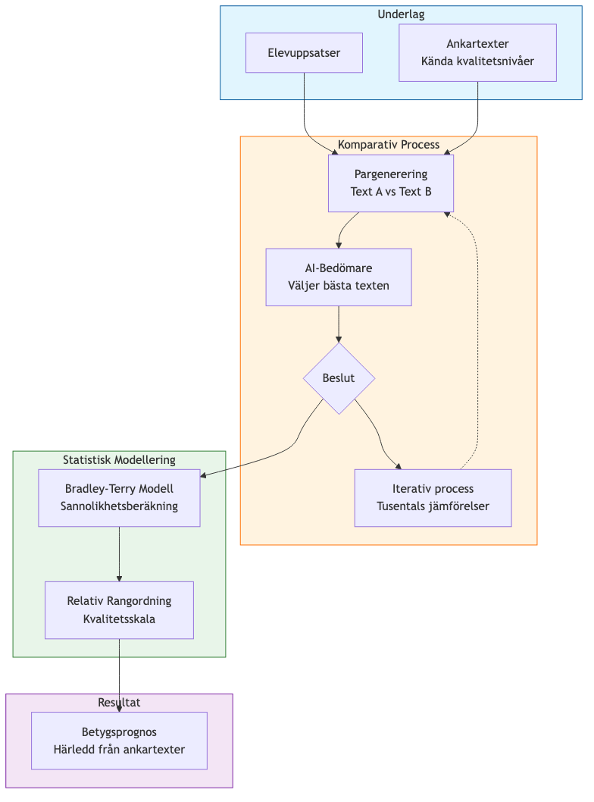
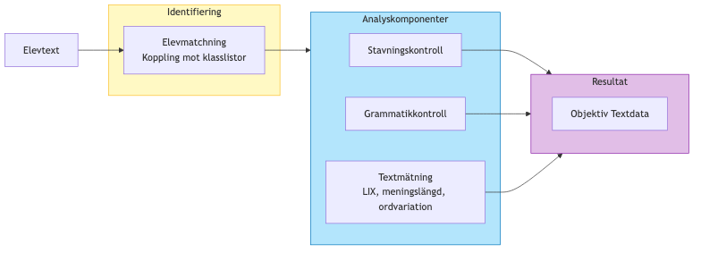
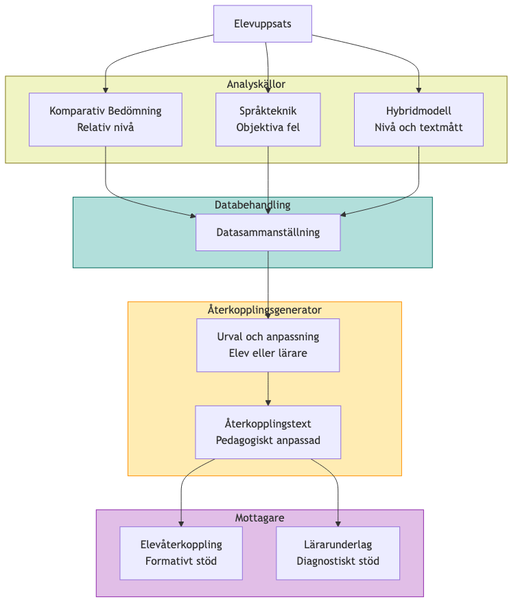

# Bilaga: Systemskisser för AI-stött Bedömningsinstrument

Denna bilaga presenterar fyra modeller som tillsammans utgör det planerade bedömningsinstrumentets uppbyggnad. Modellerna är under utveckling och befinner sig i olika stadier av färdigställande.

---

## 1. Komparativ Bedömning (CJ) med AI-stöd

Komparativ bedömning ersätter absolut betygssättning med parvisa jämförelser. En generativ språkmodell hanterar den stora mängd jämförelser som krävs för att bygga ett nätverk av bedömningar mellan uppsatserna.

---

## 2. Regelbaserad Språkteknisk Analys (NLP)

Den regelbaserade analysen utgör instrumentets objektiva grund. Genom förutbestämda regler mäts formella textegenskaper som stavning, grammatik och läsbarhet—helt oberoende av AI-modellens bedömningar.

---

## 3. Hybridmodell för Konstruktvalidering (ML-Scoring)

Hybridmodellen är utformad för att vara genomskinlig och förklarbar, till skillnad från den komparativa bedömningen där AI-modellens resonemang inte går att knyta till de faktiska bakomliggande besultsprocessserna. Genom att kombinera djupinlärning med definierade textmått går det att spåra vilka textegenskaper som påverkar det slutliga betygsförslaget.

---

## 4. Systemöversikt: Integrerad Återkoppling

Systemet sammanställer data från samtliga analysmodeller och omvandlar denna till återkoppling anpassad för respektive mottagare. Systemet är byggt för att möjliggöra jämförande analyser över tid, både på individ- och gruppnivå.

