# HuleEdu Platform Overview

## Platform Purpose and Vision

HuleEdu is a comprehensive educational assessment platform that processes student essays through multiple AI-driven pipelines including spellcheck, NLP analysis, comparative judgment (CJ) assessment, and AI-generated feedback. The platform enables educators to efficiently evaluate and provide feedback on student writing at scale, combining automated processing with human oversight where needed.

### Core Capabilities

- **Batch Processing**: Handle multiple student essays simultaneously with efficient orchestration
- **Multi-Pipeline Analysis**: Spellcheck, NLP metrics, comparative judgment scoring, AI feedback
- **Real-Time Monitoring**: Live status updates and progress tracking via WebSocket connections
- **Flexible Workflows**: Support both anonymous (GUEST) and class-based (REGULAR) processing modes
- **Grade Calibration**: Bayesian consensus models for accurate grade projection using anchor essays
- **Research Integration**: Empirical validation through ENG5 National Proficiency test datasets

## Architecture Overview

HuleEdu is built as an event-driven microservices ecosystem with strict Domain-Driven Design (DDD) principles. Services communicate asynchronously via Kafka, maintaining clear bounded contexts and ensuring loose coupling.

```mermaid
graph TB
    subgraph "Client Layer"
        FE[Frontend SPA<br/>Vue 3 + Vite]
        APIGW[API Gateway<br/>FastAPI]
        WSM[WebSocket Manager<br/>FastAPI/Starlette]
    end

    subgraph "Orchestration Layer"
        BOS[Batch Orchestrator<br/>Pipeline Coordination]
        BCS[Batch Conductor<br/>Dependency Resolution]
        ELS[Essay Lifecycle<br/>State Management]
    end

    subgraph "Processing Services"
        FS[File Service<br/>Upload & Extract]
        CS[Content Service<br/>Text Storage]
        NLP[NLP Service<br/>Text Analysis]
        SC[Spellchecker<br/>Grammar Check]
        LT[Language Tool<br/>Advanced Grammar]
        CJ[CJ Assessment<br/>Comparative Judgment]
        LPS[LLM Provider<br/>AI Integration]
    end

    subgraph "Support Services"
        CM[Class Management<br/>Student Roster]
        RAS[Result Aggregator<br/>Query Surface]
        ENT[Entitlements<br/>Credit Management]
        EMAIL[Email Service<br/>Notifications]
        ID[Identity Service<br/>Authentication]
    end

    subgraph "Infrastructure"
        KAFKA[Kafka Event Bus]
        PG[(PostgreSQL<br/>Per-Service DBs)]
        REDIS[(Redis<br/>Cache & Dedup)]
    end

    FE -->|HTTP| APIGW
    FE -.->|WebSocket| WSM
    APIGW -->|Commands| KAFKA
    WSM -.->|Events| KAFKA

    BOS <-->|Events| KAFKA
    BCS <-->|Events| KAFKA
    ELS <-->|Events| KAFKA

    FS -->|Events| KAFKA
    CS -->|Events| KAFKA
    NLP -->|Events| KAFKA
    SC -->|Events| KAFKA
    LT -->|Events| KAFKA
    CJ -->|Events| KAFKA
    LPS -->|Events| KAFKA

    CM -->|Events| KAFKA
    RAS -->|Events| KAFKA
    ENT -->|Events| KAFKA
    EMAIL -->|Events| KAFKA

    BOS --> PG
    ELS --> PG
    FS --> PG
    CM --> PG
    CJ --> PG
    RAS --> PG

    BOS --> REDIS
    LPS --> REDIS
    CJ --> REDIS
```



### Architectural Principles

1. **Microservice Autonomy**: Each service operates independently with its own database and clear domain boundaries
2. **Event-Driven Communication**: Asynchronous Kafka events with typed Pydantic contracts
3. **Thin Events**: Events carry identifiers and essential context; large data stored in Content Service
4. **Explicit Contracts**: All communication uses versioned Pydantic models in `libs/common_core`
5. **Protocol-First Design**: Dependency injection via Dishka with Protocol interfaces
6. **Observability**: Comprehensive metrics (Prometheus), tracing (Jaeger), and structured logging (Loki)

## Key Concepts and Terminology

HuleEdu uses specific terminology aligned with its educational assessment domain. For comprehensive definitions, see [Terminology and Definitions](./.././.agent/rules/100-terminology-and-definitions.md).

### Essential Terms

- **Batch**: Collection of student essays submitted together for processing
- **Pipeline**: Sequence of processing phases (e.g., spellcheck → NLP → CJ assessment)
- **Phase**: Individual processing stage within a pipeline
- **Essay Slot**: Container for an essay within a batch, may be assigned student identity
- **Content Provisioning**: Process of extracting text from uploaded files and storing in Content Service
- **Student Matching**: Phase 1 process linking essays to student roster via NLP name extraction
- **Comparative Judgment (CJ)**: Assessment method using pairwise essay comparisons for ranking
- **Anchor Essay**: Known-grade reference essay for calibrating grade projections
- **BT-Score**: Bradley-Terry score derived from pairwise comparisons
- **Correlation ID**: Unique identifier for tracing operations across services

### Processing Modes

- **GUEST Batch**: Anonymous processing without student roster (filename-only identification)
- **REGULAR Batch**: Class-based processing with student matching and validation

## Service Landscape Map

HuleEdu consists of 18 services organized into functional layers:

### Client Interface Services

| Service | Purpose | Technology |
|---------|---------|------------|
| **API Gateway** | Client-facing HTTP API, authentication, rate limiting | FastAPI |
| **WebSocket Manager** | Real-time client updates via WebSocket connections | FastAPI/Starlette |

### Orchestration Services

| Service | Purpose | Key Responsibilities |
|---------|---------|---------------------|
| **Batch Orchestrator (BOS)** | Primary batch coordinator | Pipeline initiation, batch state management, client API |
| **Batch Conductor (BCS)** | Pipeline dependency resolution | Phase sequencing, dependency graph evaluation |
| **Essay Lifecycle (ELS)** | Essay state management | Content readiness aggregation, processing coordination |

### Processing Services

| Service | Purpose | Processing Type |
|---------|---------|----------------|
| **File Service** | File upload and content extraction | docx, txt, PDF text extraction |
| **Content Service** | Text and binary artifact storage | Large content storage with reference IDs |
| **NLP Service** | Natural language processing | Phase 1: Name extraction, Phase 2: Text analysis |
| **Spellchecker Service** | Grammar and spelling validation | Basic grammar checks |
| **Language Tool Service** | Advanced grammar checking | Java-based LanguageTool subprocess |
| **CJ Assessment Service** | Comparative judgment scoring | Pairwise comparisons, BT-score calculation, grade projection |
| **LLM Provider Service** | LLM integration abstraction | Anthropic/OpenAI routing, queue management, batching |

### Support Services

| Service | Purpose | Data Managed |
|---------|---------|-------------|
| **Class Management** | Student roster and associations | Classes, students, essay-student links |
| **Result Aggregator (RAS)** | Query surface for results | Consolidated batch/essay results |
| **Entitlements Service** | Credit management | Usage tracking, quota enforcement |
| **Email Service** | Notification delivery | SMTP-based teacher notifications |
| **Identity Service** | Authentication and authorization | JWT tokens, user management |

### Development Services

| Service | Purpose | Usage |
|---------|---------|-------|
| **ENG5 NP Runner** | Research validation runner | Execute CJ assessments on ENG5 dataset |

## Getting Started Paths

### For Developers

**Start here**: [Developer Onboarding Guide](./developer-onboarding.md)

The developer onboarding guide provides:
- Complete environment setup instructions
- Recommended first service to explore
- How to run tests and understand event flows
- Git workflow and contribution guidelines

**Next steps**:
1. Set up your development environment (Docker, PDM, Python 3.11)
2. Start all services: `pdm run dev-build-start`
3. Explore the File Service as your first service
4. Run integration tests: `pdm run pytest-root tests/integration/`
5. Review the complete processing flow documentation

### For Operators

**Start here**: `docs/operations/`

Operational documentation includes:
- Service health monitoring and alerting
- Database management and migration procedures
- Kafka event bus operations
- Container debugging and log analysis
- Performance optimization guidelines

**Key runbooks**:
- `docs/operations/database-operations.md` - Database access and management
- `docs/operations/docker-troubleshooting.md` - Container debugging
- `docs/operations/kafka-operations.md` - Event bus operations
- `docs/operations/llm-provider-configuration-hierarchy.md` - LLM configuration

### For Product Owners

**Start here**: `docs/product/PRD.md`

The Product Requirements Document provides:
- Platform vision and objectives
- User personas and journeys
- Feature roadmap and release phases
- Success metrics and KPIs

**Key resources**:
- `docs/decisions/` - Architectural Decision Records (ADRs)
- `TASKS/` - Active development tasks with frontmatter tracking
- `.claude/work/session/handoff.md` - Current development status

## Quick Reference Links

### Essential Documentation

- **Architecture Rules**: `.agent/rules/000-rule-index.md` - Complete rule index
- **Processing Flows**: `.agent/rules/035-complete-processing-flow-overview.md`
- **Service Patterns**: `.agent/rules/040-service-implementation-guidelines.md`
- **Testing Standards**: `.agent/rules/075-test-creation-methodology.md`
- **Development Workflow**: `CLAUDE.md` - Comprehensive technical reference

### Architecture Diagrams

- **System Architecture**: [Architecture Diagram](./architecture-diagram.md)
- **Phase 1 Flow**: `.agent/rules/036-phase1-processing-flow.md`
- **Phase 2 Flow**: `.agent/rules/037-phase2-processing-flow.md`
- **File Upload Flow**: `.agent/rules/038-file-upload-processing-flow.md`
- **Results Retrieval**: `.agent/rules/039-results-retrieval-flow.md`

### Development Commands

```bash
# Start all services
pdm run dev-build-start

# Run tests
pdm run pytest-root services/<service>/tests/
pdm run pytest-root tests/integration/

# Code quality
pdm run format-all
pdm run lint-fix --unsafe-fixes
pdm run typecheck-all

# Container management
pdm run dev-logs [service]
pdm run dev-restart [service]
docker ps | grep huleedu
```

### Service-Specific Rules

Each major service has dedicated architecture documentation in `.agent/rules/`:

- `020.3-batch-orchestrator-service-architecture.md`
- `020.5-essay-lifecycle-service-architecture.md`
- `020.6-file-service-architecture.md`
- `020.7-cj-assessment-service.md`
- `020.10-api-gateway-service.md`
- `020.13-llm-provider-service-architecture.md`
- `020.15-nlp-service-architecture.md`

### Key Technologies

- **Language**: Python 3.11 with full PEP 484 type hints
- **Web Frameworks**: Quart (internal), FastAPI (client-facing)
- **Database**: PostgreSQL with SQLAlchemy async
- **Event Bus**: Kafka with JSON serialization
- **Caching**: Redis for deduplication and caching
- **DI Container**: Dishka with Protocol-based interfaces
- **Observability**: Prometheus, Jaeger, Loki, Grafana
- **Containerization**: Docker Compose v2
- **Package Manager**: PDM monorepo with root lockfile

### Recent Updates

See `.claude/work/session/handoff.md` for the latest development status, including:

- CJ Assessment POC validation status
- ENG5 Runner validation results
- Grade projection mechanism improvements
- LLM batching configuration options
- Session addenda with recent fixes and changes

## Contributing

HuleEdu follows strict architectural patterns and coding standards:

1. **Read the rules first**: `.agent/rules/000-rule-index.md`
2. **Follow DDD boundaries**: No cross-service direct calls
3. **Use Kafka for communication**: All inter-service events
4. **Type everything**: Full PEP 484 type hints required
5. **Test comprehensively**: Unit, integration, and contract tests
6. **Document with docstrings**: Google-style for all public APIs
7. **Respect file size limits**: 400 LoC hard limit per file

Before contributing:
1. Review relevant service architecture rules
2. Create task documentation: `pdm run new-task --domain <domain> --title "Title"`
3. Implement following established patterns
4. Run quality checks: `format-all`, `lint-fix`, `typecheck-all`
5. Write and verify tests: `pdm run pytest-root`
6. Update documentation as needed

## Support and Resources

- **Development Issues**: Check `.agent/rules/044-service-debugging-and-troubleshooting.md`
- **Docker Problems**: See `.agent/rules/046-docker-container-debugging.md`
- **Test Failures**: Review `.agent/rules/075-test-creation-methodology.md`
- **Database Access**: Reference `CLAUDE.md` Database Access section
- **Task Tracking**: Use `pdm run new-task` for all new work

For detailed technical guidance, always consult `CLAUDE.md` and the `.agent/rules/` directory.
