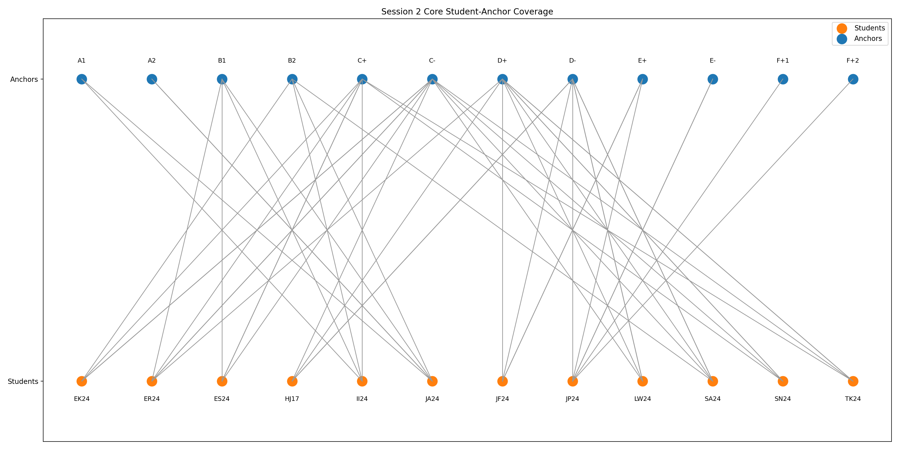
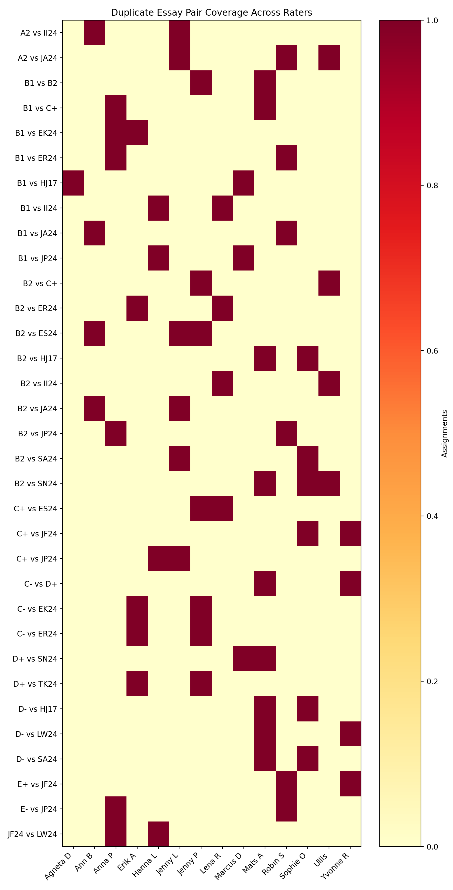

# Session 2 Diagnostics

## Student Anchor Coverage (Core)

| Student | Core Anchor Count | Distinct Anchors | Anchor IDs | Extra Count | Extra Anchors | Extra Pair IDs |
|---|---|---|---|---|---|---|
| EK24 | 4 | 3 | B2;C+;C- | 3 | A1;B1 | 106;120;86 |
| ER24 | 5 | 4 | B1;C+;C-;D+ | 5 | A1;A2;B1;B2 | 115;121;139;87;98 |
| ES24 | 4 | 3 | B1;C+;C- | 5 | A1;A2;B2 | 103;125;133;85;97 |
| HJ17 | 4 | 3 | C-;D+;D- | 4 | B1;B2 | 107;111;118;136 |
| II24 | 4 | 4 | A1;B1;B2;C+ | 4 | A2;B1;B2 | 100;102;124;96 |
| JA24 | 5 | 4 | A1;A2;B1;B2 | 5 | A2;B1;B2;C+;C- | 101;123;137;95;99 |
| JF24 | 4 | 3 | D+;D-;E+ | 4 | B1;B2;C+ | 109;112;114;130 |
| JP24 | 6 | 5 | D-;E+;E-;F+1;F+2 | 7 | B1;B2;C+;C- | 119;122;126;127;128;138;90 |
| LW24 | 4 | 3 | C-;D+;D- | 3 | B1;B2;C+ | 108;113;129 |
| SA24 | 5 | 4 | B2;C-;D+;D- | 2 | B1;B2 | 110;94 |
| SN24 | 4 | 3 | C+;C-;D+ | 4 | B1;B2 | 104;117;135;89 |
| TK24 | 4 | 3 | C+;C-;D+ | 3 | A1;B1;B2 | 105;116;88 |

## Duplicate Pair Coverage

| Pair | Total Occurrences | Core | Extra | Raters | Pair IDs |
|---|---|---|---|---|---|
| B1 vs JA24 | 2 | 1 | 1 | Ann B;Robin S | 2;137 |
| A2 vs JA24 | 3 | 2 | 1 | Jenny L;Robin S;Ullis | 3;83;123 |
| B2 vs II24 | 2 | 1 | 1 | Lena R;Ullis | 4;102 |
| C+ vs ES24 | 2 | 2 | 0 | Jenny P;Lena R | 7;69 |
| C- vs EK24 | 2 | 2 | 0 | Erik A;Jenny P | 11;70 |
| B2 vs C+ | 2 | 1 | 1 | Jenny P;Ullis | 19;131 |
| C- vs ER24 | 2 | 2 | 0 | Erik A;Jenny P | 20;71 |
| D+ vs TK24 | 2 | 2 | 0 | Erik A;Jenny P | 24;72 |
| D+ vs SN24 | 2 | 2 | 0 | Marcus D;Mats A | 27;73 |
| D- vs HJ17 | 2 | 2 | 0 | Mats A;Sophie O | 30;74 |
| D- vs SA24 | 2 | 2 | 0 | Mats A;Sophie O | 33;75 |
| D- vs LW24 | 2 | 2 | 0 | Mats A;Yvonne R | 36;76 |
| E+ vs JF24 | 2 | 2 | 0 | Robin S;Yvonne R | 40;77 |
| JF24 vs LW24 | 2 | 2 | 0 | Anna P;Hanna L | 46;61 |
| C- vs D+ | 2 | 1 | 1 | Mats A;Yvonne R | 47;93 |
| E- vs JP24 | 2 | 2 | 0 | Anna P;Robin S | 56;78 |
| B2 vs SA24 | 2 | 1 | 1 | Jenny L;Sophie O | 63;110 |
| B2 vs JA24 | 2 | 1 | 1 | Ann B;Jenny L | 67;99 |
| B1 vs II24 | 2 | 1 | 1 | Hanna L;Lena R | 68;96 |
| B1 vs C+ | 2 | 1 | 1 | Anna P;Mats A | 79;91 |
| B1 vs B2 | 2 | 1 | 1 | Jenny P;Mats A | 80;132 |
| B1 vs ER24 | 2 | 1 | 1 | Anna P;Robin S | 82;121 |
| B2 vs ES24 | 3 | 0 | 3 | Ann B;Jenny L;Jenny P | 85;125;133 |
| B1 vs EK24 | 2 | 0 | 2 | Anna P;Erik A | 86;120 |
| B2 vs ER24 | 2 | 0 | 2 | Erik A;Lena R | 87;98 |
| B2 vs SN24 | 3 | 0 | 3 | Mats A;Sophie O;Ullis | 89;104;135 |
| B1 vs JP24 | 2 | 0 | 2 | Hanna L;Marcus D | 90;127 |
| A2 vs II24 | 2 | 0 | 2 | Ann B;Jenny L | 100;124 |
| B1 vs HJ17 | 2 | 0 | 2 | Agneta D;Marcus D | 107;118 |
| B2 vs HJ17 | 2 | 0 | 2 | Mats A;Sophie O | 111;136 |
| C+ vs JF24 | 2 | 0 | 2 | Sophie O;Yvonne R | 112;114 |
| B2 vs JP24 | 2 | 0 | 2 | Anna P;Robin S | 122;138 |
| C+ vs JP24 | 2 | 0 | 2 | Hanna L;Jenny L | 126;128 |





## Redistribution Utility

Rebuild rater assignments on the fly if attendance changes using:

```
python scripts/bayesian_consensus_model/redistribute_pairs.py \
  --pairs-csv scripts/bayesian_consensus_model/session_2_planning/20251027-143747/session2_pairs.csv \
  --output-csv /tmp/session2_dynamic_assignments.csv \
  --raters 12 --per-rater 10
```

Add `--rater-names` with a comma-separated roster for named slots, or pass
`--include-status core` to restrict the allocation to the 84 core comparisons.
Run without flags for a prompted flow, or repeat `--rater-name` to supply names
explicitly (e.g., `--rater-name "Ann B" --rater-name "Lena R"`).

### TUI (Textual Interface)

Launch the interactive terminal UI:

```
python scripts/bayesian_consensus_model/redistribute_tui.py
```

The interface lets you update paths, rater counts or names, comparison count per
rater, and the status pool using form controls. Press `g` or click **Generate**
to write the assignments, or `Reset` to restore defaults.
