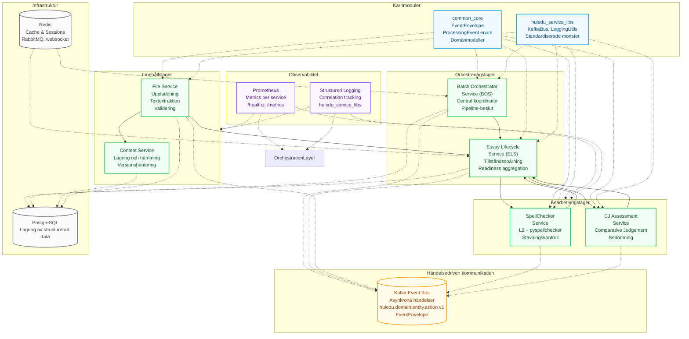
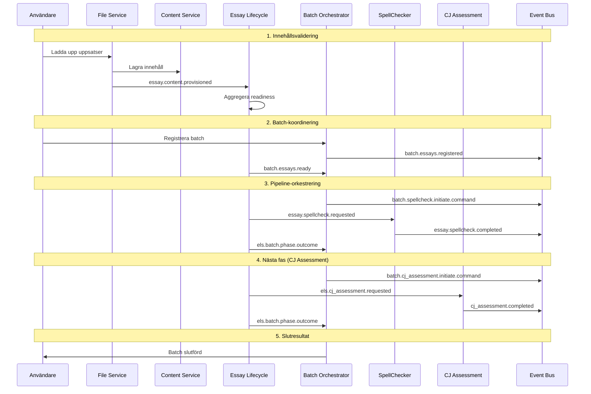
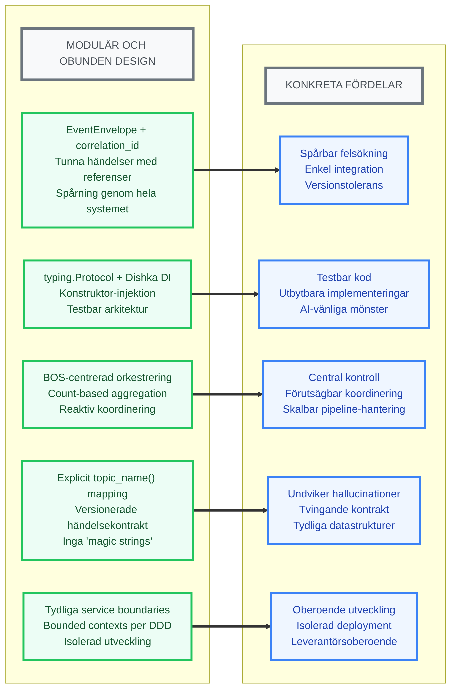

# Modulär systemdesign ftw: en hållbar arkitektur för framtidens kommunala verksamhet

Hej Camilla och Anders,

Kul att ni är igång igen. Bra löst med tid och utrymme. Jag hoppas att ni får ett tydligt mandat att driva vad ni tror är bäst för verksamheten. Att ni så uppenbart har tagit strid för skolans särställning och plats i den kommunala förvaltningen hedrar er. Innan jag går på sommarferie och helhjärtat kan ägna mig åt de projekt som under vårterminen har tvingat mig till en helt ohållbart usel mängd sömn vill jag som en gentjänst ta tillfället i akt att dela med mig av mina erfarenheter från ett drygt halvårs vedermödor.

Jag har, som ni kanske har förstått, under en längre tid försökt hitta ett sätt att i kod knacka fram lösningar på problem som jag tidigare har avfärdat som omöjliga att lösa för en enkel kommunal knegare. I huvudsak är problemet att hitta ett sätt att utan expertkunskaper bygga och underhålla robusta och skalbara backendlösningar för webbaserade appar. Tack vare det arbetet har jag också fått förmånen att misslyckas tillräckligt många gånger och på tillräckligt många sätt för att anse mig ha identifierat i alla fall utkastet till en modell som faktiskt fungerar i praktiken (end-to-end test av hela kedjan från uppladdning till flerledad bearbetning och tillbaka igen fungerar). Huvudtanken bakom bygger på att utgå från *vad* man vill åstadkomma, inte *hur* det ska åstadkommas, och låta verkliga användarbehov styra val av teknik. I nästa avsnitt följer ett koncentrerat planeringsunderlag som sammanfattar problemen jag tror ni vill lösa, den arkitektur jag tror ni vill använda och varför den passar kommunens behov. Innan vi hoppar till väsentligheterna vill jag dock delge ytterligare några av de insikter som arbetet har bibringat mig.

Den kanske viktigaste av mina insikter rör dagen kommunala infrastruktur och dess brist på anpassning till skolans behov och verklighet. I arkitekturen jag snart ska försöka beskriva ryms därför ett tydligt om än implicit SKA-krav: att den ska hålla allt vad kommunala IT-avdelningar heter så långt från alla projekt som det bara går. Det är förstås bara min intuition som talar, men om det är något jag anser mig ha insett är det att några kommunala IT-nissar aldrig kommer att få röra något jag har snickrat ihop. De saknar nämligen helt förståelse för utbildningssektorns unika behov. Samma sekund som de träder in drar de därför ofelaktigen med sig ett tankesätt där det är IT:s behov och logik som ska styra snarare än de verksamheter som IT en gång skapades för att stödja. Detta är tydligt för var och en som har arbetat med skolans IT-system och de policys som har utformats för till exempel datorhantering och dokumentationssystem.

Jag förstår att min inställning inte är särskilt fruktbar för er del, men eftersom jag inte är beroende av IT-avdelningens välvilja kan jag kosta på mig att tycka vad jag vill. Oavsett finns det inga som helst skäl för er heller att släppa in IT förrän det finns en färdig och härdad produkt med en stabil användarbas. Mitt eget projekts CI/CD-setup är redan förberedd via Docker och Github Actions och kommer alphatestas på min hemmaserver och vid behov uppgraderas till Kubernetes. På så sätt slipper mina berörda kollegor de "big bang"-lanseringar som numera tillhör stenåldern. De får också tillfälle att skapa goda argument för Sveriges kommuner och regioner att släppa taget om höftskynke och flintsten och uppnå en lite högre resurseffektivitet.

Slutligen: nedan rotvälska med insprängd kod är (hur osannolikt det på ytan än kan verka) något alla normalbegåvade människor med lite intresse och jävlaranamma kan uppnå. Mitt antagande bygger på enkel sannolikhetslära: om en småbarnsförälder och medelålders språklärare hinner lära sig grunderna för modern systemdesign på något drygt (om än sömnsnålt) halvår borde det vara en hyfsat smal sak för den inte obetydliga skara utvecklingsledare inom kommunen som har IT och digitalisering som sitt huvudsakliga arbete. Sedan är allt som krävs ett tydligt uppdrag, gott om tid och lite intresse.

Nu till huvudsaken!

## Varför decentraliserade mikrotjänster?

Anledningen är enkel: det är den enda lämpliga lösningen om man vill undvika leverantörsbundenhet och behålla full kontroll över all kod, data och framtida utveckling.

Själv väntade jag alldeles för länge eftersom jag överallt hade läst att man först bör lära sig bygga traditionella monoliter innan man ger sig in i mer komplexa projekt. Sådana "best practice"-råd var säkert vettiga för två år sedan. Då var du ju i princip tvungen att bygga allt för hand. Idag, när AI kan hålla dig i handen och dessutom knacka fram all standardkod ("boilerplate"), skulle jag säga att det är precis tvärtom.

Genom att bygga decentraliserade mikrotjänster löser man nämligen ett av de svåraste problemen inom AI-assisterad utveckling: bristen på avgränsning och överblickbarhet i stora kodbaser. En AI-modell behöver nämligen förstå hur allt i arkitekturen fungerar för att kunna tillämpa relevanta designval, men dess begränsade kontextfönster gör att den tappar den förståelsen så snart en kodbas börjar växa och kodens struktur utvecklas åt olika håll, något som dessutom späs på av generativ AI:s outplånliga förkärlek till inveckling och överutveckling.

Denna fundamentala brist blir snabbt plågsam påtaglig i traditionella monolitiska system, eftersom alla delar är mer eller mindre beroende av varandra och måste rymmas under ett och samma tvingande tak. Etter värre blir det om projektet dessutom växer organiskt, vilket tvingar fram nya lösningar som inte är förenliga med de val man gjorde i ett tidigare skede. I mitt fall blev slutresultatet ett helt ohållbart antal lager av olika, inbördes svårförenliga tjänster och lösningar som till slut tvingade mig att kasta 150 000 rader kod i papperskorgen (vilket till stor del bör tillskrivas min initala och totala oförmåga).

När jag väl hade hämtat mig tänkte jag att jag knappast har något att förlora på att åtminstone **pröva** en mikrotjänstarkitektur och satte igång med ordentlig research. Snart visade det sig att det jag först trodde var hopplöst komplext snarare var skenbart komplext. Det beror på att principen bakom varje enskild tjänst kräver att du förstår dess roll i den överordnade arkitekturen. Det var ett rent helvete att definiera, men när grunden väl är på plats vill jag påstå att mönstren blir så tydliga och upprepade att de nästan inte går att undvika, oavsett vilken del av koden du väljer att skicka in AI:n i.

En vettig mikrotjänstarkitektur leder med andra ord till det som generativ AI älskar mest av allt: ett extremt tydligt mönster som nästan inte går att frångå. Genom att strikt tillämpa abstraktion->implementering->tydlig bestämning/deklarering av alla datatyper ges de av naturen överenergiska, autoregressiva AI-modellerna fasta ramar att förhålla sig till och tydliga signaler när de vägrar att hålla sig inom dem. De flesta av de koncept som beskrivs är redan att betrakta som standard inom AI-assisterad utveckling, även om några kanske i huvudsak kan betraktas som uttryck för hur jag enklast förstår kodstrukturer och därför främst tillämpas för att sänka min kognitiva beslastning.

## Syfte

Att beskriva en fungerande modulär arkitektur som stödjer småskalig, iterativ utveckling inom kommunal verksamhet.

## Problemformulering

Kommuner behöver digitala lösningar som kan växa stegvis efter verkliga behov. Traditionella allt-i-ett-plattformar innebär ofta:

1. **Inlåsning** till en enda leverantör och (uråldrigt) programmeringsspråk.
2. **Höga startkostnader** innan någon nytta märks.
3. **Svårigheter att byta ut delar** utan omfattande refaktorering/ny tjänst.
4. **Begränsad kontroll** över den data som genereras.
5. **En kultur präglad rädsla för misslyckanden** En "Håll ryggen fri"-mentalitet som bromsar experiment och innovation (fail fast and cheap)

## Mål

1. **Flexibel utveckling**: kunna införa nya funktioner när behoven uppstår, utan att störa befintliga tjänster.
2. **Flera leverantörer**: skapa förutsättningar för små företag att bidra med specialisttjänster vid upphandling. Tjänsterna bör kunna utvecklas och skalas helt oberoende av kärnarkitekturen och främst kommunicera via språkoberoende datakontrakt.
3. **Kontroll över data**: säkerställa att kommunen äger och kan analysera all data.
4. **Datadrivna beslut**: använda faktisk data från tjänsten för att prioritera vidareutveckling, till exempel via "desire paths" i användarstatistik och inbyggd användarfeedback.

## Lösning – HuleDU:s Arkitektur

Eftersom jag har begränsad erfarenhet av hur andra system fungerar använder jag mitt eget som exempel. Arkitekturen och dess komponenter beskrivs med de engelska facktermer som är standard i branschen. Att viss svengelska infinner sig är alltså oundvikligt och något både författare och läsare får uthärda.

### Kärnan i arkitekturen



### Händelseflöde - Från Uppladdning till slutresultat



## Designval och deras fördelar



## Kodexempel från HulEdu

### 1. Händelsekuvert med korrelationsspårning

Alla meddelanden mellan tjänster slås in i ett standardiserat "kuvert" som möjliggör spårning genom hela systemet:

```python
# common_core/src/common_core/events/envelope.py
from typing import Generic, TypeVar, Optional
from uuid import UUID, uuid4
from datetime import datetime, timezone
from pydantic import BaseModel, Field

T_EventData = TypeVar('T_EventData', bound=BaseModel)

class EventEnvelope(BaseModel, Generic[T_EventData]):
    event_id: UUID = Field(default_factory=uuid4)
    event_type: str  # "huledu.essay.spellcheck.completed.v1"
    event_timestamp: datetime = Field(default_factory=lambda: datetime.now(timezone.utc))
    source_service: str
    schema_version: int = 1
    correlation_id: Optional[UUID] = None  # Spårar hela flödet
    data: T_EventData  # Den specifika händelsedatan
```

### 2. Explicit ämnesmappning (tydligt definierade enumerationer, aldrig "magic strings")

För att förhindra AI-slop och säkerställa disciplin använder vi explicit mappning av händelser till Kafka-ämnen:

```python
# common_core/src/common_core/enums.py
from enum import Enum

class ProcessingEvent(str, Enum):
    ESSAY_SPELLCHECK_REQUESTED = "essay.spellcheck.requested"
    ESSAY_SPELLCHECK_COMPLETED = "essay.spellcheck.completed"
    BATCH_ESSAYS_REGISTERED = "batch.essays.registered" 
    BATCH_ESSAYS_READY = "batch.essays.ready"
    # ... 20+ andra händelser med explicit mapping

# Privat mappning - alla händelser MÅSTE ha explicit kontrakt
_TOPIC_MAPPING = {
    ProcessingEvent.ESSAY_SPELLCHECK_REQUESTED: "huledu.essay.spellcheck.requested.v1",
    ProcessingEvent.ESSAY_SPELLCHECK_COMPLETED: "huledu.essay.spellcheck.completed.v1",
    ProcessingEvent.BATCH_ESSAYS_REGISTERED: "huledu.batch.essays.registered.v1",
    # ... explicit mappning för varje händelse
}

def topic_name(event: ProcessingEvent) -> str:
    """Konverterar ProcessingEvent till Kafka-ämnesnamn.
    
    TVINGAR fram explicit kontrakt - om en händelse saknar mappning
    kastas ValueError redan under utveckling, inte i produktion.
    """
    if event not in _TOPIC_MAPPING:
        mapped_events = "\n".join([f"- {e.name} ➜ '{t}'" for e, t in _TOPIC_MAPPING.items()])
        raise ValueError(
            f"Händelsen '{event.name}' saknar explicit mappning. "
            f"Alla Kafka-händelser måste ha definierade kontrakt.\n"
            f"Mappade händelser:\n{mapped_events}"
        )
    return _TOPIC_MAPPING[event]
```

### 3. Protocol-baserad beroendeinjektion

Istället för direkta kopplingar använder vi protokoll som definierar *vad* som ska göras, inte *hur*:

```python
# services/batch_orchestrator_service/protocols.py
from typing import Protocol
from uuid import UUID
from common_core.enums import PhaseName
from api_models import BatchRegistrationRequestV1, EssayProcessingInputRefV1

class PipelinePhaseInitiatorProtocol(Protocol):
    """Protokoll för att initiera pipeline-faser med standardiserat gränssnitt."""
    
    async def initiate_phase(
        self,
        batch_id: str,
        phase_to_initiate: PhaseName,
        correlation_id: UUID | None,
        essays_for_processing: list[EssayProcessingInputRefV1],
        batch_context: BatchRegistrationRequestV1,
    ) -> None:
        """Initierar en specifik pipeline-fas för batchen."""
        ...

# I DI-containern kan vi sedan välja implementering:
class SpellcheckPhaseInitiator(PipelinePhaseInitiatorProtocol):
    """Initierar stavningskontrollfas genom händelsepublicering."""
    
    def __init__(self, event_publisher: BatchEventPublisherProtocol):
        self.event_publisher = event_publisher
    
    async def initiate_phase(self, batch_id: str, phase_to_initiate: PhaseName, ...):
        # Konstruerar och publicerar BatchServiceSpellcheckInitiateCommandDataV1
        pass
```

### 4. Dishka DI med konstruktor-injektion

Koden ber om ett abstrakt protokoll, inte en konkret databas. En extern DI-container injicerar sedan rätt implementering, en för produktion och en för tester. Kontrollen är därmed inverterad och flyttad utanför applikationslogiken.:

```python
# services/batch_orchestrator_service/di.py
from dishka import Provider, provide, Scope
from protocols import BatchRepositoryProtocol, BatchEventPublisherProtocol

class RepositoryAndPublishingProvider(Provider):
    """Provider för datalager och händelsepublicering."""

    @provide(scope=Scope.APP)
    def provide_batch_repository(self, settings: Settings) -> BatchRepositoryProtocol:
        if settings.ENVIRONMENT == "testing":
            return MockBatchRepositoryImpl()  # In-memory för tester
        else:
            return PostgreSQLBatchRepositoryImpl(settings)  # Riktig databas

    @provide(scope=Scope.APP) 
    def provide_event_publisher(self, kafka_bus: KafkaBus) -> BatchEventPublisherProtocol:
        return DefaultBatchEventPublisherImpl(kafka_bus)  # Konstruktor-injektion
```

### 5. Aggregering och kommunikation

ELS aggregerar resultatet från enskilda processer -> BOS tar emot resultatet och bestämmer nästa fas.

```python
# services/essay_lifecycle_service/batch_tracker.py
class BatchReadinessTracker:
    """Håller reda på när uppsatser i en batch är redo för nästa fas."""
    
    async def check_batch_readiness(self, batch_id: str, target_status: EssayStatus) -> bool:
        """Kontrollerar om alla uppsatser har nått målstatus."""
        batch_essays = await self.state_store.get_essays_for_batch(batch_id)
        
        ready_count = sum(1 for essay in batch_essays 
                         if essay.status == target_status)
        
        total_count = len(batch_essays)
        
        if ready_count == total_count and total_count > 0:
            # Alla uppsatser redo - publicera BatchEssaysReady till BOS
            await self._publish_batch_ready_event(batch_id, batch_essays)
            return True
            
        return False
```

Enligt mig utgör kombinationen av dessa principer ett disciplinerat, förutsägbart system med tydliga gränsnitt, vilket är A och O, särskilt om det byggs tillsammans med oförutsägbara och stundtals direkt bedrägliga AI-modeller.

## Service Boundaries - Vem äger vad?

En av de viktigaste sakerna att förstå är vem som äger vilka beslut och data:

### Batch Orchestrator Service (BOS)

**Äger:** Batch-livscykel, pipeline-beslut, koordinering

- Tar beslut om vilka faser som ska köras när
- Äger ProcessingPipelineState för varje batch
- Initierar alla pipeline-faser genom kommandon till ELS

### Essay Lifecycle Service (ELS)

**Äger:** upsats-tillstånd, readiness-aggregering, koordinering inom varje fas

- Spårar individuella uppsatsers status genom ProcessingStage
- Aggregerar readiness och meddelar BOS när batchar är redo
- Översätter batch-kommandon från BOS till uppsatsspecifika förfrågningar

### Content Service

**Äger:** All innehållslagring och versionering

- Lagrar original-text, korrigerad text, bearbetningsresultat
- Hanterar StorageReferenceMetadata för tunna händelser
- Säkerställer datapersistens och åtkomlighet

### File Service

**Äger:** Uppladdning och initial validering

- Tar emot användaruppladdningar
- Extraherar text från olika filformat
- Validerar innehåll innan det skickas vidare

### Specialiserade Services (SpellChecker, CJ Assessment, etc.)

**Äger:** Domän-specifik bearbetning

- Implementerar sin specifika algoritm/bearbetning
- Konsumerar förfrågningar från ELS
- Publicerar resultat tillbaka när bearbetning är klar

Denna klara ansvarsfördelning gör att tjänsterna kan utvecklas oberoende och att nya leverantörer enkelt kan bidra med specialisttjänster inom sina domäner.

## Från idé till första mikrotjänst – konkret förslag på arbetsgång

1. **Formulera ett vad-mål** tillsammans med verksamheten.
2. **Identifiera service boundary** - vilken bounded context äger problemet?
3. **Definiera event contracts** i common_core först (EventEnvelope + event models)
4. **Skissa en minimal tjänst** (MVP) med tydlig protocol.py och en implementering
5. **Bestäm observability** - vilka mätpunkter visar om tjänsten hjälper användarna?
6. **Använd AI för boilerplate** - låt generativ AI skapa DI-setup, HTTP-routes, och standardmönster. Definiera dem tydligt i all dokumentation.
7. **Bygg med integration från dag 1** - Definiera och implementera ett service_libs och EventEnvelope direkt.
8. **Driftsätt i testmiljö** med docker-compose, samla in användardata och från /metrics endpoint
9. **Låt pilotanvändare prova** och analysera faktisk användning via Prometheus
10. **Iterera baserat på data** - undvik prestige, utgå enbart från verklig användarstatistik

> Poängen är att misslyckas snabbt, billigt och lära sig lika snabbt av sina misstag. När felsteg inte kostar miljoner blir det lättare att våga lyckas.

## Förväntade effekter

- **Snabbare ledtider**: nya tjänster kan tas i bruk utan att vänta på stora systemuppdateringar.
- **Lägre risk**: fel i en tjänst påverkar inte hela systemet tack vare event-driven isolering mellan tjänstelager.
- **Datadriven utveckling**: /metrics endpoints och correlation_id tracking ger faktisk data för prioriteringar.
- **Ökad konkurrens**: flera små och snabba leverantörer kan bidra med specialisttjänster inom tydliga service boundaries.
- **AI-assisterad utveckling**: tydliga mönster gör att generativ AI kan hjälpa istället för att sabotera.
- **Leverantörsoberoende**: full kontroll över kod, data och utveckling - kommunen slipper hamna i klorna på en enda leverantör som lovar runt och sedan levererar en prenumerationsbaserad AI-wrapper eller gammal uppvärmd skåpmat med en kärna skriven någon gång på 90-talet.

## En sammanfattande sommarhälsning

Allt ovan framstår säkert som aningen "unhinged" för en riktigt programmerare, men det fungerar och det är huvudsaken. Och nu har ni dessutom en arkitektur som faktiskt är testad i praktiken - inte bara teoretiskt snygg i PowerPoint. Detaljerna kan man låta proffsen slipa på när man väl har tagit sig så långt att det finns fungerande MVP:er att reda i.

Poängen är att detta **inte** bygger på några konstigheter. Det mesta bygger snarare på systematiskt tillämpade mönster som sedan får sitt faktiska uttryck med hjälp av generativ AI. Och återigen: om jag kan lära mig grunderna på min begränsade fritid, kan kommunens digitaliseringsavdelning definitivt klara det. Men det krävs ett genuint intresse, ett tydligt och fokuserat uppdrag och tid att lära sig grunderna. Om det visar sig omöjligt inom rådande förvaltningskultur har förvaltningen ett kultur- och kunskapsproblem snarare än ett teknikproblem på halsen.

Alla välönskningar till er och övriga inom UKF. Nu tar jag "lov",

Olof
